<div align="center">

# WAYNAH | وَيْنَه؟
### دليلك الموثوق أينما كنت في اليمن — Local Geographic Intelligence & Trust Platform

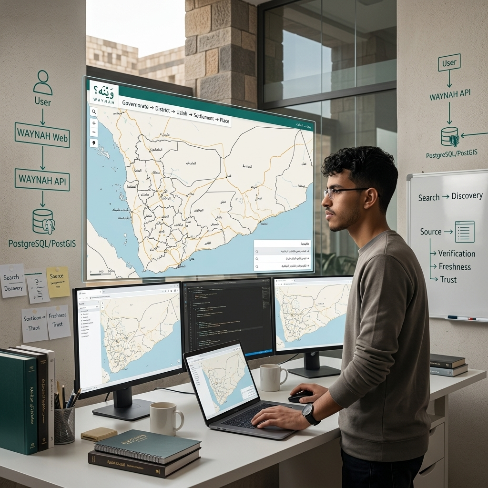

**Engineered Location Discovery · Spatial Hierarchy · Multi-Source Verification · Local Trust**

[](https://turbo.build)
[](https://nextjs.org)
[](https://hono.dev)
[](https://typescriptlang.org)
[](https://postgresql.org)
[](https://postgis.net)
[](https://prisma.io)

[🌐 Web Application](https://waynah.vercel.app) &nbsp;|&nbsp; [🔌 API Gateway](https://waynah-api.vercel.app/health) &nbsp;|&nbsp; [📐 Architecture Specs](ARCHITECTURE.md) &nbsp;|&nbsp; [🛡️ Security Policy](SECURITY.md) &nbsp;|&nbsp; [👨‍💻 Developer Profile](#18-—-the-engineer-behind-waynah)

</div>

---

## 01 — THE HERO

**WAYNAH / وَيْنَه؟** مشروع هندسي مستقل يهدف لبناء وتطوير البنية التحتية للمعلومات الجغرافية والمحلية في اليمن. يُدار المشروع وفق هوية بصريّة هادئة باسم **"Calm Local Atlas — أطلس محلي هادئ"** تحت توقيع المطور والمهندس **M.GH.AL**.

---

## 02 — THE QUESTION: وَيْنَه؟ (WHERE IS IT?)

> **هناك أماكن يعرفها الناس... لكن يصعب وصفها رقميًا.**  
> سوق شعبية، شارع جانبي، قرية بعيدة، عيادة محلية، أو محل تجاري صغير في حارة.  
> عندما يسأل أي شخص في اليمن: **"وَيْنَه؟"** — الإجابة ليست مجرد إحداثيات خطية صامتة، بل سياق جغرافي كامل، طريقة وصول، هاتف للتواصل، وتأكيد موثوق بأن المعلومة حقيقية وحديثة.

**WAYNAH / وَيْنَه؟** يحول سؤال *"أين المكان؟"* من مجرد استعلام نصي عشوائي إلى **بنية معلومات جغرافية منظمة وقابلة للاكتشاف والتحقق (Geographic Intelligence & Discovery System)**.

---

## 03 — THE REAL PROBLEM

تفتقر البيانات المكانية والتجارية المحلية في اليمن إلى الفهرسة الموحدة والموثوقية المستمرة:

1. **العنوان غير الرسمي**: معظم الأماكن تُوصف بالأحياء والأزقة والمعالم البارزة وليس بالرموز البريدية أو الشوارع الرقمية.
2. **تشتت مصادر البيانات**: تضارب الأرقام والهواتف والمواقع بين المصادر المختلفة دون معرفة أيها الأحدث أو الأكثر دقة.
3. **غياب نظام الموثوقية**: صعوبة التمييز بين الأماكن التي تم فحصها وتأكيدها، والأماكن غير المعتمدة أو المغلقة.
4. **تعدد اللغات والصيغ النصية**: اختلاف كتابة الأسماء العربية (مثل: *صنعاء / صنعاء القديمة / مديرية التحرير*) مما يؤدي إلى فشل أنظمة البحث التقليدية.

---

## 04 — WHAT IS WAYNAH?

**WAYNAH / وَيْنَه؟** ليس مجرد خريطة تفاعلية، وليس مجرد دليل تجاري عابر. إنه **منصة جغرافية هندسية كاملة (Monorepo Platform)** تم بناؤها خصيصًا لتوفير:

- 🗺️ **فهرسة جغرافية هرمية (Administrative Spatial Hierarchy)**: من المحافظة والمديرية والعزلة وصولاً إلى الحي والشارع والمعلم.
- 🔍 **ملاحة واستكشاف فائق السرعة (Fuzzy & Spatial Search)**: محرك بحث مدعوم بمعالجة المصطلحات العربية واليمانية مع ترتيب النتائج حسب القرب الجغرافي ونسبة التطابق.
- 🛡️ **نموذج الثقة والتحقق المباشر (Trust & Verification Model)**: تصنيف دقيق لحالة الموثوقية (`UNVERIFIED`, `VERIFIED`, `CLAIMED`, `REPORTED`, `CLOSED`) مع تسجيل كافة التعديلات في سجل تدقيق محكم (`AuditLog`).
- 🏢 **إدارة الفروع والممتلكات التجارية (Branch Claiming & RBAC)**: تمكين أصحاب الأعمال من تقديم طلبات ملكية الفروع وتوثيق بياناتهم بمرجعية إدارية سليمة.

---

## 05 — THE CORE MODEL

يعتمد WAYNAH على النموذج الخماسي للاكتشاف المكاني:

```text
       ┌─────────────────────────────────────────────────────────┐
       │                       WHERE?                            │
       │     (Geographic Context: Boundary, Point, Uzlah)       │
       └───────────────────────────┬─────────────────────────────┘
                                   │
                                   ▼
       ┌─────────────────────────────────────────────────────────┐
       │                       WHAT?                             │
       │       (Entity Context: Place, Category, Business)       │
       └───────────────────────────┬─────────────────────────────┘
                                   │
                                   ▼
       ┌─────────────────────────────────────────────────────────┐
       │                    HOW TO REACH?                        │
       │    (Navigation Context: Coordinates, Phone, Address)   │
       └───────────────────────────┬─────────────────────────────┘
                                   │
                                   ▼
       ┌─────────────────────────────────────────────────────────┐
       │                       TRUST?                            │
       │ (Verification: Confidence Score, Freshness, Verification)│
       └───────────────────────────┬─────────────────────────────┘
                                   │
                                   ▼
       ┌─────────────────────────────────────────────────────────┐
       │                     DISCOVERY                           │
       │    (Result Delivery: Autocomplete, Drawer, Map Pin)     │
       └───────────────────────────┬─────────────────────────────┘
```

---

## 06 — GEOGRAPHIC INTELLIGENCE & SPATIAL COVERAGE

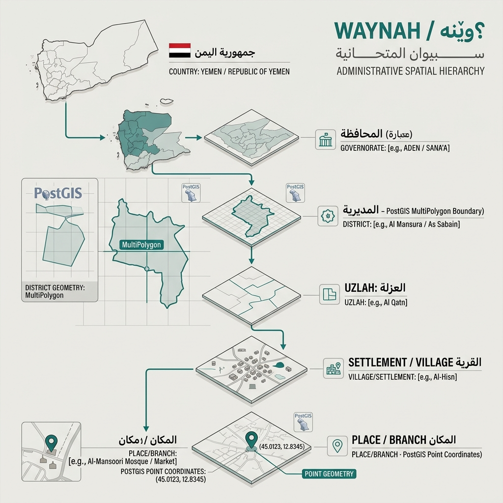
*الشكل الهيكلي 1: التسلسل الجغرافي الإداري في اليمن ونماذج PostGIS المكانية (MultiPolygon & Point).*

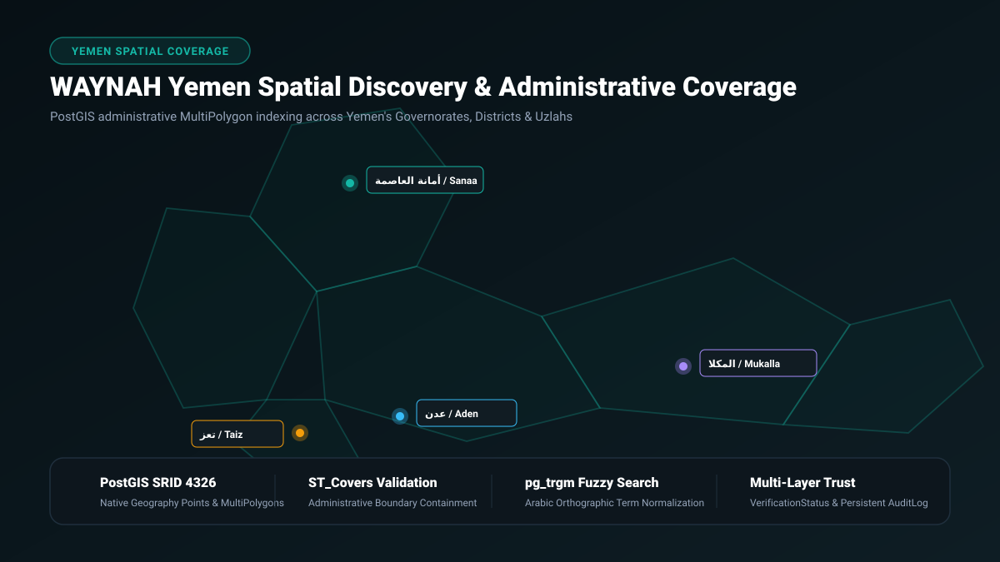
*الشكل الهيكلي 2: نطاقات التغطية الجغرافية والاستعلام المكاني للمحافظات والمديريات اليمنية.*

يتعامل WAYNAH مع الجغرافيا اليمنية من خلال هيكل رمزي وهندسي محدد باستخدام تقنيات PostGIS المكانية (`geography(MultiPolygon, 4326)` & `geography(Point, 4326)`):

```text
Yemen (جمهورية اليمن)
  │
  ├── Governorate (المحافظة) — e.g. أمانة العاصمة, عدن, تعز, حضرموت
  │     │
  │     └── District (المديرية) — e.g. مديرية التحرير, مديرية صيرة, مديرية المكلا
  │           │   (PostGIS MultiPolygon Boundary Indexing)
  │           │
  │           ├── Uzlah / Neighborhood (العزلة / الحي) — [Spatial Resolution Layer]
  │           │     │
  │           │     └── Settlement / Village (القرية / التجمع السكني)
  │           │           │
  │           │           └── Landmark / Street (المعلم / الشارع)
  │           │                 │
  │           │                 └── Place / Branch (المكان / الفرع)
  │           │                       └── Coordinates: PostGIS Point (Latitude, Longitude)
```

> **تنبيه الهندسة المكانية**: يتم التحقق في الكود عبر `GeographySpatialResolutionService` باستخدام استعلام PostGIS `ST_Covers(d.boundary, ST_SetSRID(ST_MakePoint(lng, lat), 4326))`. في حال تعارض الإحداثيات الجغرافية للمكان مع المديرية المحددة، يطلق الخادم استثناءً هندسيًا صريحًا بحرمانه وتمرير رمز الخطأ `GEOGRAPHIC_CONTEXT_MISMATCH`.

---

## 07 — TRUST & DATA FRESHNESS

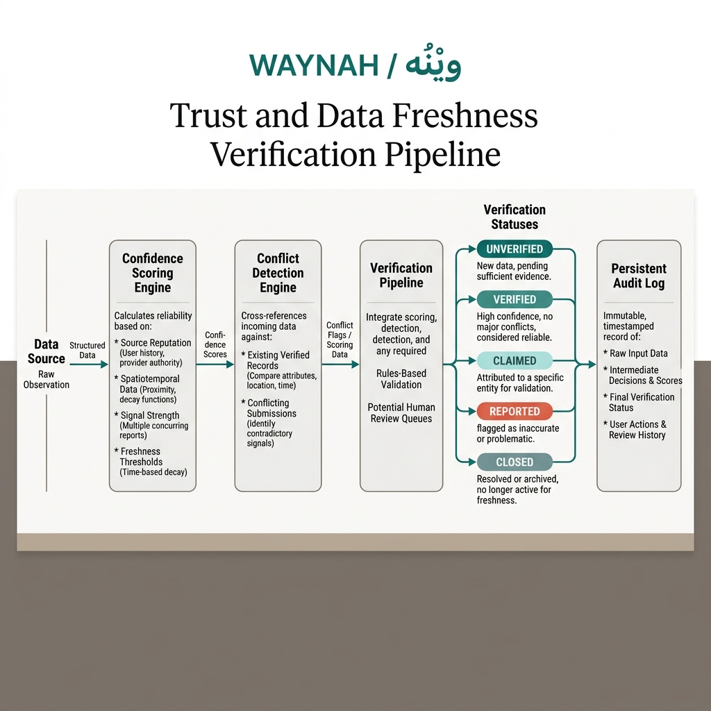
*المخطط الهندسي 1: متوالية التوثيق والموثوقية وتدقيق المصادر وسجلات النزاع.*

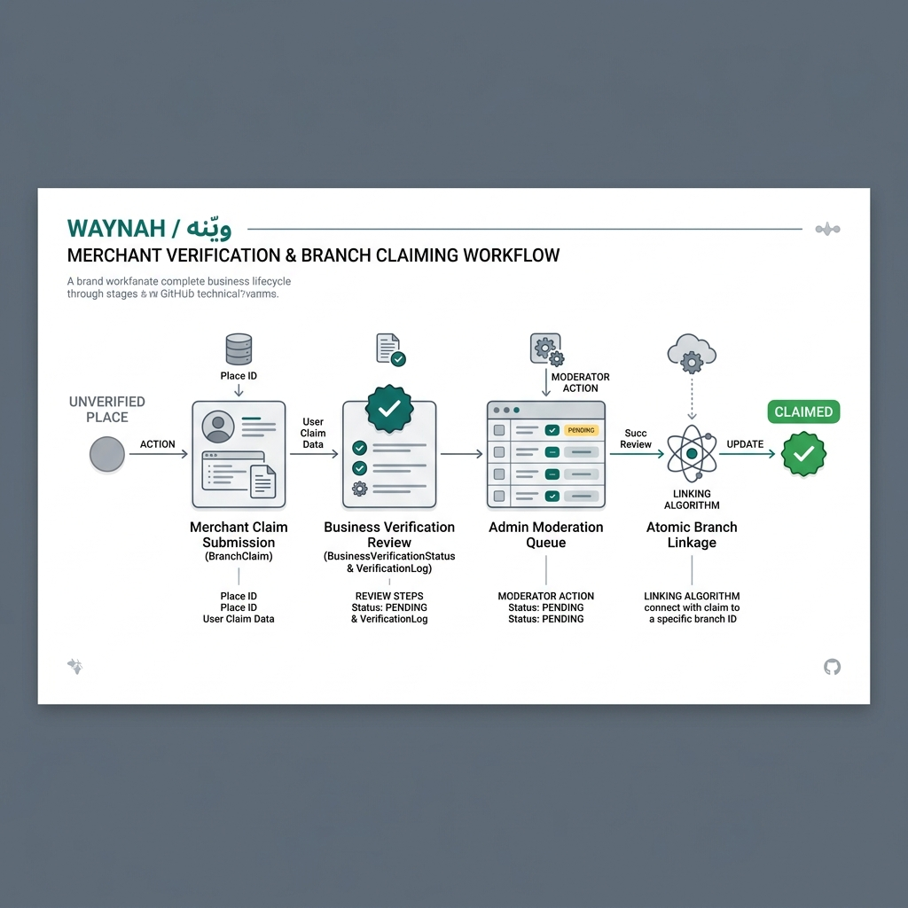
*المخطط الهندسي 2: دورة حياة ملكية الفروع والتوثيق التجاري وقواعد الربط الذري.*

لا يعتمد WAYNAH على الادعاء المباشر لدقة البيانات، بل يبني الموثوقية عبر متوالية تدقيق متعددة الطبقات:

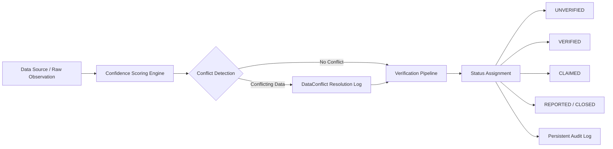
```mermaid
flowchart LR
    A[Data Source / Raw Observation] --> B[Confidence Scoring Engine]
    B --> C{Conflict Detection}
    C -- No Conflict --> D[Verification Pipeline]
    C -- Conflicting Data --> E[DataConflict Resolution Log]
    E --> D
    D --> F[Status Assignment]
    F --> G[UNVERIFIED]
    F --> H[VERIFIED]
    F --> I[CLAIMED]
    F --> J[REPORTED / CLOSED]
    F --> K[Persistent Audit Log]
```

### مستويات توثيق الأماكن (`VerificationStatus`):
1. **UNVERIFIED (غير موثق)**: مكان مضاف من مصدر أولي أو ملحوظة مكتشفة لم تخضع بعد للفحص الإداري.
2. **VERIFIED (موثق إداريًا)**: تم فحص وتأكيد بيانات المكان وإحداثياته من قبل فريق الإدارة أو المصادر المعتمدة.
3. **CLAIMED (مملوك للفرع)**: تم تأكيد ملكية هذا الفرع لعلامة تجارية أو نشاط تجاري مسجل وموثق (`BusinessVerification`).
4. **REPORTED (بلاغ مغلق/مشكوك)**: مكان وردت بشأنه بلاغات عن تغيير نشاطه أو خطأ بياناته.
5. **CLOSED (مغلق نهائيًا)**: نشاط تجاري أو معلم لم يعد قائمًا على الواقع.

---

## 08 — PRODUCT EXPERIENCE & DOMAIN TRANSACTIONS

تم تصميم واجهات **WAYNAH Web** بهوية بصرية هادئة تحت طابع **"Calm Local Atlas — أطلس محلي هادئ"** باستخدام منصة Next.js 16 وتوليفات Tailwind CSS v4 مع خريطة Leaflet المتفاعلة.

### 1. Interactive Location Discovery & Navigation Web App
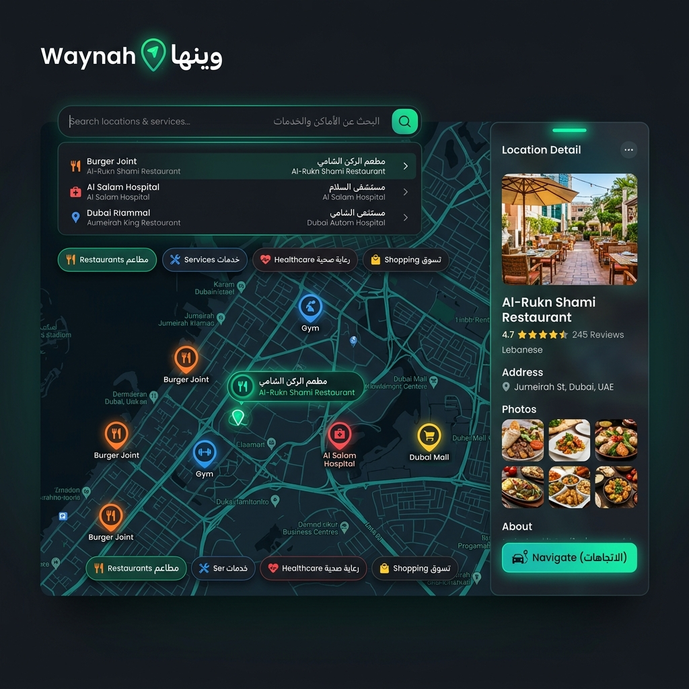
*الشكل 1: الواجهة الرئيسية لاستكشاف الأماكن مع الخريطة التفاعلية، البحث اللحظي، القوائم الجانبية لتفاصيل الأماكن، والفلترة حسب التصنيفات.*

---

### 2. Platform Operations & Spatial Analytics Console
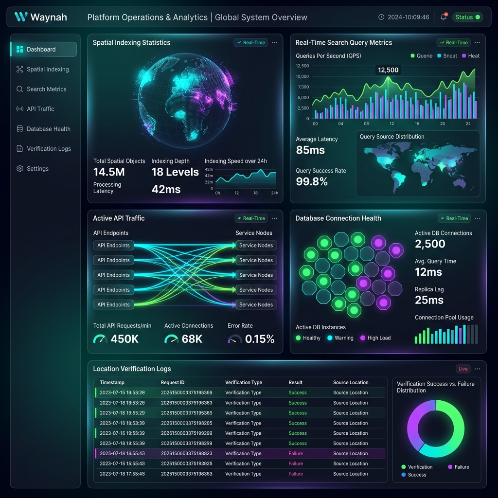
*الشكل 2: لوحة التحكم الإدارية لمتابعة حالة مؤشرات الأداء المكانية، النزاعات الناتجة عن البيانات، مراجعة مطالب الملكية وسجلات الموثوقية.*

---

### 3. Catalog, Bookings & Fulfillment Subsystem
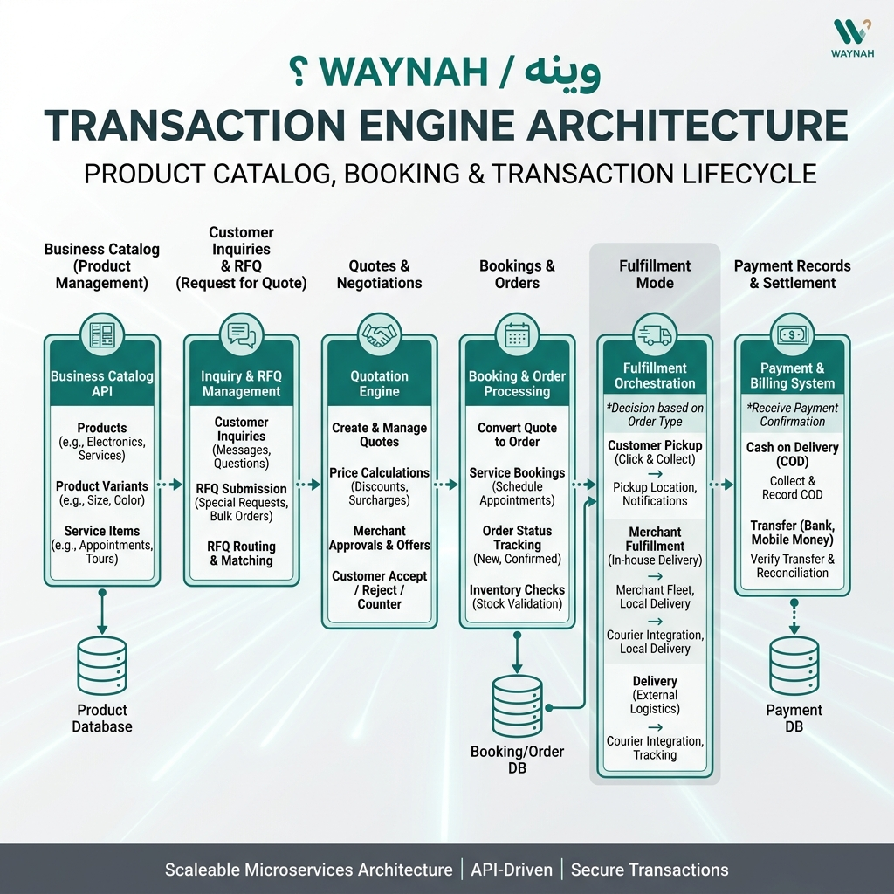
*الشكل 3: هيكلية إدارة المنتجات والخدمات، طلبات الأسعار (RFQ)، الحجوزات، وأنماط التنفيذ والتسديد.*

---

## 09 — SYSTEM ARCHITECTURE & DATA PIPELINE

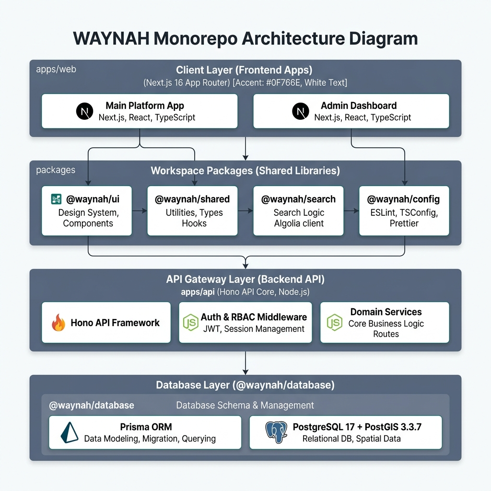
*الشكل المعماري 1: طبقات المونوريبو المسؤولة عن الربط بين الويب، الحزم المشتركة، بوابات REST API، وقاعدة البيانات المكانية.*

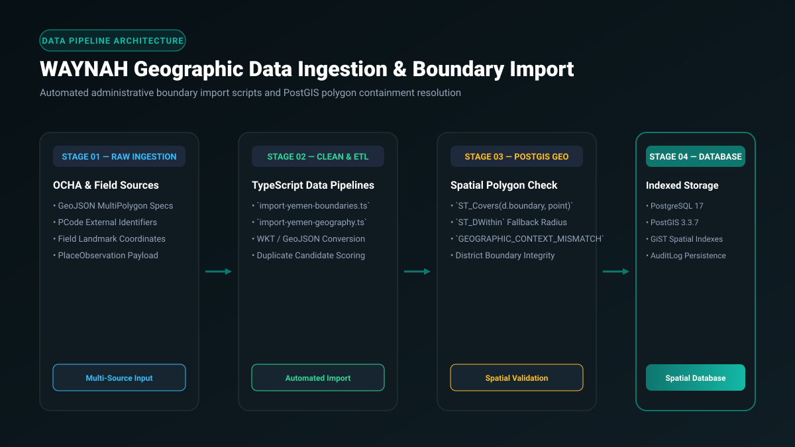
*الشكل المعماري 2: مسارات معالجة واستيراد الحدود الجغرافية ومطابقة النطاقات عبر سكربتات TypeScript واستعلامات PostGIS.*

يعمل WAYNAH كبنية مونوريبو (Monorepo Architecture) متكاملة تدار بواسطة Turborepo و pnpm workspaces:

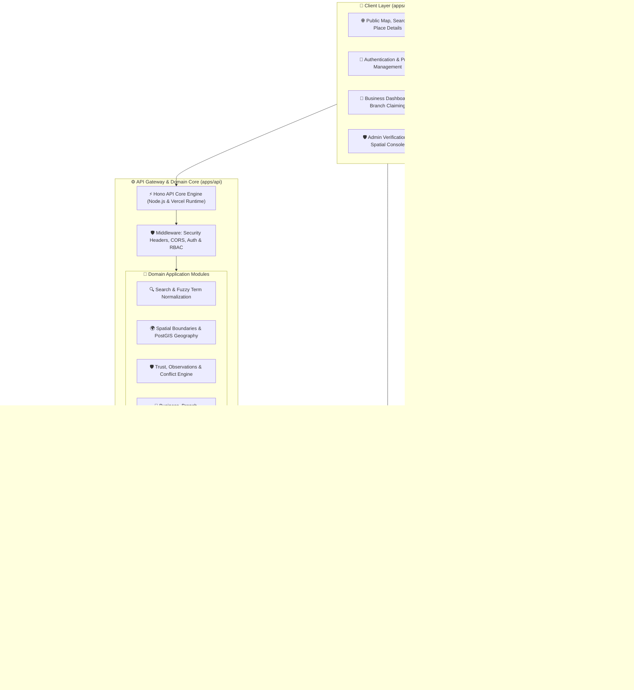
```mermaid
graph TD
    subgraph ClientLayer ["🎨 Client Layer (apps/web)"]
        UI_PUBLIC["🌐 Public Map, Search & Place Details"]
        UI_AUTH["🔐 Authentication & Profile Management"]
        UI_BUSINESS["🏢 Business Dashboard & Branch Claiming"]
        UI_ADMIN["🛡️ Admin Verification & Spatial Console"]
    end

    subgraph SharedPackages ["📦 Workspace Packages (packages/*)"]
        PKG_UI["🎨 @waynah/ui (Primitives: Button, Card, Badge, Input...)"]
        PKG_SHARED["📑 @waynah/shared (Types, Schemas, Permissions & RBAC)"]
        PKG_SEARCH["🔍 @waynah/search (Normalization, Fuzzy Search & Ranking)"]
        PKG_CONFIG["⚙️ @waynah/config (TypeScript, ESLint & Prettier Rules)"]
    end

    subgraph ApiLayer ["⚙️ API Gateway & Domain Core (apps/api)"]
        HONO_SERVER["⚡ Hono API Core Engine (Node.js & Vercel Runtime)"]
        SEC_MIDDLEWARE["🛡️ Middleware: Security Headers, CORS, Auth & RBAC"]
        AUDIT_SYS["📜 Audit Logger & Security Event Dispatcher"]

        subgraph DomainServices ["🧠 Domain Application Modules"]
            DOM_SEARCH["🔍 Search & Fuzzy Term Normalization"]
            DOM_GEO["🌍 Spatial Boundaries & PostGIS Geography"]
            DOM_TRUST["🛡️ Trust, Observations & Conflict Engine"]
            DOM_BIZ["🏢 Business, Branch Claiming & Verification"]
            DOM_USER["👥 Users, Favorites & Service Requests"]
            DOM_ADMIN["👑 Admin Operations & Verification Logs"]
        end
    end

    subgraph DataLayer ["🗄️ Database & Spatial Storage (packages/database)"]
        PRISMA_CLIENT["💎 Prisma ORM Client"]
        MIGRATIONS["📜 Schema Migrations (17 Spatial & Entity Migrations)"]
        POSTGRES_DB[("🐘 PostgreSQL 17 + PostGIS 3.3.7<br/>(Spatial Boundary Indexing & pg_trgm Search)")]
    end

    ClientLayer --> PKG_UI
    ClientLayer --> PKG_SHARED
    ClientLayer --> HONO_SERVER

    HONO_SERVER --> SEC_MIDDLEWARE
    SEC_MIDDLEWARE --> DomainServices
    DomainServices --> AUDIT_SYS
    DomainServices --> PKG_SHARED
    DomainServices --> PKG_SEARCH
    DomainServices --> PRISMA_CLIENT

    PRISMA_CLIENT --> MIGRATIONS
    MIGRATIONS --> POSTGRES_DB
```

---

## 10 — DATA & SPATIAL MODEL

يعتمد نموذج البيانات على العلاقات التالية داخل `packages/database/prisma/schema.prisma`:

```text
Governorate (المحافظة)
 └── District (المديرية) [Boundary: MultiPolygon 4326]
      └── Place (المكان / المعلم)
           ├── PlaceLocation [Geom: Point 4326]
           ├── Category (التصنيف)
           ├── Business (الشركة / العلامة التجارية)
           │    ├── BusinessVerification (التوثيق التجاري)
           │    ├── BusinessMember (الأعضاء والرتب)
           │    ├── BranchClaim (طلبات ملكية الفروع)
           │    ├── Product (المنتجات المعروضة)
           │    └── ServiceItem (الخدمات المقدمة)
           ├── PlaceObservation (ملحوظات المصادر الجغرافية)
           ├── DataConflict (نزاعات وتعارضات البيانات)
           ├── Favorite (المفضلات للمستخدمين)
           └── Review (التقييمات والمراجعات)

User (المستخدم)
 ├── Session & AccountToken (الجلسات وتأكيد الحساب)
 ├── Favorite & ServiceRequest (الطلبات والمفضلات)
 └── AuditLog (سجل العمليات والفعاليات والأمن)
```

---

## 11 — SEARCH & DISCOVERY

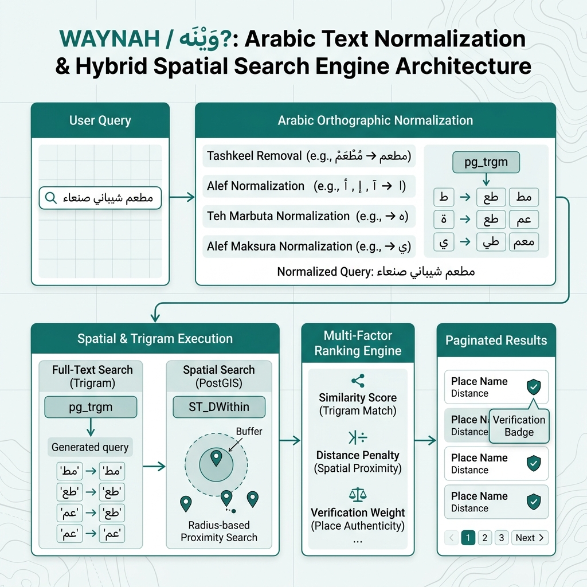
*الشكل المعماري: معالجة المصطلحات العربية وتنقية النصوص والاستعلام المكاني الهجين ترتيبًا.*

تم تطوير حزمة `@waynah/search` خصيصًا لضمان فهم طبيعة المصطلحات الجغرافية والتجارية في اليمن:

```text
User Query ("مطعم شيباني صنعاء")
       │
       ▼
[Term Normalization]
  • Removal of Arabic Diacritics (التشكيل)
  • Normalization of Alef variants (أ/إ/آ -> ا), Teh Marbuta (ة -> ه), Alef Maksura (ى -> ي)
  • Extraction of Geographic Stop Words & Aliases
       │
       ▼
[Spatial & Trigram Query Execution]
  • PostGIS ST_DWithin / ST_Distance (if coordinates provided)
  • PostgreSQL pg_trgm Fuzzy Name Matching
       │
       ▼
[Multi-Factor Ranking Engine]
  • Name Similarity Score (Trigram Match)
  • Distance Penalty / Proximity Score
  • Verification Weight (VERIFIED/CLAIMED places get ranking boost)
       │
       ▼
[Paginated Response Payload]
  • Return formatted places with verification badge and spatial drawer info
```

---

## 12 — ENGINEERING STACK

تم التثبت من إصدارات المكتبات والتقنيات المستخدمة مباشرة من مستودع المشروع:

| الطبقة / المكون | التقنية المستعملة | الإصدار | الغرض والوظيفة |
| :--- | :--- | :--- | :--- |
| **Monorepo Build System** | Turborepo | `v2.4.4` | تنسيق البناء السريع وتسريع التخزين البصري والمهام |
| **Package Manager** | pnpm Workspaces | `v12.8.1` | إدارة الحزم المتعددة والاعتمادات المشتركة بكفاءة عالية |
| **Frontend Framework** | Next.js (App Router) | `v16.3.6` | بناء واجهات التطبيق التفاعلية وصفحات العرض الموزعة |
| **UI Library & Styling** | React + Tailwind CSS | `v19.3` / `v4.3` | نظام التصميم وتوليف العناصر البصرية برمزية `#0F766E` |
| **Map Engine** | Leaflet | `v1.9.4` | عرض الخرائط التفاعلية والتحكم في العلامات والتجمع مكانيًا |
| **API Gateway Engine** | Hono Core | `v4.13.10` | خادم REST API عالي الأداء يدعم Vercel & Node |
| **Database ORM** | Prisma ORM | `v6.4.1` | إدارة الاستعلامات وبناء كائنات الجداول والهجرات |
| **Database Engine (Prod)** | Supabase PostgreSQL + PostGIS | `v17` / `v3.3.7` | تخزين البيانات الجغرافية وإحداثيات النطاقات والمضلعات |
| **Runtime Language** | TypeScript | `v5.8.2` | التحقق من صحة الأنواع والحرص على النزاهة البرمجية |
| **Hosting & Infra** | Vercel + Supabase | Managed Cloud | الاستضافة المباشرة للويب والواجهة وقاعدة البيانات المكانية |

---

## 13 — SECURITY & GOVERNANCE

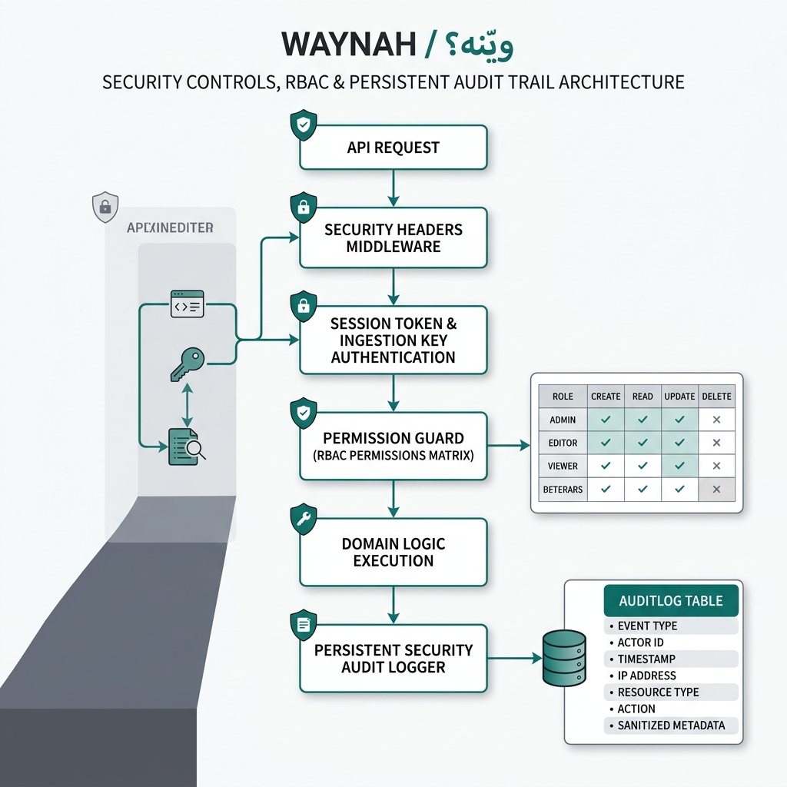
*الشكل الأمني: طبقات الحماية وتأكيد الهوية وصلاحيات RBAC وتسجيل الفعاليات في AuditLog.*

يتبع **WAYNAH** معايير هندسية محكمة لحماية البيانات وإدارة الوصول (Security Hardened & Verified Controls):

- 🔐 **إدارة الصلاحيات (RBAC - Role-Based Access Control)**: حظر العمليات الحساسة وتحديد صلاحيات الأدوار (`SUPER_ADMIN`, `ADMIN`, `BUSINESS_OWNER`, `BUSINESS_MANAGER`, `USER`).
- 📜 **سجل التدقيق الشامل (Persistent Audit Log)**: تسجيل عمليات تعديل البيانات، التوثيق، والمطالبات في جدول `AuditLog` بدون حصر أي كلمة مرور أو بيانات سرية.
- 🛑 **الحماية من الهجمات**: استخدام `securityHeadersMiddleware` لحظر الثغرات الشائعة (XSS, Clickjacking, MIME Sniffing) وتحديد نطاق CORS بدقة.
- ⚡ **آلية الأخطاء الآمنة (Safe Error Handler)**: منع تسريب تفاصيل الخادم الداخلية أو Stack Traces عند وقوع أخطاء في واجهة REST API.

---

## 14 — PRODUCTION STATUS & PUBLIC LAUNCH ROADMAP

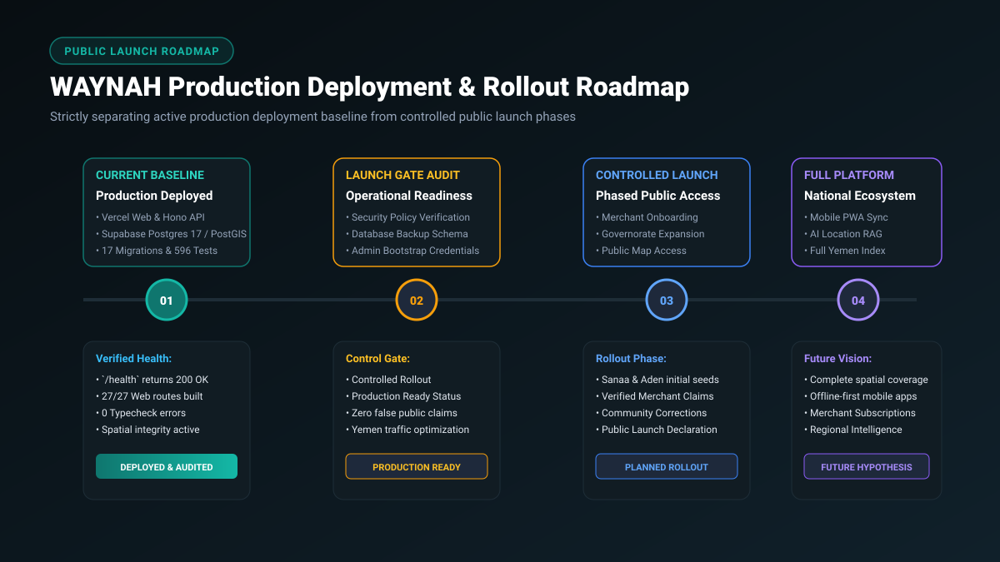
*خارطة الطريق 1: التمييز الهندسي الدقيق بين النشر الإنتاجي المطبق والنشر التدريجي والإطلاق العام.*

| المكون | حالة التشغيل (Production Status) | البيئة والاستضافة | ملاحظات الجاهزية |
| :--- | :--- | :--- | :--- |
| **Web Application** | 🟢 Production Deployed & Verified | Vercel Serverless | متصل بالواجهة ويدعم العرض التفاعلي والخريطة |
| **API Gateway** | 🟢 Production Deployed & Verified | Vercel Serverless Function | يخدم جميع المسارات وتتوفر نقطة `/health` (HTTP 200) |
| **PostgreSQL + PostGIS** | 🟢 Production Deployed & Migrated | Supabase Managed Postgres | تم تنفيذ جميع الهجرات الـ 17 وتفعيل ملحق PostGIS |
| **Public Launch Gate** | 🟡 Production Ready (Controlled Rollout) | Operational Launch Gate Audited | التشر الإنتاجي محقق ومفحص؛ مرحلة الإطلاق العام تدريجية ومبوبة |

> **تنبيه الإطلاق**: النشر الإنتاجي (Production Deployment) نشط ومفحص تقنيًا. الإطلاق العام للجمهور (Public Launch) يُدار بشكل تدريجي ومسيطر عليه.

---

## 15 — VERIFIED ENGINEERING STATUS

تم التثبت التقني من سلامة النظام من خلال:

- ✅ **17 الهجرات المكانية والهيكلية (Prisma Migrations)**: تم إنشاؤها وتطبيقها بنجاح دون أخطاء.
- ✅ **596 اختبار كلي (Integration & Security Test Suites)**: تغطي 577 اختبار API و 19 اختبار حزمة البحث.
- ✅ **بناء خالي من الأخطاء (Zero Typecheck Errors)**: نجاح أمر `pnpm typecheck` عبر 10 حزم وتطبيقات في المونوريبو.
- ✅ **الربط والإنتاجية (Supabase Direct & Pooler Connectivity)**: تم ضبط روابط قواعد البيانات وقنوات الحماية.

---

## 16 — REPOSITORY STRUCTURE

```text
waynah/
├── apps/
│   ├── api/                    # Hono REST API Server & Domain Services
│   │   ├── src/
│   │   │   ├── config/         # Security & Environment Configs
│   │   │   ├── domain/         # Domain Modules (Admin, Business, Geo, Trust...)
│   │   │   ├── middleware/     # Security, Auth, Logging & Rate-Limit
│   │   │   ├── routes/v1/      # REST Endpoint Handlers
│   │   │   └── server.ts       # Hono Server Setup & Vercel Handler
│   │   └── tests/              # API Integration & Unit Tests
│   │
│   └── web/                    # Next.js 16 Web Application
│       ├── app/                # App Router Routes ((public), (auth), (admin)...)
│       ├── components/         # Page Components, Drawers & Map Shell
│       └── lib/                # API Client, Auth Context & Permissions Guard
│
├── packages/
│   ├── database/               # Prisma Schema, Migrations & PostGIS Utilities
│   │   ├── prisma/
│   │   │   ├── schema.prisma   # Master Database Schema
│   │   │   └── migrations/     # 17 Executed Spatial Schema Migrations
│   │   └── src/spatial/        # Spatial Verification & Boundary Health
│   │
│   ├── search/                 # Arabic Normalization & Fuzzy Spatial Search Engine
│   │   └── src/
│   │       ├── normalization/  # Yemen Geography & Text Normalizer
│   │       └── ranking/        # Search Weight & Scoring Algorithms
│   │
│   ├── shared/                 # Shared Zod Schemas, Permission Codes & Types
│   ├── ui/                     # Primitives Design System (Button, Card, Badge...)
│   ├── maps/                   # Map Component Layer & Leaflet Clustering (Source Directory)
│   └── config/                 # Shared TypeScript & ESLint Rules
│
├── docs/                       # Architecture Specs & Technical Studies
│   ├── images/                 # Official System Diagrams & Screenshots (20 Visual Assets)
│   └── WAYNAH_BUILD_SPECIFICATION.md
│
├── docker/                     # Docker Compose (PostgreSQL 16 + PostGIS 3.4)
├── scripts/                    # Geographic Boundary & Data Ingestion Pipelines
└── package.json                # Master Monorepo Root Script Configuration
```

---

## 17 — FUTURE VISION & EXPLORATORY DIRECTIONS

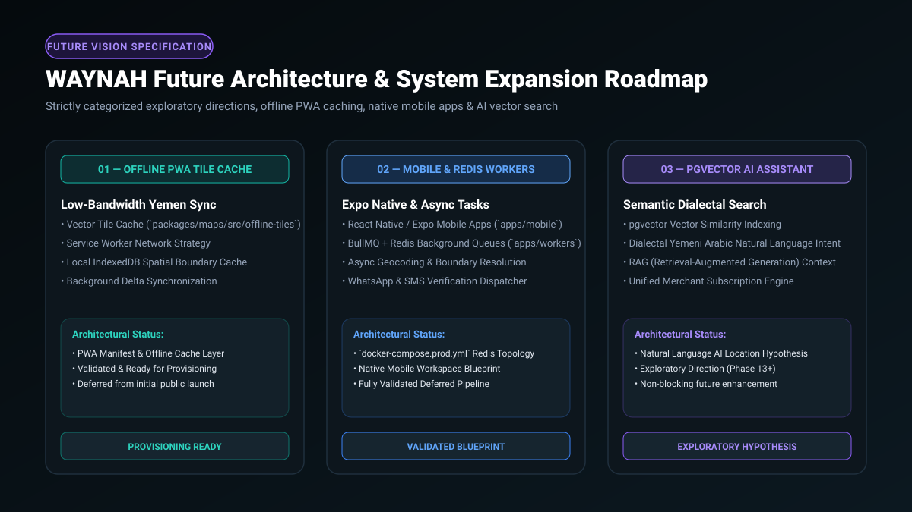
*الشكل المعماري 1: خارطة المستقبل ورؤية التخزين المؤقت، التطبيقات الذاتية، وطبقة ذكاء المتجهات pgvector AI.*

حرصًا على الدقة والشفافية البرمجية، تم تمييز المكونات الحالية عن المخططات المستقبلية:

```text
CURRENT (المطبّق والجاهز حاليًا)
  ├── Next.js 16 Web App + Hono API + PostgreSQL 17/PostGIS 3.3.7
  ├── Arabic & Spatial Fuzzy Search Engine (@waynah/search)
  ├── Administrative Hierarchy & PostGIS Boundary Checks
  ├── Multi-Layer Trust & Observation Verification Engine
  └── Fine-grained RBAC & Persistent Audit Logs

VALIDATED / READY FOR PROVISIONING (جاهز للربط والتوسعة)
  ├── Redis Caching & BullMQ Background Workers Topology
  └── WhatsApp & SMS Verification Dispatcher Package

EXPLORATORY / HYPOTHESIS (رؤية مستقبلية قيد الدراسة)
  ├── PWA Offline Tile Caching for Low-Bandwidth Yemen Connectivity
  ├── React Native / Expo Mobile Apps (iOS & Android)
  ├── pgvector AI Natural Language Location Assistant
  └── Unified Local Commerce & Merchant Subscription System
```

---

## 18 — THE ENGINEER BEHIND WAYNAH

<div align="center">


### Mohammed Ghaleb AL-AOSIMI (`M.GH.AL`)
**Full-Stack Developer · Software Engineer · Third-Year IT Student**

[](https://github.com/mghalaosimi-web)

</div>

#### Profile Overview
**Mohammed Ghaleb AL-AOSIMI** (under the engineering brand identity **`M.GH.AL`**) is a software engineer and third-year Information Technology student. His engineering philosophy centers on building practical, structured, production-oriented software systems spanning data layers, backend infrastructure, and responsive user experiences rather than isolated demonstrations.

#### Core Technical Competencies
- **Frontend & UI Systems**: Next.js (App Router), React, TypeScript, JavaScript, Tailwind CSS, Arabic RTL Layout Engineering.
- **Backend & API Systems**: Node.js, Hono API Gateway, RESTful Architecture, Fine-Grained RBAC, Persistent Audit Systems.
- **Database & Spatial Systems**: PostgreSQL 17, PostGIS Spatial Extensions (`geography`, `ST_Covers`), Prisma ORM, SQLite, Drift, Firebase, Supabase.
- **Infrastructure & Deployment**: Vercel Serverless Hosting, Supabase Managed Cloud Postgres, Monorepo Orchestration (Turborepo, pnpm Workspaces).
- **Mobile & Cross-Platform**: Flutter, Android Native.

#### Developer Engineering Gallery (M.GH.AL in Action — 7 Visual Assets)

<table align="center">
  <tr>
    <td width="50%" align="center">
      <b>01 — Spatial Data Engineering &amp; PostGIS</b><br/>
      
      <br/>
      <i>هندسة البيانات المكانية واستعلامات النطاقات الجغرافية لليمن.</i>
    </td>
    <td width="50%" align="center">
      <b>02 — Monorepo System Architecture Review</b><br/>
      
      <br/>
      <i>مراجعة الهيكل المعماري للمونوريبو وفصل الطبقات الخدمية.</i>
    </td>
  </tr>
  <tr>
    <td width="50%" align="center">
      <b>03 — Production Infrastructure &amp; System Health</b><br/>
      
      <br/>
      <i>متابعة النشر الإنتاجي ومؤشرات الأداء على Vercel و Supabase.</i>
    </td>
    <td width="50%" align="center">
      <b>04 — Future Vision Roadmap Planning</b><br/>
      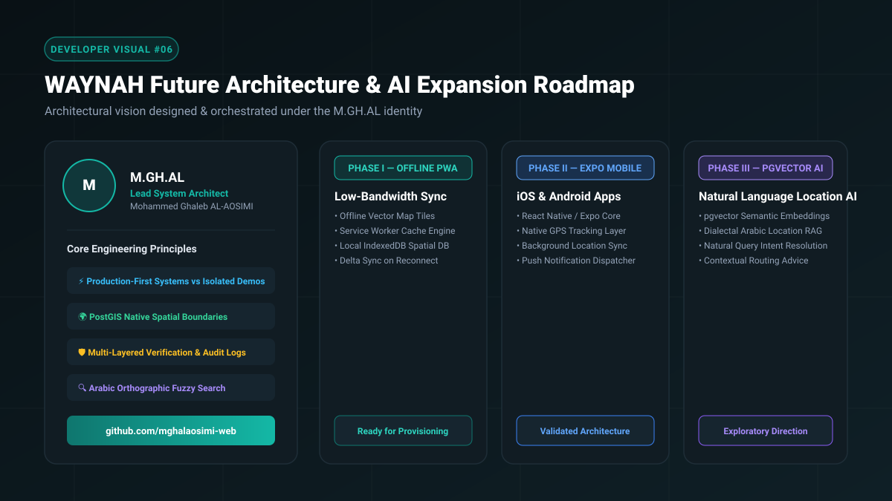
      <br/>
      <i>تخطيط ركائز المستقبل والتوسعة المكانية وذكاء الاصطناعي.</i>
    </td>
  </tr>
  <tr>
    <td width="50%" align="center">
      <b>05 — Data Ingestion &amp; Boundary Import</b><br/>
      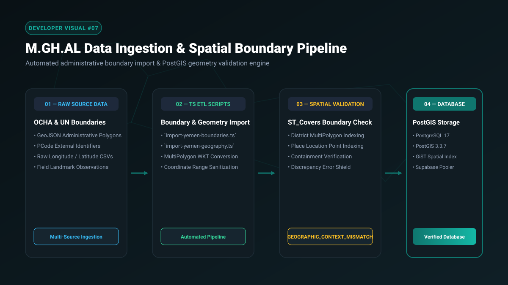
      <br/>
      <i>إدارة وظائف استيراد الحدود الجغرافية ومطابقة النطاقات.</i>
    </td>
    <td width="50%" align="center">
      <b>06 — Product Builder &amp; Spatial Core</b><br/>
      
      <br/>
      <i>تطوير النواة المكانية ومحرك البحث الهجين والاستكشاف الجغرافي.</i>
    </td>
  </tr>
</table>

#### Project Connection
**WAYNAH / وَيْنَه؟** represents an independent engineering project developed under the **`M.GH.AL`** identity to solve real-world spatial discovery, administrative data hierarchy, and trust verification challenges within Yemen's geographic landscape.

---

## 19 — PROJECT LINKS

- 🌐 **Web Application**: [https://waynah.vercel.app](https://waynah.vercel.app)
- 🔌 **API Gateway Health**: [https://waynah-api.vercel.app/health](https://waynah-api.vercel.app/health)
- 📐 **Architecture Specification**: [ARCHITECTURE.md](ARCHITECTURE.md)
- 🛡️ **Security Policy**: [SECURITY.md](SECURITY.md)
- 👨‍💻 **Developer GitHub**: [https://github.com/mghalaosimi-web](https://github.com/mghalaosimi-web)

---

## 20 — QUICK START (LOCAL DEVELOPMENT)

```bash
# 1. Clone the repository
git clone https://github.com/mghalaosimi-web/waynah.git
cd waynah

# 2. Install workspace dependencies
pnpm install

# 3. Start local PostgreSQL + PostGIS container
pnpm db:up

# 4. Generate Prisma client & apply database migrations
pnpm db:generate
pnpm db:migrate

# 5. Launch local development server (Turbo Orchestrator)
pnpm dev
```

*Web Application runs at `http://localhost:3000` | API Gateway runs at `http://localhost:4000`*
