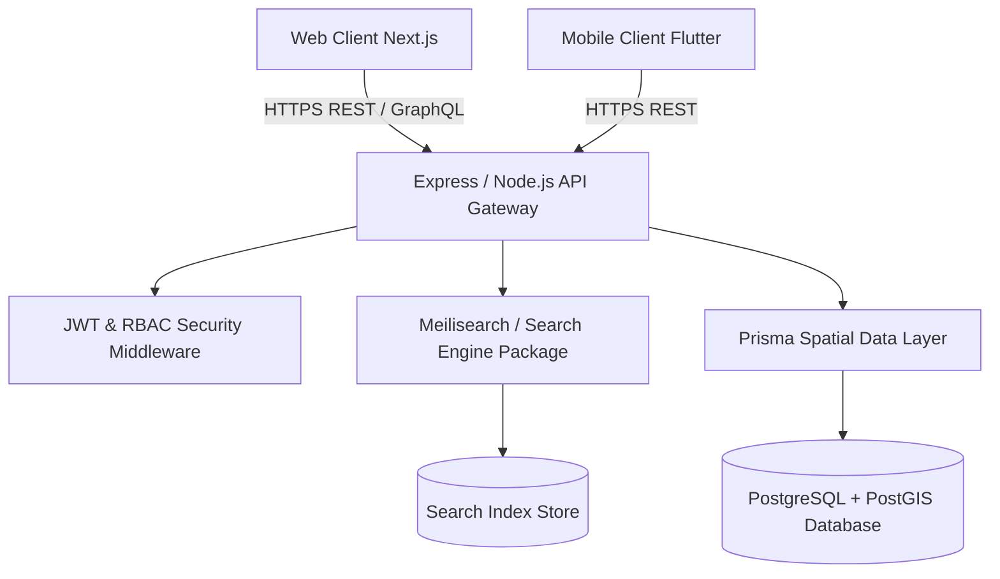

# 📍 Waynah (وينها) — Enterprise Location Discovery & Navigation Platform

[](https://turbo.build)
[](https://nextjs.org)
[](https://typescriptlang.org)
[](https://prisma.io)
[](https://pnpm.io)
[](LICENSE)

> **Waynah (وينها)** is a modern, enterprise-grade monorepo platform designed for high-performance location discovery, spatial directory navigation, service indexing, and real-time mapping.

---

## 🖼️ Application Dashboards & User Experience

### 1. Interactive Location Discovery & Navigation Web App

*Figure 1: Waynah web interface featuring interactive vector map, bilingual Arabic/English autocomplete search, category filters, and location details drawer.*

---

### 2. Platform Operations & Spatial Analytics Console

*Figure 2: Admin management console displaying spatial index metrics, search throughput, active database health, and location verification logs.*

---

## 🏗️ Monorepo Architecture & Data Flow



---

## 📂 Monorepo Structure

```
waynah/
├── apps/
│   ├── web/                    # Next.js 15 Web Application
│   └── api/                    # Core REST API Gateway
├── packages/
│   ├── database/               # Prisma Schema, Migrations & Database Client
│   ├── maps/                   # Mapbox / Leaflet Spatial Components
│   ├── search/                 # Search Indexing & Query Pipeline
│   ├── ui/                     # Shared Design System & UI Components
│   ├── shared/                 # Common Types, Utilities & DTOs
│   └── config/                 # Shared ESLint, TypeScript & Tailwind Configs
├── docker/                     # Docker Compose Database Setup
├── docs/images/                # High-Resolution Screenshots
└── README.md                   # Complete Platform Documentation
```

---

## 🌟 Key Features

- 🗺️ **Interactive Vector Mapping**: Fast, responsive mapping with custom cluster pins and location drawers.
- 🔎 **Fast Hybrid Search Engine**: Instant autocomplete, category filtering, fuzzy search, and spatial proximity sorting.
- 🏢 **Monorepo Architecture (Turborepo + pnpm)**: Modular package structure with shared UI component library, database client, and configurations.
- 🌐 **Bilingual Support (Arabic / English)**: Full RTL/LTR responsive layouts and localized search index support.
- 🔐 **Enterprise Security & Role Access**: Fine-grained RBAC permissions for business managers, administrators, and users.

---

## 🚀 Quick Start & Installation

### Prerequisites
- Node.js 18+
- pnpm 12+
- Docker & Docker Compose

### 1. Clone Repository & Install Dependencies
```bash
git clone https://github.com/mghalaosimi-web/waynah.git
cd waynah
pnpm install
```

### 2. Launch Local Database Containers
```bash
pnpm db:up
```

### 3. Generate Prisma Client & Run Migrations
```bash
pnpm db:generate
pnpm db:migrate
```

### 4. Start Development Mode (Turborepo Orchestrator)
```bash
pnpm dev
```
- **Web App**: `http://localhost:3000`
- **API Gateway**: `http://localhost:4000`

---

## 🧪 Build & Verification Commands

```bash
# Type check all packages and apps
pnpm typecheck

# Lint codebase across monorepo
pnpm lint

# Production build
pnpm build
```

---

## 📄 License

This project is open-source and licensed under the [MIT License](LICENSE).
