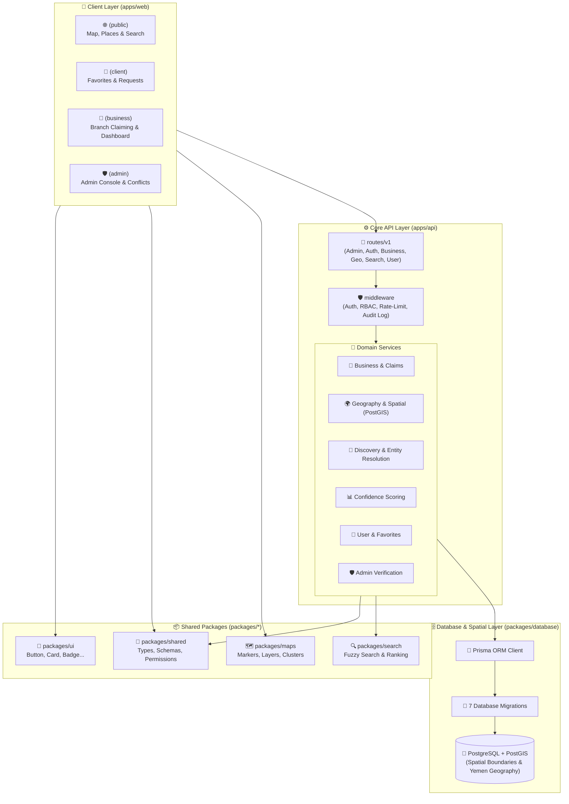

# 📍 Waynah (وينها) — Enterprise Location Discovery & Navigation Platform

[](https://turbo.build)
[](https://nextjs.org)
[](https://typescriptlang.org)
[](https://prisma.io)
[](https://pnpm.io)
[](LICENSE)

> **Waynah (وينها)** is a modern, enterprise-grade monorepo platform designed for high-performance location discovery, spatial directory navigation, service indexing, and real-time mapping.

---

## 🖼️ Application Dashboards & User Experience

### 1. Interactive Location Discovery & Navigation Web App

*Figure 1: Waynah web interface featuring interactive vector map, bilingual Arabic/English autocomplete search, category filters, and location details drawer.*

---

### 2. Platform Operations & Spatial Analytics Console

*Figure 2: Admin management console displaying spatial index metrics, search throughput, active database health, and location verification logs.*

---

## 🏗️ Monorepo Architecture & Data Flow



---

## 🗺️ Master System Tree (Present & Future)

```text
====================================================================================================
                                 📍 WAYNAH - MASTER SYSTEM TREE (PRESENT & FUTURE)
====================================================================================================

 📂 [waynah] (Monorepo Root)
 ├── 🟢 ⚙️ package.json                # Root dependencies & scripts
 ├── 🟢 ⚙️ pnpm-workspace.yaml          # PNPM Workspaces (apps/* & packages/*)
 ├── 🟢 ⚙️ turbo.json                   # Turborepo build orchestrator & caching
 ├── 🟢 🐳 docker-compose.yml          # PostgreSQL 16 + PostGIS 3.4
 ├── 🔮 🐳 docker-compose.prod.yml     # [Future] Redis Queue + MinIO S3 + Nginx Gateway
 ├── 🟢 🔑 .env                         # Local environment variables
 └── 🟢 📘 README.md                    # Core platform guide

 │
 ├── 🟢 📁 [apps] (Executable Applications)
 │   │
 │   ├── 🟢 📁 [api] (Express API & Domain Core)
 │   │   ├── 🟢 📄 index.ts / server.ts # Server entry points
 │   │   ├── 🟢 📁 [src/config]       # security.config.ts
 │   │   ├── 🟢 📁 [src/middleware]   # auth, authorization (RBAC), rate-limit, audit-log, logging
 │   │   ├── 🟢 📁 [src/routes/v1]    # admin, auth, business, discovery, geography, search, user
 │   │   │   └── 🔮 [src/routes/v2]   # [Future] GraphQL & Mobile Optimization Routes
 │   │   ├── 🟢 📁 [src/domain]       # 🧠 Domain Business Logic:
 │   │   │   ├── 🟢 📁 admin          # admin.service, admin-verification.service
 │   │   │   ├── 🟢 📁 business       # business.service, business-verification (Branch Claiming)
 │   │   │   ├── 🟢 📁 discovery      # discovery-orchestrator, ingestion, entity-resolution
 │   │   │   ├── 🟢 📁 geography      # geography, geography-spatial-resolution (PostGIS)
 │   │   │   ├── 🟢 📁 intelligence   # confidence-scoring.service
 │   │   │   ├── 🟢 📁 search         # search.service
 │   │   │   ├── 🟢 📁 user           # user-favorites, user-requests
 │   │   │   ├── 🔮 📁 notifications  # [Future] WhatsApp / SMS / Push Notifications Engine
 │   │   │   ├── 🔮 📁 billing        # [Future] Verified Business Subscriptions & Billing
 │   │   │   └── 🔮 📁 ai-assistant   # [Future] Natural Language Location AI Assistant
 │   │   └── 🟢 📁 [tests]            # 🧪 17 Test Suites (Security, Geography, Domain, Auth)
 │   │
 │   ├── 🟢 📁 [web] (Next.js 14 Web Application)
 │   │   ├── 🟢 📁 [app]               # App Router: (public), (auth), (client), (business), admin
 │   │   ├── 🟢 📁 [components]        # Domain, Layout, Maps, Navigation, Filters
 │   │   ├── 🟢 📁 [lib]               # api-client, auth-context, map-shell, permission-guard
 │   │   └── 🔮 📁 [pwa]               # [Future] Offline PWA Cache Layer
 │   │
 │   ├── 🔮 📁 [mobile]                # 🚀 [Future] React Native / Expo Mobile App (iOS & Android)
 │   │   ├── 🔮 📁 ios                 # iOS Native Project
 │   │   ├── 🔮 📁 android             # Android Native Project
 │   │   └── 🔮 📁 src                 # Offline Vector Maps & Native GPS Tracking
 │   │
 │   └── 🔮 📁 [workers]               # 🚀 [Future] Background Queue Workers (BullMQ & Redis)
 │       ├── 🔮 📄 geocoding-job.ts    # Async Geocoding & Boundary Resolution
 │       └── 🔮 📄 sync-scheduler.ts   # Continuous Data Ingestion Scheduler
 │
 ├── 🟢 📁 [packages] (Shared Workspace Packages)
 │   ├── 🟢 📁 [database]             # 💎 Prisma ORM & PostGIS Spatial DB
 │   │   ├── 🟢 📁 prisma/schema.prisma # Central Prisma Data Schema
 │   │   ├── 🟢 📁 prisma/migrations    # 7 Spatial & Structural Schema Migrations
 │   │   ├── 🟢 📁 src/spatial          # health.ts, resolution.ts (PostGIS Resolution)
 │   │   └── 🔮 📁 src/seeders          # [Future] Large Scale Seed Generator
 │   │
 │   ├── 🟢 📁 [shared]               # 📑 Shared Constants, Types & Zod Schemas
 │   │   ├── 🟢 📁 constants          # permissions.ts (RBAC), error-codes.ts
 │   │   ├── 🟢 📁 schemas            # discovery, pagination, search
 │   │   └── 🟢 📁 types              # auth.types, response.types
 │   │
 │   ├── 🟢 📁 [ui]                   # 🎨 Design System & Primitive UI Components
 │   │   └── 🟢 📁 src/primitives    # Button, Card, Badge, Input, Skeleton, Spinner, Container...
 │   │
 │   ├── 🟢 📁 [maps]                 # 🗺️ Map Components, Markers, Layers & Clustering
 │   │   ├── 🟢 📁 src/clustering      # Marker Cluster Algorithms
 │   │   └── 🔮 📁 src/offline-tiles   # [Future] Vector Tile Offline Caching
 │   │
 │   ├── 🟢 📁 [search]               # 🔍 Spatial Search, Fuzzy Matching & Ranking Engine
 │   │   ├── 🟢 📁 src/normalization   # Arabic & Yemen Geographic Term Normalization
 │   │   └── 🔮 📁 src/vector-search  # [Future] pgvector AI Semantic Search
 │   │
 │   ├── 🔮 📁 [notifications]        # 🚀 [Future] WhatsApp API & Push Dispatcher
 │   ├── 🔮 📁 [offline-sync]         # 🚀 [Future] Low-Bandwidth Yemen Data Sync Engine
 │   └── 🟢 📁 [config]               # ⚙️ Shared ESLint, TypeScript & Prettier Configs
 │
 ├── 🟢 📁 [docs] (Architecture & Formal Specification Studies)
 │   ├── 🟢 📄 WAYNAH_BUILD_SPECIFICATION.md
 │   ├── 🟢 📄 WAYNAH_PHASE_3_DOMAIN_MODEL_STUDY_V1_2.md
 │   ├── 🟢 📄 WAYNAH_PHASE_4_SYSTEM_ARCHITECTURE_STUDY_V1_0.md
 │   ├── 🟢 📄 WAYNAH_PHASE_5_UX_UI_SYSTEM_STUDY_V1_0.md
 │   ├── 🟢 📄 YEMEN_GEOGRAPHIC_IMPORT_SPECIFICATION.md
 │   └── 🔮 📄 WAYNAH_PHASE_6_PRODUCTION_DEVOPS_PLAN.md # [Future] CI/CD & Production Guide
 │
 ├── 🟢 📁 [scripts] (Data Pipelines & Import Utilities)
 │   ├── 🟢 📜 import-yemen-boundaries.ts # Import Yemen Administrative Boundaries to PostGIS
 │   ├── 🟢 📜 import-yemen-geography.ts  # Import & Seed Yemen Geographic Landmark Data
 │   ├── 🟢 📁 data                        # Data Cleaning, Normalization & Export Tools
 │   └── 🔮 📁 etl                         # [Future] Large Scale Spatial Data Extraction Pipeline
 │
 └── 🟢 📁 [tests] (E2E & Integration Verification Suites)
====================================================================================================
```

---

## 🌟 Key Features

- 🗺️ **Interactive Vector Mapping**: Fast, responsive mapping with custom cluster pins and location drawers.
- 🔎 **Fast Hybrid Search Engine**: Instant autocomplete, category filtering, fuzzy search, and spatial proximity sorting.
- 🏢 **Monorepo Architecture (Turborepo + pnpm)**: Modular package structure with shared UI component library, database client, and configurations.
- 🌐 **Bilingual Support (Arabic / English)**: Full RTL/LTR responsive layouts and localized search index support.
- 🔐 **Enterprise Security & Role Access**: Fine-grained RBAC permissions for business managers, administrators, and users.

---

## 🚀 Quick Start & Installation

### Prerequisites
- Node.js 18+
- pnpm 12+
- Docker & Docker Compose

### 1. Clone Repository & Install Dependencies
```bash
git clone https://github.com/mghalaosimi-web/waynah.git
cd waynah
pnpm install
```

### 2. Launch Local Database Containers
```bash
pnpm db:up
```

### 3. Generate Prisma Client & Run Migrations
```bash
pnpm db:generate
pnpm db:migrate
```

### 4. Start Development Mode (Turborepo Orchestrator)
```bash
pnpm dev
```
- **Web App**: `http://localhost:3000`
- **API Gateway**: `http://localhost:4000`

---

## 🧪 Build & Verification Commands

```bash
# Type check all packages and apps
pnpm typecheck

# Lint codebase across monorepo
pnpm lint

# Production build
pnpm build
```

---

## 📄 License

This project is open-source and licensed under the [MIT License](LICENSE).
