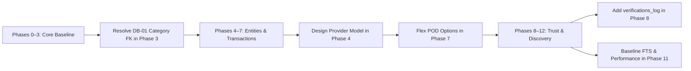

# WAYNAH — BUILD CONTRACT GAP REGISTER

> **نوع الوثيقة:** سجل الفجوات الفنية وعقد البناء الموحد لمشروع WAYNAH (`Build Contract Gap Register`).  
> **تاريخ الإصدار:** 1 أكتوبر 2026  
> **حالة السجل:** **`STATUS: READY WITH CONDITIONS`**  
> **المرجع الرئيسي:** [WAYNAH_IMPLEMENTATION_READINESS_REVIEW.md](file:///f:/waynah/docs/WAYNAH_IMPLEMENTATION_READINESS_REVIEW.md)  
> **العلامة البرمجية للمشروع:** `M.GH.AL` | **النطاق التجريبي المرجعي:** محافظة حجة – الجمهورية اليمنية.

---

## 1. Executive Summary & Audit Methodology (ملخص منهجية التدقيق)

يوثق هذا السجل جميع الفجوات والملاحظات والاشتراطات الفنية المكتشفة أثناء مراجعة جاهزية البناء والتنفيذ لمشروع WAYNAH. 

تم تصنيف كل بند وفق السلم المعياري لشدة الأثر (`Severity`) والتصنيف الهيكلي (`Classification`) لتحديد ما إذا كان يشكل مانعاً تنفذياً (`Blocking`) أم أنه قرار تصميمي مجدول قابل للتأجيل والتطوير المتدرج.

---

## 2. Complete Master Gap Register (سجل الفجوات الشامل)

| GAP ID | Area | Finding / Description | Evidence / Reference | Severity | Classification | Blocking? | Required Action / Recommended Decision |
| --- | --- | --- | --- | --- | --- | --- | --- |
| **`GAP-DB-01`** | Database Schema | إلزامية حقل التصنيف `categoryId` في جدول `Place` تمنع إدخال الأماكن المجردة قبل تصنيفها. | [schema.prisma](file:///f:/waynah/packages/database/prisma/schema.prisma#L93) (`categoryId String`) | **`MEDIUM`** | `DECISION REQUIRED` | **`NO`** | مراجعة إمكانية تحويل الحقل إلى اختياري `categoryId String?` أو اعتماد تصنيف افتراضي "Uncategorized" في منطق التطبيق قبل Phase 3. |
| **`GAP-DB-02`** | Database / Verification | نموذج `BusinessVerification` الحالي يحفظ الحالة الراهنة فقط دون سجل السيرة التوثيقية التراكمية. | [schema.prisma](file:///f:/waynah/packages/database/prisma/schema.prisma#L287-L301) | **`MEDIUM`** | `DESIGN GAP` | **`NO`** | الإبقاء على `BusinessVerification` كعرض للحالة الحالية وإضافة جدول `verifications_log` الإضافي في Phase 8 دون حذف البيانات. |
| **`GAP-DB-03`** | Domain Models | نموذج `Provider` غير موجود حالياً في `schema.prisma` ويلزم تصميمه في Phase 4 دون تقييده بشركة واحدة. | `LOGIC-004`, `Phase 4 Spec` | **`LOW`** | `LOCKED DEPENDENCY` | **`NO`** | صياغة schema الخاصة بـ `Provider` في Phase 4 لدعم العمل المستقل والعلاقة متعددة الشركات. |
| **`GAP-HID-01`** | Hidden Decision | مواصفات Phase 7 تشير لرمز OTP لإثبات التسليم كـ قرار حتمي. | `WAYNAH_BUILD_SPECIFICATION.md` (Phase 7) | **`INFORMATIONAL`** | `DEFER TO IMPLEMENTATION` | **`NO`** | اعتبار OTP خياراً تنفيذياً مرناً إلى جانب طرق التثبت الأخرى (QR, Photo, Pin Code) دون تجميده كقيد دومين. |
| **`GAP-HID-02`** | Queue Infra | تحديد محرك طوابير العمليات غير التزامنية بين PostgreSQL Queue و Redis/BullMQ. | `TOQ-01`, `Phase 9 Spec` | **`INFORMATIONAL`** | `DEFER TO IMPLEMENTATION` | **`NO`** | الاعتماد المبدئي على PostgreSQL-backed queue لتقليل البنية التحتية وتأجيل Redis لحين الحاجة الفعلية. |
| **`GAP-HID-03`** | Search Engine | استراتيجية محرك البحث النصي العربي `tsvector` و `pg_trgm`. | `TOQ-04`, `Phase 11 Spec` | **`INFORMATIONAL`** | `DESIGN CANDIDATE` | **`NO`** | ضبط معاجم المعالجة اللغوية العربية والجذور في Phase 11 خاضعاً للتجربة والتعديل دون تعطيل البناء الأول. |
| **`GAP-HID-04`** | Performance Target | صياغة زمن استجابة البحث بأقل من `100ms` كشرط قبول قسري. | `WAYNAH_BUILD_SPECIFICATION.md` (Phase 11) | **`LOW`** | `OBSERVATION` | **`NO`** | توضيح أن `<100ms` هو هدف قياسي هندسي (`Engineering Performance Target`) يقاس بعد قياس حجم البيانات الفعلي. |
| **`GAP-GEO-01`** | Geography Authority | تأجيل مطابقة الحدود الإدارية بـ `ST_Covers` لحين استيراد OCHA Yemen COD-AB. | `GEOGRAPHIC_DATA_CONTRACT.md`, `ADR-002` | **`LOW`** | `FACT` | **`NO`** | الاعتماد التام على استعلام `nearest-Place` النقطي حالياً ومنع اختراع أي fallback صامت يغير السلطة الإدارية. |
| **`GAP-FIN-01`** | Payment Boundary | ضمان عدم معاملة WAYNAH كجهة مالية أو بوابة دفع في الكود المستقبل. | `LOGIC-006`, `ADR-005` | **`INFORMATIONAL`** | `LOCKED DEPENDENCY` | **`NO`** | تتبع حالات الدفع منطقياً (COD / External) وتجنب ربط أي منطق تشغيلي ببوابات دفع إلزامية. |

---

## 3. Classification Definitions (تعريف التصنيفات)

* **`FACT`**: حقيقة فنية أو واقع موجود في مستودع المشروع أو وثائق الجغرافيا.
* **`LOCKED DEPENDENCY`**: متطلب دومين مقفل يوجه التصميم التقني بشكل حتمي.
* **`OBSERVATION`**: ملاحظة هندسية لتوضيح المفاهيم وتجنب الخلط.
* **`DESIGN CANDIDATE`**: خيار فني موصى به قابل للمراجعة والتطوير أثناء التنفيذ.
* **`SPECIALIST REQUIRED`**: موضوع يتطلب صياغة سياسات قانونية أو تشغيلية أو مالية مع إطلاق المنصة.
* **`DEFER TO IMPLEMENTATION`**: قرار تفصيلي مؤجل لمرونة التطوير البرمجي دون تعطيل مرحلة البناء الحالية.
* **`DECISION REQUIRED`**: فجوة تتطلب قراراً تصميمياً غير عائق قبل تنفيذ المرحلة المتعلقة بها.
* **`CONFLICT`**: تعارض بين وثيقتين مقفلتين (سجل المشروع الحالي: **0 تعارضات**).

---

## 4. Action Plan for Non-Blocking Gaps (خطة المعالجة المجدولة)



---

```text
================================================================================
END OF BUILD CONTRACT GAP REGISTER
DOCUMENT STATUS: READY WITH CONDITIONS
================================================================================
```
