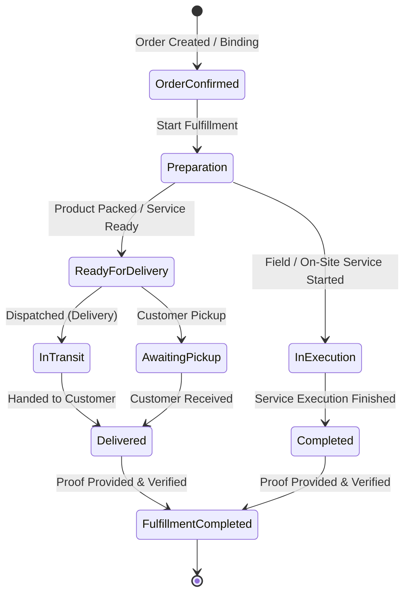
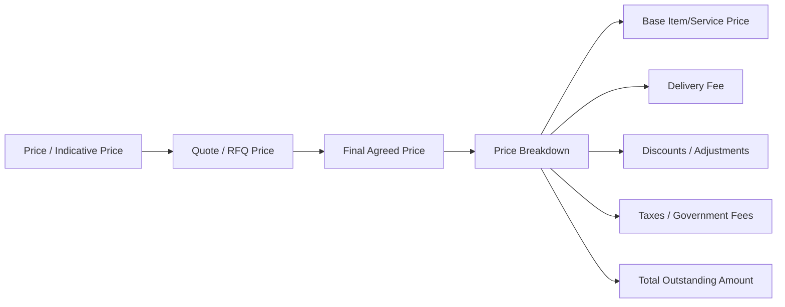
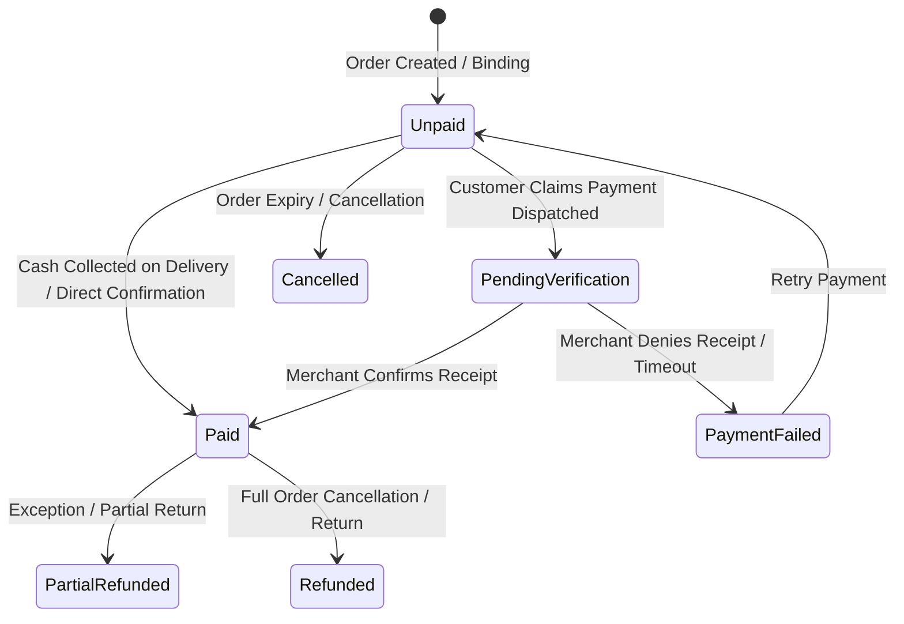

# WAYNAH-LOGIC-006: Combined Fulfillment / Delivery Execution & Money / Payments Domain Logic Study

> **رمز الدراسة:** `WAYNAH-LOGIC-006`  
> **عنوان الدراسة:** دراسة المجال المنطقية المركبة لتنفيذ الوفاء والتسليم والمبالغ والمدفوعات (`Fulfillment / Delivery Execution + Money / Payments`).  
> **حالة الوثيقة الفعلية:** **`STATUS: STUDY COMPLETED (PENDING REVIEW & DECISION SESSION)`**  
> **تاريخ الإنشاء:** 1 أكتوبر 2026  
> **العلامة البرمجية للمشروع:** `M.GH.AL` | **النطاق التجريبي المرجعي:** محافظة حجة – الجمهورية اليمنية.  
> **الاعتمادات المقفلة:** `LOGIC-001` (المبادئ الحاكمة)، `LOGIC-002` (الأنشطة والنماذج الـ 41)، `LOGIC-003` (الرحلات العشر A–J)، `LOGIC-004` (تفكيك الكيانات الخمسة)، `LOGIC-005` (المنتج والكتالوج والطلبات والحجوزات).

---

## 1. Executive Summary & Domain Scope (الملخص التنفيذي ونطاق الدراسة)

تُغطي هذه الدراسة مرحلة **ما بعد الالتزام (Post-Commitment Lifecycle)** في منصة WAYNAH. وتبدأ هذه المرحلة بمجرد إنشاء تعهد تشغيلي أو مالي ملزم (`Booking` أو `Order`) وتنتهي بالوفاء الشامل والتسليم النهائي واستيفاء المستحقات المالية وإغلاق المعاملة أو التعامل مع الاستثناءات والتسويات عند الفشل.

تتعامل الوثيقة مع تحديات الواقع التشغيلي اليمني، حيث تنعدم البنية التحتية القياسية لشركات التوصيل السريع، وتغلب المدفوعات النقدية عند الاستلام (`Cash on Delivery`) أو التحويلات عبر المحافظ الرقمية المحلية والصرافين، مع انتشار الخدمات الميدانية والمحلات الصغيرة والتنفيذ في الموقع.

### الأهداف الأساسية لـ LOGIC-006:
1. **تفكيك مفهوم الوفاء (`Fulfillment`):** التمييز الصارم بين الوفاء والتسليم (`Delivery`)، وتحديد أنماط التنفيذ (ذاتي، موفر محلي، طرف ثالث، استلام الزبون، تنفيذ ميداني/عن بُعد).
2. **تحديد حدود المسؤولية والأدلة التشغيلية:** من المسؤول عن الوفاء؟ متى يبدأ ومتى ينتهي؟ وكيف يتم إثبات الاكتمال (`Completion Evidence`)؟
3. **التأطير المنطقي للمبالغ والمدفوعات (`Money / Payments`):** تتبع الدورة المالية من السعر التقديري (`Indicative Price`) والعرض (`Quote`) إلى السعر النهائي (`Final Price`)، الرسوم (`Fees`)، الخصومات، وحالات الدفع والتسوية.
4. **تحديد دور المنصة المالي:** تأكيد موقف WAYNAH كمنصة تمكين ودليل ومحرك معاملات تواصل/تنسيق وليست طرفاً مالياً مقتطعاً أو بنكاً إلا وفق ما يحدده المختص المالي والقانوني (`SPECIALIST REQUIRED`).
5. **الالتزام بالتجرد التقني:** عدم اختراع بوابات دفع، API، Database Schemas، أو Prisma Models.

---

## 2. Evidence Discipline & System Conventions (انضباط الأدلة والأعراف)

تلتزم جميع فقارات هذه الدراسة بترميز الأدلة والمفاهيم بدقة:

* **`FACT`**: حقيقة واقعية مثبتة في بيئة العمل اليمنية أو في هندسة الأنظمة.
* **`LOCKED DEPENDENCY`**: قرار مقفل مسبقاً من `LOGIC-001` إلى `LOGIC-005`.
* **`OBSERVATION`**: ملاحظة ميدانية أو تشغيلية ناتجة عن دراسة النماذج الـ 41.
* **`WORKING HYPOTHESIS`**: فرضية عمل منطقية خاضعة للاختبار والتثبت.
* **`DESIGN CANDIDATE`**: خيار تصميمي مرشح للمفاضلة.
* **`SPECIALIST REQUIRED`**: مسألة قانونية أو مالية أو تنظيمية تتطلب مختصاً.
* **`DEFER TO IMPLEMENTATION`**: تفصيل برمجي أو تقني مؤجل لمرحلة البناء.
* **`DECISION REQUIRED`**: قرار ينبغي حسمه في جلسة القرار (Decision Session).
* **`OPEN QUESTION`**: سؤال مفتوح موثق بـ OQ ID.

---

## 3. Locked Dependencies Verification (التحقق من الاعتمادات المقفولة)

* `Place ≠ Business ≠ Provider ≠ Service ≠ Product` **`[LOCKED DEPENDENCY — LOGIC-004]`**.
* `Business` هو المالك المنطقي والتجاري الأساسي للخدمة والمنتج والكتالوج، و `Branch` مستوى إتاحة تشغيلي اختياري **`[LOCKED DEPENDENCY — OQ-24 / LOGIC-004 / LOGIC-005]`**.
* `Inquiry` للاستعلام، `Request` للطلب المباشر للخدمات المعيارية، `RFQ` للمسار التفاوضي غير المعياري **`[LOCKED DEPENDENCY — OQ-11 / LOGIC-005]`**.
* `Booking` تعهد زماني/خدمي فرعي، و `Order` تعهد مالي/تشغيلي ملزم **`[LOCKED DEPENDENCY — LOGIC-005]`**.
* الرحلات الرئيسية العشر (Journeys A–J) متطابقة تماماً مع `LOGIC-003` و `LOGIC-005` **`[LOCKED DEPENDENCY — LOGIC-003]`**.
  * `Journey G` = Fulfillment / Delivery Execution.
  * `Journey I` = Remote / Digital / Remote Service.

---

## 4. Part I: Fulfillment / Delivery Execution (الوفاء وتنفيذ التسليم)

### 4.1 ما معنى الوفاء (`Fulfillment`) داخل WAYNAH؟
**`[DESIGN CANDIDATE — DOMAIN LOGIC]`**  
الوفاء (`Fulfillment`) في WAYNAH هو **مجموعة العمليات والأنشطة التشغيلية والميدانية أو الرقمية التي يقدمها الموفر (`Provider` / `Business`) أو ينفذها الطرف الثالث لإنجاز التعهد وإيصال المنافع الموعودة في الـ `Order` أو `Booking` إلى المستخدم (`Customer`) بالمواصفات المتفق عليها.**

#### الفرق الجوهري بين الوفاء (`Fulfillment`) والتسليم (`Delivery`):
* **`Fulfillment` (الوفاء الشامل):** المظلة التشغيلية الكبرى. يشمل تجهيز المنتج، التعبئة، تغليف الطلب، تنفيذ الخدمة الميدانية، تأدية الخدمة بالحضور، أو إرسال الملف الرقمي، بالإصافة إلى النقل والتسليم إن وجد.
* **`Delivery` (التسليم/النقل):** حركة النقل المادي أو اللوجستي للمنتج أو معدات الخدمة من نقطة البداية (المحل/الفرع/المنزل) إلى موقع المستخدم (`Customer Location` / `Place`). التسليم هو جزء فرعي محتمل من الوفاء وليس الوفاء كله.

### 4.2 دورة حياة الوفاء (Start & End Boundaries)
**`[DESIGN CANDIDATE — DOMAIN LOGIC]`**



* **متى يبدأ الوفاء؟** يبدأ لحظة تأكيد الـ `Order` أو تثبيت الـ `Booking` وتحوله إلى تعهد فعال (`CONFIRMED / ACCEPTED`).
* **متى ينتهي الوفاء؟** ينتهي لحظة توفير دليل الاكتمال (`Completion Evidence`) واكتمال التسليم أو تأدية الخدمة بنجاح وانتقال حالة الوفاء إلى `FULFILLED / COMPLETED`.

---

### 4.3 أنماط الوفاء والتسليم المعتمدة في WAYNAH (Fulfillment & Delivery Modes)

**`[FACT / OBSERVATION — YEMEN REALITY]`**  
نظرًا لتنوع الأنشطة الـ 41 في اليمن، تعتمد المنظومة المنطقية 6 أنماط رئيسية للوفاء:

| نمط الوفاء | التسمية المفهومية | الوصف التشغيلي | النطاق الميداني في اليمن | الرحلات المرتبطة |
|---|---|---|---|---|
| **1. Customer Pickup** | استلام العميل بنفسه | يأتي الزبون بنفسه إلى موقع النشاط التجارية أو المحل أو المكان لإحراز المنتج أو الخدمة. | المطاعم، المخابز، الصيدليات، متاجر التجزئة. | Journey A, B, C |
| **2. Merchant Fulfillment** | توصيل الموفر الذاتي | يقوم صاحب العمل (`Business` / `Branch`) أو موظفه بنقل المنتج وتسليمه للمشتري مباشرة. | المطاعم الكبيرة، محلات المياه، تجار الجملة، المتاجر ذات سيارات التوصيل. | Journey G |
| **3. Third-Party Delivery** | توصيل عبر سائق/طرف ثالث | إسناد عملية نقل المنتج إلى مندوب توصيل مستقل أو خدمة نقل خارجية غير مملوكة للموفر. | التوصيل بين المديريات، البضائع، سائق راكشة/دراجة موصل. | Journey G |
| **4. Mobile / Field Fulfillment** | تنفيذ ميداني في موقع الزبون | ينتقل الموفر أو مهندس الخدمة بـ معداته إلى مكان الزبون لتأدية الخدمة في الموقع. | الصيانة المنزلية، السباكة، الحلاقة المنزلية، الكشف الطبي المنزلي. | Journey D |
| **5. On-Site Service Execution** | تنفيذ الخدمة بمقر الموفر | حضور الزبون إلى مقر الخدمة واستهلاك الخدمة في المكان زمنيًا. | الفنادق، صالونات التجميل، العيادات، الورش. | Journey C, F |
| **6. Remote / Digital Fulfillment** | وفاء رقمي / عن بُعد | تأدية الخدمة أو تسليم المخرج بدون تواجد جغرافي مادي، عبر وسائل الاتصال الرقمي. | الاستشارات القانونية/الطبية عبر الهاتف، التصميم، البرمجة. | Journey I |

---

### 4.4 حدود المسؤولية وإثبات الاكتمال (Responsibility Boundaries & Completion Evidence)

#### من المسؤول عن الوفاء؟
* **`Business` / `Provider`**: هو المسؤول الأول والأساسي أمام المستخدم عن سلامة المنتج أو جودة الخدمة والمواصفات المتفق عليها **`[LOCKED DEPENDENCY — OQ-24]`**.
* **`Delivery Actor` (سائق/ناقل)**: مسؤول عن السلامة الفيزيائية للبضاعة أثناء النقل والالتزام بالوقت والموقع الممتد بين الاستلام والتسليم.

#### ماذا يحدث عند عدم وجود Delivery؟
في الأنماط التي لا تتطلب توصيلاً ماديًا (Customer Pickup, On-Site Service, Remote Service)، تنعدم مرحلة النقل المادي (`In Transit`)، وتنتقل العملية مباشرة من التجهيز (`Ready`) إلى التنفيذ والاستلام المباشر.

#### إثبات الاكتمال (`Completion Evidence`):
**`[DESIGN CANDIDATE — DOMAIN LOGIC]`**  
يتطلب إغلاق الـ Fulfillment دليلاً منطقياً يثبت التسليم أو تأدية الخدمة:
1. **رمز تأكيد رقمي (OTP / Verification Code):** يشاركه العميل مع الموصل أو الموفر عند التسليم.
2. **تأكيد المستخدم المباشر (`Customer Confirmation`):** نائم/نشط عبر التطبيق أو الرسالة.
3. **صورة إثبات التسليم / الإنجاز (`Photo Proof / Document`):** صورة المنتج المسلم، أو صورة تقرير الصيانة الموقع، أو سند الاستلام اليدوي.
4. **تأكيد الموفر الإيجابي مع مهلة الاعتراض (`Auto-Completion Window`):** إقرار الموفر بالتسليم مع منح العميل مهلة زمنية محددة للاعتراض قبل الانتهاء الآلي.

---

### 4.5 الاستثناءات التشغيلية أثناء الوفاء (Fulfillment Exceptions)

#### 1. فشل التسليم (`Delivery Failure`):
* **عدم تواجد العميل / إغلاق الهاتف:** يعود المنتج للموفر، وتُسجل حالة `DELIVERY_FAILED_CUSTOMER_UNREACHABLE`.
* **خطأ العنوان الجغرافي:** إذا كان الموصل خارج نطاق `nearest-Place` المعرف، يتم الإبلاغ عن تعارض جغرافي.

#### 2. الوفاء الجزئي (`Partial Fulfillment`):
* يحدث عند توفر جزء من المنتجات المطلوبة في الـ `Order` وعدم توفر الجزء الآخر لدى الموفر.
* **المنطق المعتمد:** لا يتم تعديل الـ `Order` تلقائياً، بل يُتاح للمستخدم خياران مفاهيميان:
  أ) قبول الوفاء الجزئي مع تعديل السعر المالي والتكلفة المتبقية (`Partial Order Adjustment`).  
  ب) إلغاء الطلب كاملاً وإعادته لحالة الاستثناء.

#### 3. عدم توفر المنتج/الخدمة والبدائل (`Unavailable Product/Service & Substitution`):
* **`Substitution Logic`**: لا يحق للموفر استبدال أي منتج أو خدمة بمنتج آخر تلقائياً دون موافقة العميل الصريحة.
* **إجراء الاستبدال:** يقترح الموفر البديل (`Proposed Substitution`) بصفاته وسعره، ولا يصبح التعديل نافذاً إلا بعد تأكيد العميل (`Customer Acceptance`).

---

## 5. Part II: Money / Payments (المبالغ والمدفوعات)

### 5.1 الهيكلية المنطقية للقيم المالية في WAYNAH
**`[DESIGN CANDIDATE — DOMAIN LOGIC]`**

لا تبتكر المنظومة أي بوابات دفع أو معاملات بنكية محددة، بل تُحدد المفاهيم المنطقية للأسعار والمبالغ كالتالي:



1. **السعر المرجعي / التقديري (`Indicative Price`):** سعر استرشادي محدد على الخدمة أو المنتج قد يتغير حسب ظروف التنفيذ أو الكمية.
2. **عرض السعر (`Quote`):** السعر التفاوضي المحدد المقدم من الموفر رداً على طلب RFQ في **Journey E**.
3. **السعر النهائي المتفق عليه (`Final Price`):** السعر الملزم للطرفين عند تأكيد الـ `Order` أو الـ `Booking`.
4. **رسوم التوصيل (`Delivery Fee`):** تكلفة خدمة النقل والتوصيل (منفصلة منطقياً عن سعر المنتج/الخدمة الأصلية).
5. **الخصومات والتعديلات (`Discounts & Adjustments`):** التخفيضات المعتمدة أو الفروقات الناتجة عن الوفاء الجزئي.
6. **الضرائب والرسوم الحكومية (`Taxes & Regulatory Fees`):** مبالغ نظامية محتملة تضاف وفق القوانين النافذة `[SPECIALIST REQUIRED — TAX & LEGAL]`.
7. **المبلغ المستحق الإجمالي (`Outstanding Amount`):** المبلغ المالي الصافي الإجمالي المطلوب سداده من المشتري إلى الموفر/الناقل.

---

### 5.2 دور المنصة المالي (WAYNAH Financial Position)

**`[SPECIALIST REQUIRED — FINANCIAL & LEGAL]`**  
**`[DESIGN CANDIDATE — DOMAIN LOGIC]`**

* **طبيعة منصة WAYNAH:** WAYNAH في أصلها المفاهيمي هي **دليل وأداة تمكين تشغيلية وتواصلية وتنسيقية (`Directory & Operational Facilitator`)** تربط بين المستخدمين والموفرين والأماكن.
* **هل WAYNAH طرف مالي مباشر؟**
  * المنصة **ليست بنكاً ولا محفظة مالية ولا طرفاً مستلماً للأموال افتراضياً** في التعاملات العادية.
  * في المعاملات المالية النقدية أو التحويلات الخارجية المباشرة، المعاملة المالية تتم **مباشرة بين الزبون والموفر أو الناقل** (`Direct Customer-to-Merchant Payment`).
  * في حال إضافة خدمات دفع إلكتروني أو ضمان مالي (`Escrow`) مستقبلاً، يجب أن يتم ذلك عبر شريك مالي مرخص، ووفق دراسة قانونية ومالية مستقلة `[SPECIALIST REQUIRED — FINANCIAL REGS]`.

---

### 5.3 حالات ودورة حياة الدفع (Payment Status Lifecycle)

**`[DESIGN CANDIDATE — DOMAIN LOGIC]`**

تُدار حالة الدفع (`Payment Status`) بشكل مستقل منطقياً عن حالة الوفاء (`Fulfillment Status`) ولكنها مرتبطة بالـ `Order`:



#### الحالات المنطقية لدورة الدفع:
1. **غير مدفوع (`UNPAID`):** الالتزام نشأ ولكن لم يتم استلام أي مبلغ بعد (الوضع الافتراضي عند إنشاء الطلب).
2. **قيد التثبت (`PENDING_VERIFICATION`):** في التحويلات الخارجية أو المحافظ، عندما يدعي الزبون إرسال المبلغ وينتظر تأكيد الموفر.
3. **مدفوع (`PAID`):** تأكيد استلام المبلغ بالكامل من قبل الموفر أو الناقل.
4. **فشل الدفع (`PAYMENT_FAILED`):** رفض عملية التحويل أو عدم مطابقة الإشعار أو التراجع.
5. **مسترد جزئياً (`PARTIALLY_REFUNDED`):** إعادة جزء من المبلغ للزبون نتيجة وفاء جزئي أو تعديل.
6. **مسترد بالكامل (`REFUNDED`):** إلغاء المعاملة وإعادة المبلغ كاملاً للعميل.

---

### 5.4 التعامل مع المدفوعات الخارجية والنقدية (Cash & External Transactions)

**`[FACT / OBSERVATION — YEMEN REALITY]`**  
تعتمد الغالبية العظمى من المعاملات في اليمن على الدفع النقدي عند الاستلام (`Cash on Delivery - COD`) أو التحويل عبر شبكات الصرافة المحلية والمحافظ الرقمية (مثل جوالي، كاش، فلوسك، موني، إلخ).

#### القواعد المنطقية للتعاملات الخارجية النقدية والإلكترونية:
1. **الاستلام النقدي عند التسليم (`COD`):**
   * الناقل أو الموفر هو المسؤول عن تحصيل المبلغ النقدي عند التسليم.
   * إثبات التسليم المقترن بالسداد يتحول إلى حالة `PAID` بإقرار الناقل/الموفر.
2. **التحويلات الخارجية عبر المحافظ/الصرافة (`External Transfers`):**
   * تعتبر المنصة الشفرة الرقمية أو الإشعار المدخل من المستخدم بمثابة `Payment Intent / Claim`.
   * لا تعتمد المنصة المعاملة كـ `PAID` إلا بعد **تأكيد الموفر الإيجابي** بـ استلام الإشعار في حسابه المالي المباشر.
   * إخلاء مسؤولية المنصة: المنصة لا تتحمل مسؤولية صحة إشعارات التحويل الخارجي، وتترك التحقق المالي الصريح للموفر `[SPECIALIST REQUIRED — LEGAL]`.

---

### 5.5 المعالجات المالية عند الإلغاء والفشل (Cancellation, Refund & Adjustments)

#### 1. نجاح الدفع وفشل الوفاء (`Paid + Failed Fulfillment`):
إذا تم دفع المبلغ مسبقاً وفشل الموفر في الوفاء بالطلب أو الخدمة:
* **التزام إعادة المبلغ (`Refund Obligation`):** يلتزم الموفر بإعادة المبلغ كاملاً للمستخدم.
* **تسجيل النزاع (`Financial Dispute`):** في حال امتنوع الموفر عن الإعادة، تُسجل حالة نزاع مالي وتنتقل للمعالجة التشغيلية/الإدارية.

#### 2. الإلغاء والجزاءات المالية (`Cancellation Penalties & Fees`):
* تطبيقاً لقرار **`OQ-27`** المقفل: حقوق الإلغاء مكفولة مفاهيمياً للطرفين.
* قواعد سياسات الغرامات، وساعات الإلغاء المجاني، والتعويضات عن قطع الغيار أو التجهيز المسبق تحال صراحة لـ **`SPECIALIST REQUIRED (LEGAL & OPS)`** لتحديد القواعد القانونية والتجارية للمنصة.

---

## 6. Open Questions Registry for LOGIC-006 (سجل الأسئلة المفتوحة الجديد)

تستحدث هذه الدراسة الأسئلة المفتوحة التالية والمترتبة على أحكام الوفاء والمدفوعات:

| رمز السؤال | موضوع المسألة | التصنيف المبدئي | الوصف والتبعات |
|---|---|---|---|
| **`OQ-28`** | Proof of Delivery Dispute Resolution | **`SPECIALIST REQUIRED (LEGAL & OPS)`** | البروتوكول الإداري والقانوني عند ادعاء العميل عدم الاستلام رغم تقديم الموصل/الموفر لرمز تأكيد أو صورة إثبات. |
| **`OQ-29`** | External Payment Voucher Verification Logic | **`DEFER TO IMPLEMENTATION`** | الخوارزمية والشفرة البرمجية لقراءة أو فحص مطابقة إشعارات التحويل الرقمي المحول الخارجية. |
| **`OQ-30`** | Partial Delivery Return & Restocking Rules | **`SPECIALIST REQUIRED (COMMERCIAL)`** | الضوابط التجارية لإعادة المنتجات غير التالفة عند الوفاء الجزئي وتحديد من يتحمل تكلفة التوصيل المرجعي. |
| **`OQ-31`** | Multi-Item Order Multi-Merchant Fulfillment Boundary | **`OPEN QUESTION | HIGH`** | هل يصح منطقياً تضمين منتجات من عدة `Business` مختلفين في `Order` واحد وتجزئة الوفاء أم يتطلب كل `Business` طلب `Order` مستقل؟ |
| **`OQ-32`** | Currency Volatility & Exchange Rate Discrepancies | **`SPECIALIST REQUIRED (FINANCIAL & YEMEN CONTEXT)`** | معالجة فروقات العملة المحلية (تعدد أشكال الريال اليمني) وتغيرات أسعار الصرف بين لحظة الطلب ولحظة الوفاء والدفع. |

---

## 7. Operational & Conceptual Integrity Verification (فحص النزاهة والاتساق)

1. **الربط مع LOGIC-004 و LOGIC-005:**  
   تلتزم الدراسة تماماً بأن `Business` هو المالك المنطقي والتجاري للـ Order والوفاء، وأن `Branch` هو نقطة الاستلام أو الانطلاق المادية الاختيارية.
2. **الربط مع الرحلات A–J:**  
   تُغطي الدراسة الرحلة G (Delivery Execution) والرحلة I (Remote Service Fulfillment) دون ادعاء خلق رحلات جديدة.
3. **التجرد التقني:**  
   لم تذكر الوثيقة أي جداول Prisma أو REST API Endpoints أو بوابات دفع إلكترونية (مثل Stripe أو PayPal)، بل حافظت على التفكيك المفاهيمي المنطقي.

---

```text
================================================================================
STATUS: LOGIC-006 STUDY COMPLETED (PENDING FORMAL REVIEW & DECISION SESSION)
================================================================================
```
