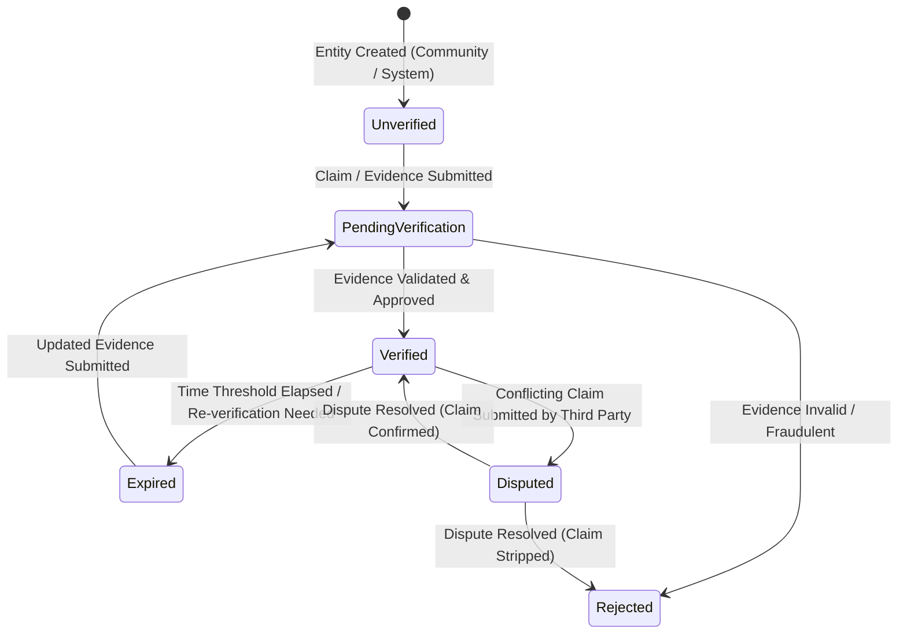
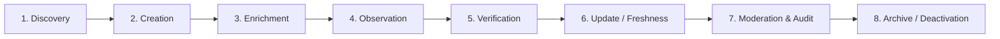

# WAYNAH-LOGIC-007: Combined Trust / Verification & Data / Operations Domain Logic Study

> **رمز الدراسة:** `WAYNAH-LOGIC-007`  
> **عنوان الدراسة:** دراسة المجال المنطقية المركبة لنظام الثقة والتحقق وإدارة البيانات والعمليات التشغيلية (`Trust / Verification + Data / Operations`).  
> **حالة الوثيقة الفعلية:** **`STATUS: STUDY COMPLETED (PENDING REVIEW & DECISION SESSION)`**  
> **تاريخ الإنشاء:** 1 أكتوبر 2026  
> **العلامة البرمجية للمشروع:** `M.GH.AL` | **النطاق التجريبي المرجعي:** محافظة حجة – الجمهورية اليمنية.  
> **الاعتمادات المقفلة:** `LOGIC-001` إلى `LOGIC-006`.

---

## 1. Executive Summary & Domain Scope (الملخص التنفيذي ونطاق الدراسة)

تُعالج هذه الدراسة الركائز الثلاث الحاكمة لجودة واستدامة وموثوقية منصة WAYNAH:
1. **نظام الثقة والتحقق (`Trust & Verification System`):** بناء الموثوقية الشاملة في البيانات والكيانات دون خلط بين التحقق التوثيقي (`Verification`) والموثوقية المتراكمة (`Trust`) ورصد الواقع (`Observation`) وتجربة المستخدمين (`Review`).
2. **إدارة دورة حياة البيانات (`Data Lifecycle Management`):** من الاكتشاف والإنشاء إلى الإثراء والرصد والتحقق والتحديث والإنعاش (`Freshness`) والأرشفة.
3. **العمليات التشغيلية وضبط الجودة (`Operations & Quality Assurance`):** التعامل مع البيانات المتقادمة، السجلات الناقصة، المحلات المغلقة، الموفرين الخاملين، كشف التكرار، والتحكيم الإداري.

---

## 2. Evidence Discipline & Locked Dependencies (الأدلة والاعتمادات المقفولة)

### الاعتمادات المقفولة المباشرة:
* `Observation ≠ Review` **`[LOCKED DEPENDENCY — LOGIC-001 / LOGIC-004]`**.
* `Business Verification ≠ Observation Confidence` **`[LOCKED DEPENDENCY — LOGIC-004]`**.
* `Place Trust` منفصل منطقياً عن `Business Ownership Verification` **`[LOCKED DEPENDENCY — LOGIC-004]`**.
* `Place ≠ Business ≠ Provider ≠ Service ≠ Product` **`[LOCKED DEPENDENCY — LOGIC-004]`**.
* التراخيص الرسمية في اليمن (مثل تراخيص البلديات أو وزارة التجارة) قد تتواجد لدى `Business` ولكنها قد تنعدم لدى المحلات الصغيرة أو الموفرين المستقلين، مما يتطلب تدرجاً منطقياً في التحقق دون إقصاء للأعمال الواقعية **`[FACT / YEMEN REALITY — LOGIC-002]`**.

---

## 3. Part I: Trust & Verification Architecture (منظومة الثقة والتحقق)

### 3.1 التفكيك الرباعي الإلزامي: (Verification vs Trust vs Observation vs Review)

تفرض منصة WAYNAH تمييزاً صارماً بين المفاهيم الأربعة لمنع أي تداخل بياناتي أو منطقي:

```mermaid
graph TD
    subgraph QuadConcept ["التفكيك المفاهيمي الرباعي"]
        V[1. Verification - التحقق الرسمية/التوثيقي] -->|يجيب على| V_Q["هل الكيان واقعي وصاحب ادعاء الملكية موثق؟"]
        T[2. Trust - مؤشر الثقة والموثوقية] -->|يجيب على| T_Q["ما مدى موثوقية واكتمال وحداثة بيانات الكيان؟"]
        O[3. Observation - رصد الواقع الميداني] -->|يجيب على| O_Q["ماذا رصد المساهمون في المكان واقعياً؟"]
        R[4. Review - تجربة واشتراطات المستخدم] -->|يجيب على| R_Q["كيف يقيم الزبون تجربته وانطباعه الشخصي؟"]
    end
end
```

#### التحديد الواضح لمجالات المنظومة:
1. **ما الذي يتم التحقق منه (`What is Verified?`)**:
   * **إثبات الملكية (`Business Claim & Ownership`):** التثبت من أن مدعي ملكية النشاط التجاري هو المالك الحقيقي أو الممثل المخول.
   * **وجود المكان الجغرافي (`Place Existence`):** التثبت من الوجود المادي الحقيقي للمكان في الواقع.
   * **بيانات التواصل (`Contact Verification`):** التثبت من صحة أرقام الهواتف ووسائل الاتصال.
   * **هوية الموفر (`Provider Identity`):** التثبت من الهوية الشخصية للموفر المستقل أو المهندس.
2. **ما الذي يتم قياس الثقة فيه (`What is Measured for Trust?`)**:
   * **ثقة المكان (`Place Trust`):** دقة الإحداثيات، استقرار الوجود المادي، وتعدد الرصد المتوافق.
   * **ثقة النشاط التجاري (`Business Trust`):** حالة التحقق من الملكية، اكتمال بيانات الكتالوج، وحداثة الأسعار.
   * **ثقة الموفر (`Provider Trust`):** الموثوقية التشغيلية، تاريخ الالتزام بالحجوزات، والمؤهلات التخصصية.
   * **ثقة المعلومة والمنتج (`Product/Information Confidence`):** درجة اكتمال مواصفات المنتج وحداثة تسعيره.
   * **ثقة الرصد الميداني (`Observation Confidence`):** موثوقية الراد الكاشف بناء على تاريخ مساهماته السابقة.
3. **ما الذي يعبر عن تجربة المستخدم (`What Expresses User Experience?`)**:
   * **التقييم والمراجعة (`Review & Rating`):** الانطباع الشخصي للزبون بعد استهلاك الخدمة أو شراء المنتج ضمن **Journeys A–J** (يشمل التقييم العددي، التعليق الوصفي، وتقييم جودة التعامل والمعاملة).

---

### 3.2 مستويات وحالات التحقق (Verification Status & Evidence)

**`[DESIGN CANDIDATE — DOMAIN LOGIC]`**

تُحدد المنظومة المنطقية الحالات المنطقية لدورة التحقق (`Verification Status`):



#### الأدلة المنطقية للتحقق (`Verification Evidence`):
1. **الأدلة الرسمية/القانونية:** السجل التجاري، الترخيص البلدي، البطاقة الشخصية، عقد الإيجار.
2. **الأدلة التشغيلية الميدانية:** إشعار الاتصال الهاتفي المُفعل، صور اليافطة الخارجية مع المعالم المجاورة، أو زيارة جامع البيانات الميداني (`Field Collector`).
3. **الأدلة الرقمية:** تأكيد رمز OTP عبر رقم الهاتف المرتبط مباشرة بالنشاط التجاري.

---

## 4. Part II: Data & Operations Lifecycle (دورة حياة البيانات والتشغيل)

### 4.1 مراحل دورة حياة البيانات (Data Lifecycle)

تخضع جميع سجلات الكيانات (`Place`, `Business`, `Provider`, `Service`, `Product`) لدورة حياة تشغيلية محددة:



1. **الاكتشاف (`Discovery`):** رصد وجود مكان أو نشاط جديد عبر المسح الميداني، إدخال المستخدم، أو البيانات الجغرافية العامة.
2. **الإنشاء (`Creation`):** تسجيل الكيان في المستوى الأدنى من التوثيق (`Unverified / Draft`).
3. **الإثراء (`Enrichment`):** إضافة التفاصيل (ساعات العمل، الخدمات، الصور، الكتالوج).
4. **الرصد الميداني (`Observation`):** تسجيل ملاحظات المجتمع والتجارب الواقعية المستمرة حول حالة الكيان.
5. **التحقق (`Verification`):** رفع أدلة الملكية أو التثبت الجغرافي وتحديث حالة التوثيق.
6. **التحديث والتحديث الزمني (`Update & Freshness`):** ضمان حداثة البيانات وتحديد زمن آخر تأكيد (`Last Verified / Last Observed Timestamp`).
7. **الإشراف والتحكيم (`Moderation & Operational Audit`):** فحص البلاغات وتعارض البيانات والتعديلات غير المصرحة.
8. **الأرشفة والتعطيل (`Archive / Deactivation`):** تحويل الكيانات المغلقة نهائياً أو غير الفعالة إلى حالة المؤرشف لتسهيل البحث التاريخي دون إفساد نتائج الاكتشاف الفعال.

---

### 4.2 النزاهة وحداثة البيانات وتحديد التكرار (Data Freshness & Duplicate Logic)

#### 1. منطق حداثة البيانات (`Data Freshness`):
* **`Stale Data Logic`**: لا تُحذف البيانات القديمة تلقائياً، ولكن تتراجع مؤشرات الثقة (`Confidence Score`) للبيانات التي لم تُحدث لفترة زمنية طويلة (وفق المهلة المحددة تشغيلياً).
* **إشارة الإنعاش (`Freshness Signal`):** يتم إنعاش البيانات إما بتأكيد الموفر، أو بتعدد الرصد الميداني المتوافق من المستخدمين، أو بالمعاملات التشغيلية الناجحة.

#### 2. التكرار والدمج والتفكيك المفاهيمي (`Duplicate Detection, Merge & Split`):
* **التكرار المكانية/التجاري:** عند رصد مكانين أو نشاطين متطابقين في الموقع أو الاسم:
  * **الدمج المفهومي (`Conceptual Merge`):** تُدمج سجلات الرصد والمعلومات مع الحفاظ على الأصول التاريخية (`Data Provenance`).
  * **التفكيك المفهومي (`Conceptual Split`):** عند اكتشاف أن محلاً واحداً يستضيف نشاطين تجاريين مستقلين ملكية وتشغيلاً (مثل صيدلية داخل مستشفى أو بوفية داخل محطة).

---

### 4.3 الإشراف الميداني والنزاعات (Moderation & Ownership Disputes)

#### 1. نزاعات ادعاء الملكية (`Ownership Disputes`):
**`[SPECIALIST REQUIRED — LEGAL & OPS]`**
* عند تقديم شخصين ادعاءين متضاربين لملكية `Business` واحد:
  1. تنتقل حالة الملكية فوراً إلى `DISPUTED`.
  2. يُعلق الاستخدام الإداري للكتالوج والتعديلات حتى تقديم الأدلة الحسمية.
  3. تُحال القضية للتحكيم التشغيلي/القانوني للمنصة.

#### 2. تعديل وتدقيق مراجعات المستخدمين (`Review Moderation`):
* المراجعة (`Review`) هي رأي الزبون الشخصي ولا يحق للموفر حذفها لمجرد أنها سلبية.
* البلاغات عن المراجعات المسيئة أو الوهمية تُعالج عبر الإشراف المادي (`Content Moderation`) بناءً على سياسات المحتوى النظامية.

---

## 5. Open Questions Registry for LOGIC-007 (سجل الأسئلة المفتوحة الجديد)

تستحدث هذه الدراسة الأسئلة المفتوحة التالية:

| رمز السؤال | موضوع المسألة | التصنيف المبدئي | الوصف والتبعات |
|---|---|---|---|
| **`OQ-33`** | Provider Identity Verification Protocol for Freelancers | **`SPECIALIST REQUIRED (OPS & LEGAL)`** | الشروط والإثباتات الدنيا المطلوبة للتحقق من هوية الموفرين الميدانيين الذين لا يمتلكون مقراً مادياً ثابتًا. |
| **`OQ-34`** | Automated Stale Data Confidence Decay Algorithm | **`DEFER TO IMPLEMENTATION`** | الخوارزمية والدالة البرمجية المسؤولة عن خفض مؤشر الثقة تدريجياً مع مرور الزمن على آخر تأكيد. |
| **`OQ-35`** | Review Moderation & Defamation Policy | **`SPECIALIST REQUIRED (LEGAL & REGULATORY)`** | الضوابط القانونية والأخلاقية لمعالجة بلاغات التشهير أو المراجعات الكاذبة ضد الأنشطة التجارية. |
| **`OQ-36`** | Multi-Source Observation Conflict Resolution Weighting | **`DEFER TO IMPLEMENTATION`** | الأوزان الرقمية المخصصة لمصادر الرصد المختلفة (موظف المنصة vs الموفر Verified vs المستخدم المستمر vs الزبون الجديد). |

---

## 6. Operational Integrity & Boundaries Check (فحص النزاهة والحدود)

* **الالتزام بالقرارات المقفلة:** لم تخل الدراسة بالقرارات المقفلة في LOGIC-001..006، وحافظت على التفكيك الصارم بين Place, Business, Provider, Service, Product.
* **التجرد التقني:** عدم كتابة أي كود أو Prisma Schemas أو Endpoints، واقتصار الوثيقة على المنطق التفكيكي المفهومي.

---

```text
================================================================================
STATUS: LOGIC-007 STUDY COMPLETED (PENDING FORMAL REVIEW & DECISION SESSION)
================================================================================
```
