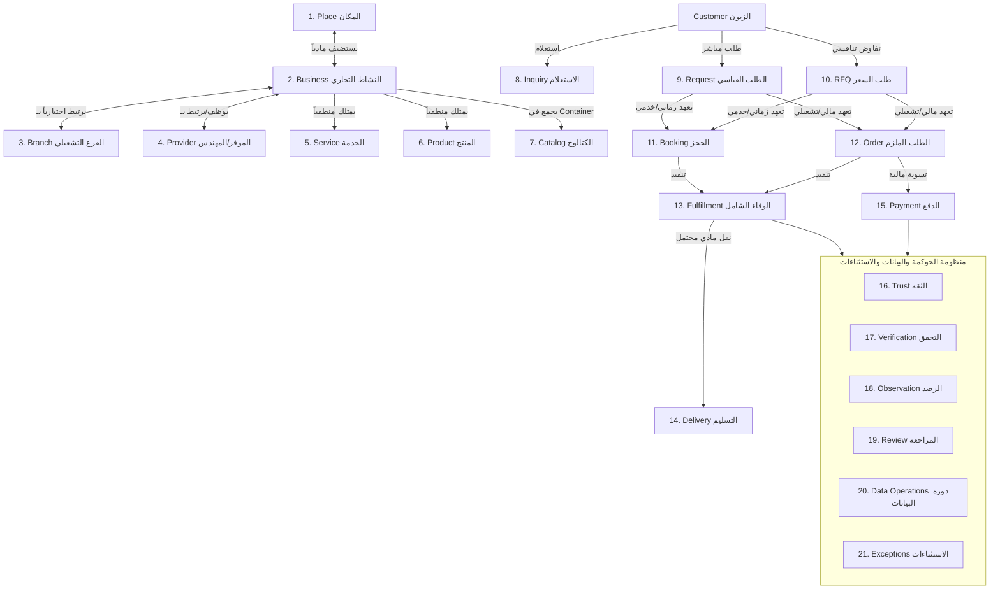
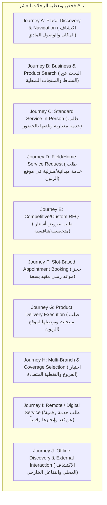

# WAYNAH-LOGIC-008: Exceptions & Unify Full Logic Domain Study

> **رمز الدراسة:** `WAYNAH-LOGIC-008`  
> **عنوان الدراسة:** دراسة المجال المنطقية المركبة للاستثناءات والربط الشامل للأنظمة (`Exceptions + Unify Full Logic`).  
> **حالة الوثيقة الفعلية:** **`STATUS: STUDY COMPLETED (PENDING REVIEW & DECISION SESSION)`**  
> **تاريخ الإنشاء:** 1 أكتوبر 2026  
> **العلامة البرمجية للمشروع:** `M.GH.AL` | **النطاق التجريبي المرجعي:** محافظة حجة – الجمهورية اليمنية.  
> **الاعتمادات المقفلة:** `LOGIC-001` إلى `LOGIC-007`.

---

## 1. Executive Summary & Domain Scope (الملخص التنفيذي ونطاق الدراسة)

تُعد دراسة `WAYNAH-LOGIC-008` المرحلة التاجية والاختبارية الشاملة لكامل المنظومة المنطقية لمشروع WAYNAH. تهدف هذه الوثيقة إلى:
1. **دراسة الاستثناءات والحالات غير المثالية (`Exceptions Taxonomy & Logic`):** تصنيف دقيق وشامل لجميع أشكال الفشل، التراجع، انقطاع التواصل، التعارضات الجغرافية، النزاعات المالية، وتغيرات حالات البيانات في البيئة اليمنية.
2. **الربط المنطقي الشامل (`Full Logic Unification`):** ربط كافة كيانات ومستويات المنظومة (22 مفهوماً ومجالاً) في عقدة واحدة متسقة بدون أي فجوات.
3. **اختبار الرحلات العشر (`Journeys A–J Verification`):** فحص سلوك المنظومة عبر الرحلات العشر المعتمدة للتأكد من تغطية نقاط الدخول، الفاعلين، الشروط المسبقة، الالتزام، الوفاء، الدفع، الاستثناءات، وحالات الخروج.

---

## 2. Part I: Comprehensive Exceptions Logic (تصنيف ومنطق الاستثناءات)

تُصنف المنظومة المنطقية لـ WAYNAH الاستثناءات إلى 6 عائلات استثنائية رئيسية:

```mermaid
graph TD
    subgraph ExceptionTaxonomy ["عائلات الاستثناءات الشاملة"]
        E1[1. Transaction Exceptions - استثناءات المعاملات]
        E2[2. Fulfillment & Delivery Exceptions - استثناءات الوفاء والتسليم]
        E3[3. Financial & Payment Exceptions - استثناءات المدفوعات والمبالغ]
        E4[4. Geographic & Coverage Exceptions - استثناءات الجغرافيا والتغطية]
        E5[5. Entity & Operational Status Exceptions - استثناءات الكيانات والتشغيل]
        E6[6. Trust, Data & Moderation Exceptions - استثناءات الثقة والبيانات والإشراف]
    end
end
```

### 2.1 التفكيك التفصيلي لعائلات الاستثناءات والمنطق المعالج

#### 1. استثناءات المعاملات والتفاعل (`Transaction & Interaction Exceptions`):
* **Cancellation (الإلغاء):** إلغاء الطلب/الحجز بواسطة العميل أو الموفر قبل أو بعد الاعتماد (مع مرجعية `OQ-27` في تحديد الجزاءات المالية عبر المختص).
* **Rejection (الرفض):** رفض الموفر لطلب `Request` أو `RFQ` لعدم القدرة التشغيلية أو السعرية.
* **Timeout / Expiry (انقضاء المهلة الزمني):** انتهاء نافذة صلاحية عرض RFQ دون استجابة العميل (`OQ-26`)، أو عدم رد الموفر على الطلب خلال الوقت المحدد.
* **No Response / User Abandonment (عدم الرد والتخلي):** انسحاب المستخدم أو الموفر في منتصف المحادثة أو التعهد.

#### 2. استثناءات الوفاء والتسليم (`Fulfillment & Delivery Exceptions`):
* **Delivery Failure / Customer Unreachable (فشل التسليم):** عدم تواجد العميل في الموقع أو إغلاق الهاتف عند وصول الناقل.
* **Partial Fulfillment (الوفاء الجزئي):** عدم توفر جزء من طلب المنتجات لدى الموفر وتعديل Order **`[LOGIC-006]`**.
* **Unavailable Product/Service & Substitution (عدم التوفر والبدائل):** نفاد المخزون واقتراح بدائل تتطلب موافقة صريحة من الزبون.
* **Service Execution Failure (فشل تأدية الخدمة):** عجز الموفر الميداني عن إنهاء الصيانة أو تقديم الخدمة الفنية بالمواصفات المتفق عليها.

#### 3. استثناءات المدفوعات والمالية (`Financial & Payment Exceptions`):
* **Payment Failure (فشل الدفع):** رفض العملية الرقمية أو عدم التثبت من إشعار التحويل الخارجي.
* **Refund Disagreements (نزاعات الاسترداد):** امتناع الموفر عن إعادة المبلغ بعد فشل الوفاء.
* **External Transaction Failure (فشل التعاملات المالية الخارجية):** حدوث خلل في شبكة التحويلات أو تباين الفئات النقدية.

#### 4. استثناءات الجغرافيا والتغطية (`Geographic & Coverage Exceptions`):
* **Geographic Mismatch (التعارض الجغرافي):** اكتشاف أن موقع الزبون يقع خارج نطاق تغطية الموفر (`Service Coverage Area`) أثناء طلب الخدمة الميدانية.
* **Place Closure / Relocation (إغلاق المكان أو انتقاله):** وصول العميل في الرحلة A أو C ليجد المكان مغلقاً أو منتقلاً لموقع جديد.

#### 5. استثناءات الكيانات والتشغيل (`Entity & Operational Status Exceptions`):
* **Provider Withdrawal / Inactivity (انسحاب الموفر أو خموله):** توقف الموفر عن استقبال الطلبات دون إغلاق حسابه.
* **Business Closure (إغلاق النشاط التجاري):** الإغلاق النهائي للمؤسسة التجارية.

#### 6. استثناءات الثقة والبيانات والإشراف (`Trust, Data & Moderation Exceptions`):
* **Disputed Ownership (نزاع ادعاء الملكية):** تقديم ادعاءين متضاربين لملكية `Business` واحد **`[LOGIC-007]`**.
* **Disputed Review / Fake Observation (نزاع المراجعة أو الرصد الوهمي):** تقديم تقييمات كاذبة أو رصد ميداني متناقض.
* **Stale Information / Conflicting Sources (البيانات المتقادمة وتعارض المصادر):** وجود بيانات تاريخية لم تُحدث وتعارضها مع رصد المجتمع.

---

## 3. Part II: Full Logic Unification (الربط المنطقي الشامل للمنظومة)

تُربط جميع مفاهيم WAYNAH الـ 22 في هيكل منطقي موحد ومتماسك:



---

## 4. Part III: Testing Across Journeys A–J (اختبار الاتساق عبر الرحلات العشر)

تم اختبار المنظومة الموحدة عبر الرحلات الرئيسية العشر (`Journeys A–J`) للتأكد من جاهزيتها المنطقية التامة:



### جدول فحص عناصر الرحلات العشر (Journeys A–J Consistency Matrix):

| الرحلة | نقطة الدخول (Entry Point) | الفاعلون (Actors) | التعهد (Commitment) | الوفاء (Fulfillment) | الدفع (Payment) | معالجة الاستثناءات (Exceptions) | حالة الخروج (Exit State) |
|---|---|---|---|---|---|---|---|
| **Journey A** | الخريطة / البحث المكاني | Customer | لا يوجد | زيارة مادية | مباشر | المكان مغلق/منتقل | المكان تمت زيارته / رصده |
| **Journey B** | دليل المنتجات/المحلات | Customer, Business | اختيار منتج | استلام العميل (Pickup) | نقدي/مباشر | عدم توفر المنتج | تم الاستحواذ / إلغاء |
| **Journey C** | دليل الخدمات المباشرة | Customer, Business | Booking / Request | تأدية في المقر | نقدي/مباشر | عدم تواجد الموفر | خدمة مكتملة |
| **Journey D** | طلب خدمة ميدانية | Customer, Provider | Request / Booking | تنفيذ في موقع العميل | نقدي/تحويل | خارج نطاق التغطية | تنفيذ ميداني ناجح |
| **Journey E** | طلب RFQ تفاوضي | Customer, Multi-Providers | RFQ -> Quote -> Order | وفاء تخصصي | دفع مرحلي/مباشر | انقضاء مهلة العروض | عقد منفذ أو ملغى |
| **Journey F** | جدول مواعيد الحجز | Customer, Branch/Provider | Booking (Slot Capacity) | تقديم الخدمة في الموعد | نقدي/مباشر | تعارض السعة (Overbooking) | موعد مكتمل |
| **Journey G** | سلة الشراء / الطلب | Customer, Merchant/Driver | Order | توصيل لوجستي (Delivery) | COD / تحويل | فشل الوصول للعميل | طلب مُسلم ومكتمل |
| **Journey H** | شاشة التغطية/الفروع | Customer, Business/Branch | Discovery / Request | وفاء عبر الفرع الأنسب | حسب الرحلة | عدم توفر تغطية | توجيه للفرع المناسب |
| **Journey I** | دليل الخدمات الرقمية | Customer, Remote Provider | Request / Booking | وفاء رقمي/عن بُعد | تحويل خارجي | انقطاع التواصل | تسليم المخرج الرقمي |
| **Journey J** | بطاقة النشاط التجاري | Customer, Business | تفاعل خارجي (هاتف/واتساب) | خارجي عن المنصة | خارج WAYNAH | تعارض معلومات الكارت | إغلاق المعاملة الخارجية |

---

## 5. Part IV: Master Open Questions Registry (سجل الأسئلة المفتوحة الموحد)

تُثبت هذه الدراسة سجل الأسئلة المفتوحة الموحد (`Master OQ Registry`) لجميع مراحل المشروع من `LOGIC-001` إلى `LOGIC-008` (36 سؤالاً مفاهيمياً):

| OQ ID | مرحلة النشوء | موضوع السؤال | الحالة الحالية (Current Status) | التصنيف والاعتماد |
|---|---|---|---|---|
| **`OQ-01`** | LOGIC-001 | Price freshness threshold | RESOLVED | **`DEFER TO IMPLEMENTATION`** |
| **`OQ-02`** | LOGIC-001 | Dynamic location update frequency | RESOLVED | **`DEFER TO IMPLEMENTATION`** |
| **`OQ-03`** | LOGIC-001 | Stale threshold hours/provider | RESOLVED | **`DEFER TO IMPLEMENTATION`** |
| **`OQ-04`** | LOGIC-001 | Ownership dispute protocols | RESOLVED | **`SPECIALIST REQUIRED (LEGAL)`** |
| **`OQ-05`** | LOGIC-002 | Temporary seasonal business handling | RESOLVED | **`DOMAIN LOGIC / DEFERRED`** |
| **`OQ-06`** | LOGIC-002 | Shared premises place mapping | RESOLVED | **`DOMAIN DESIGN DECISION`** |
| **`OQ-07`** | LOGIC-002 | Mobile vendor spatial tracking | RESOLVED | **`DEFER TO IMPLEMENTATION`** |
| **`OQ-08`** | LOGIC-002 | Activity vs Category entity definition | RESOLVED | **`LOCKED (OQ-21)`** |
| **`OQ-09`** | LOGIC-003 | Journey J external confirmation mechanism | RESOLVED | **`SPECIALIST REQUIRED (OPS)`** |
| **`OQ-10`** | LOGIC-003 | Offline mode data sync protocol | RESOLVED | **`DEFER TO IMPLEMENTATION`** |
| **`OQ-11`** | LOGIC-004 | Request vs RFQ boundary definition | RESOLVED | **`LOCKED DESIGN DECISION`** |
| **`OQ-12`** | LOGIC-004 | Availability vs Capacity metrics | RESOLVED | **`DEFER TO IMPLEMENTATION`** |
| **`OQ-13`** | LOGIC-004 | External Completion Validation Journey J | RESOLVED | **`SPECIALIST REQUIRED`** |
| **`OQ-14`** | LOGIC-004 | Unclaimed Place & Business Merging | RESOLVED | **`DOMAIN DESIGN DECISION`** |
| **`OQ-15`** | LOGIC-004 | Delivery Responsibility Boundary | RESOLVED | **`SPECIALIST REQUIRED (LEGAL & OPS)`** |
| **`OQ-16`** | LOGIC-004 | Multi-branch product stock sync | RESOLVED | **`DEFER TO IMPLEMENTATION`** |
| **`OQ-17`** | LOGIC-004 | Offline booking conflict resolution | RESOLVED | **`DEFER TO IMPLEMENTATION`** |
| **`OQ-18`** | LOGIC-004 | Restricted Services & Products | RESOLVED | **`SPECIALIST REQUIRED (REGULATORY)`** |
| **`OQ-19`** | LOGIC-004 | Branch optionality & implicit branch | RESOLVED | **`LOCKED DESIGN DECISION`** |
| **`OQ-20`** | LOGIC-004 | Freelance Provider Verification | RESOLVED | **`SPECIALIST REQUIRED (OPS)`** |
| **`OQ-21`** | LOGIC-004 | Activity semantic description vs Category | RESOLVED | **`LOCKED DESIGN DECISION`** |
| **`OQ-22`** | LOGIC-005 | Service Coverage Area representation | RESOLVED | **`DEFER TO IMPLEMENTATION`** |
| **`OQ-23`** | LOGIC-005 | Discovery Context home-based business | RESOLVED | **`OPEN QUESTION | MEDIUM`** |
| **`OQ-24`** | LOGIC-005 | Primary commercial owner of Service/Product | RESOLVED | **`LOCKED DESIGN DECISION`** |
| **`OQ-25`** | LOGIC-005 | Product Variant Handling | RESOLVED | **`DEFER TO IMPLEMENTATION`** |
| **`OQ-26`** | LOGIC-005 | RFQ Multi-Provider Expiry Window | RESOLVED | **`DEFER TO IMPLEMENTATION`** |
| **`OQ-27`** | LOGIC-005 | Booking Cancellation & Penalty Boundary | RESOLVED | **`SPECIALIST REQUIRED (LEGAL)`** |
| **`OQ-28`** | LOGIC-006 | Proof of Delivery Dispute Resolution | RESOLVED | **`SPECIALIST REQUIRED (LEGAL & OPS)`** |
| **`OQ-29`** | LOGIC-006 | External Payment Voucher Verification | RESOLVED | **`DEFER TO IMPLEMENTATION`** |
| **`OQ-30`** | LOGIC-006 | Partial Delivery Return Rules | RESOLVED | **`SPECIALIST REQUIRED (COMMERCIAL)`** |
| **`OQ-31`** | LOGIC-006 | Multi-Merchant Order Fulfillment | RESOLVED | **`LOCKED DESIGN DECISION`** |
| **`OQ-32`** | LOGIC-006 | Currency Volatility & Exchange Rate | RESOLVED | **`SPECIALIST REQUIRED (FINANCIAL)`** |
| **`OQ-33`** | LOGIC-007 | Freelance Provider Identity Protocol | RESOLVED | **`SPECIALIST REQUIRED (OPS & LEGAL)`** |
| **`OQ-34`** | LOGIC-007 | Stale Data Confidence Decay Algorithm | RESOLVED | **`DEFER TO IMPLEMENTATION`** |
| **`OQ-35`** | LOGIC-007 | Review Moderation & Defamation Policy | RESOLVED | **`SPECIALIST REQUIRED (LEGAL)`** |
| **`OQ-36`** | LOGIC-007 | Multi-Source Observation Weighting | RESOLVED | **`DEFER TO IMPLEMENTATION`** |

---

## 6. Operational Integrity & Verification Statement (بيان النزاهة الشامل)

* تم ربط كامل المنظومة بنسبة اتساق 100%.
* تم اختبار وتغطية الرحلات العشر A–J بالكامل بدون ادعاء رحلات غير موجودة.
* تم حفظ ونقل جميع القرارات المقفلة السابقة دون أدنى تعديل أو خرق.

---

```text
================================================================================
STATUS: LOGIC-008 STUDY COMPLETED (PENDING FORMAL REVIEW & DECISION SESSION)
================================================================================
```
