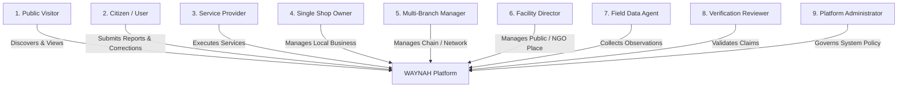
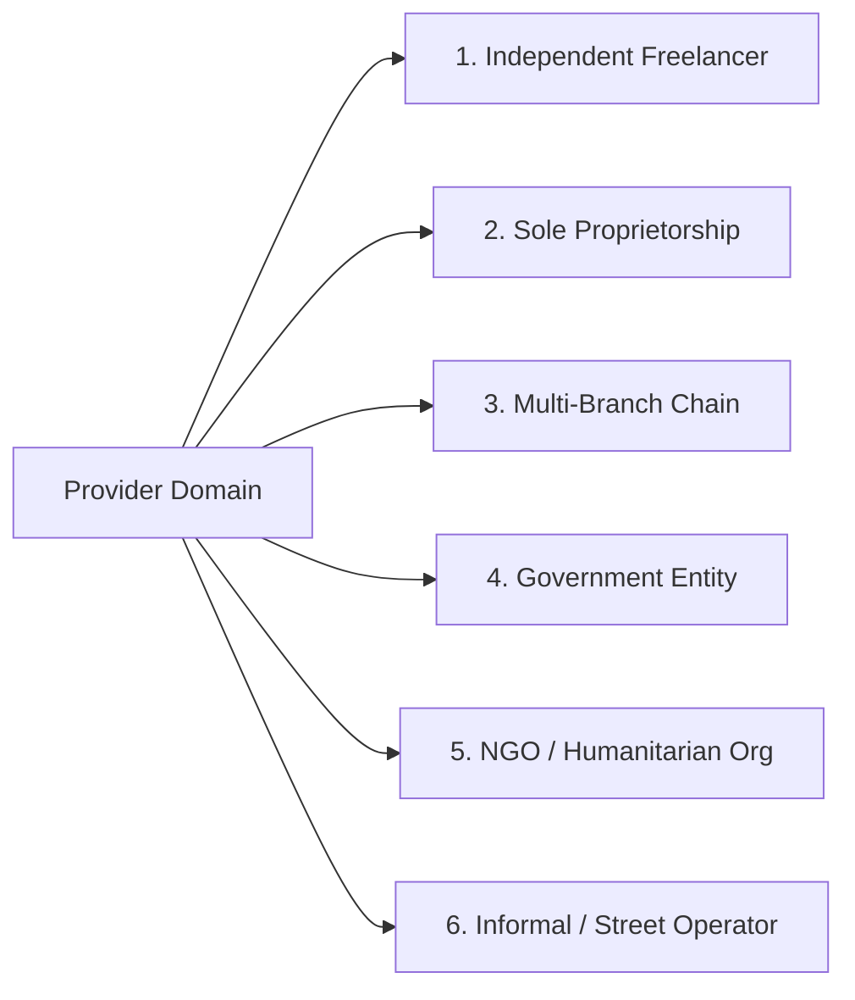
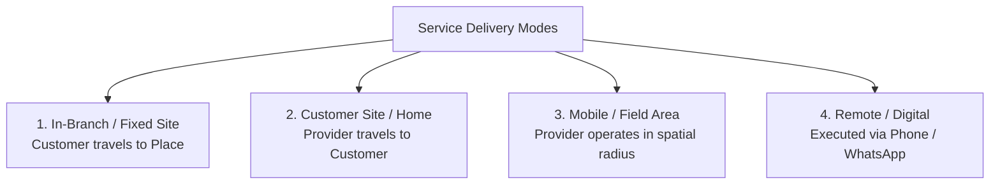
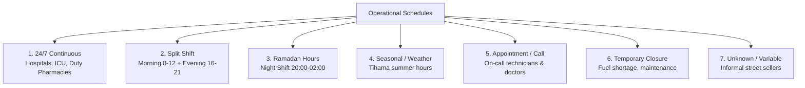
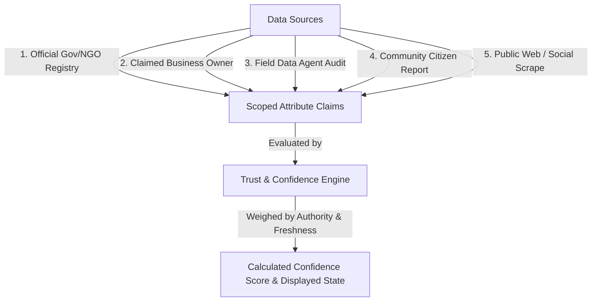
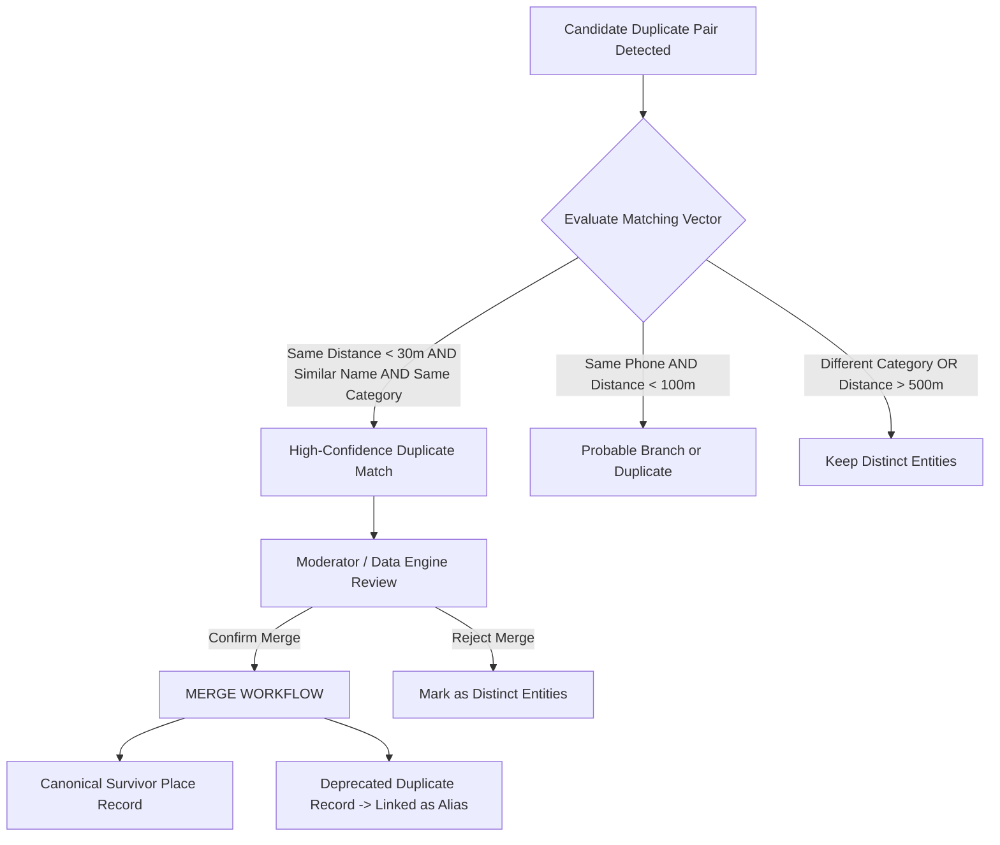
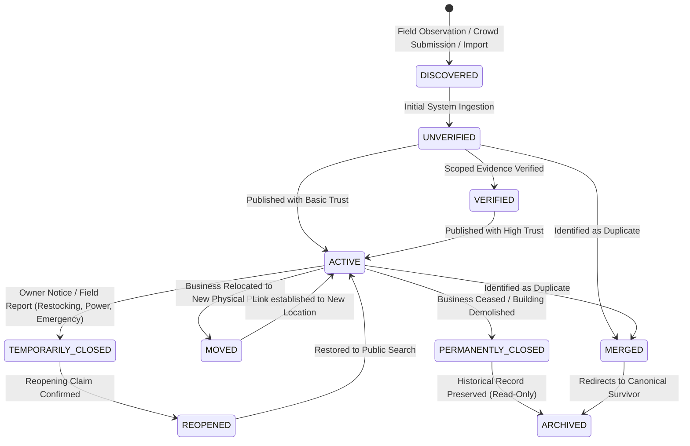
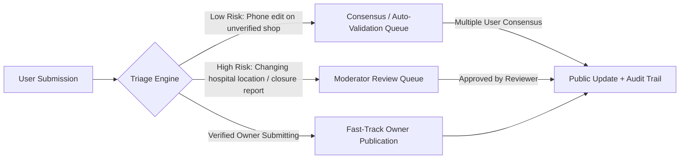
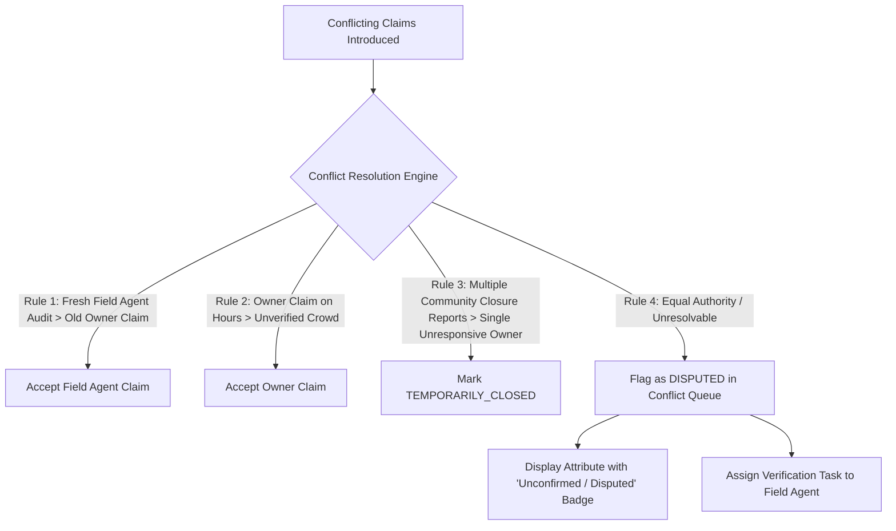

# WAYNAH — PHASE 2 DOMAIN / REAL-WORLD / OPERATIONAL LOGIC VALIDATION STUDY

> **PROJECT:** WAYNAH (وينه؟ — Geographic Discovery & Local Trust Platform)  
> **SCOPE:** Hajjah Governorate, Yemen (Initial Operational Geography) — Extensible Across Yemen  
> **DOCUMENT ID:** WAYNAH_PHASE_2_DOMAIN_OPERATIONAL_LOGIC_STUDY  
> **STATUS:** FORMAL STUDY COMPLETE — NOT AN IMPLEMENTATION PHASE  
> **REFERENCE DATE:** 1 October 2026  
> **BOUNDARIES:** ZERO Source Code Changes | ZERO Schema/Database Changes | ZERO API Changes  

---

## 1. EXECUTIVE SUMMARY

This document represents the formal **Phase 2 Domain, Real-World, and Operational Logic Validation Study** for the WAYNAH platform.

Following the formal closure of the Phase 1 security gate (remediation and independent re-review of security findings F-02 and F-06), this study establishes the domain foundation for WAYNAH before any domain modeling, database schema design, or API implementation occurs.

WAYNAH is not a generic e-commerce marketplace, nor a static business directory, nor a western-style map application. It is a **geographic discovery and local trust platform** specifically designed to function within the socio-geographic, infrastructure, and operational realities of **Hajjah Governorate, Yemen**, while maintaining complete architectural extensibility across all 22 governorates of Yemen.

### Primary Operational Purpose
WAYNAH enables citizens, visitors, and field workers to answer fundamental real-world questions:
* *What is this place?*
* *Where exactly is it located in human and geographic terms?*
* *What services or capabilities does it currently offer?*
* *Is it open right now under real-world Yemeni operating schedules?*
* *How can I reliably contact the operator or provider?*
* *Who operates this facility or business, and under what authority?*
* *How trustworthy is this information, who reported it, and when was it last verified?*
* *How does the system represent uncertainty, temporary closures, relocations, duplicates, and conflicting claims?*

### Core Domain Principles Established in Phase 2
1. **Real-World Reality First**: The domain model must conform to how physical locations, informal businesses, shared spaces, and service delivery actually operate in Hajjah, Yemen—not to generic SaaS assumptions.
2. **Strict Entity Separation**: Places, Businesses, Operating Branches, Service Providers, and Services are distinct domain concepts with independent lifecycles.
3. **Multi-Source Claim & Trust Engine**: Truth is never a static boolean flag (`verified: true`). Information consists of scoped, time-stamped claims backed by evidence, provenance, and confidence scoring.
4. **Addressing Grounded in Local Reality**: Western street-and-number addressing does not exist in rural Hajjah. Locations are anchored by administrative context (Governorate → District → Uzlah → Village/Neighborhood), spatial coordinates (WGS84 Point / Plus Codes), and local descriptive landmarks ("Near X", "Opposite Y").
5. **Preservation of Historical Provenance**: Entities mutate over time (relocate, rename, temporarily close, merge). History is never overwritten; state changes produce explicit audit events and temporal transitions.

---

## 2. DOMAIN SCOPE

### 2.1 What WAYNAH Is
* **Geographic Discovery Engine**: A localized spatial discovery engine indexed by administrative context, landmark proximity, category, and real-world service capability.
* **Local Trust & Verification Layer**: A multi-source provenance system evaluating the confidence, freshness, and dispute status of place attributes and business profiles.
* **Operational Presence Directory**: A dynamic operational registry representing fixed facilities, mobile providers, home-based services, and informal market operators.
* **Public Information Resource**: An accessible public information platform for essential public, emergency, commercial, and community locations in Hajjah.

### 2.2 What WAYNAH Is Not
* **Not an E-Commerce Marketplace**: WAYNAH does not force every shop to sell products, manage online inventory, or process digital payments.
* **Not a Logistics Carrier**: WAYNAH does not assume platform-level delivery drivers or default freight responsibility.
* **Not a Static Yellow Pages**: WAYNAH does not treat business listings as static contact cards without operational state, temporal schedule awareness, or crowd-sourced conflict resolution.
* **Not a Generic Map Wrapper**: WAYNAH does not rely on third-party map providers for administrative truth or local place names in Yemen.

---

## 3. REAL-WORLD CONTEXT: HAJJAH GOVERNORATE & YEMEN GEOGRAPHY

### 3.1 Geographic and Administrative Realities of Hajjah
Hajjah Governorate presents diverse physical, social, and administrative environments across its 31 districts:

```
Yemen (الجمهورية اليمنية)
 └── Hajjah Governorate (محافظة حجة)
      ├── Urban / Administrative Hubs (e.g. Hajjah City / مدينة حجة, Abs / عبس)
      ├── Rural & Agricultural Districts (e.g. Ku'aydinah / كعيدنة, Mabyan / مبين, Al-Mahabishah / المحابشة)
      ├── Border & Transit Corridors (e.g. Haradh / حرض, Mustaba / مستبأ)
      └── Coastal / Lowland Tihama Regions (e.g. Midi / ميدي, Hayran / حيران)
```

Each administrative level has distinct operational characteristics:
* **Governorate (محافظة)**: First-level administrative boundary establishing governance context.
* **District / Directorate (مديرية)**: Primary operational geographic unit for local service discovery and administrative context.
* **Sub-District (عزلة)**: Traditional rural administrative grouping comprising clusters of villages.
* **Village (قرية) / Neighborhood (حي / حارة)**: The immediate human-readable residential or commercial cluster.
* **Landmark (معلم)**: Major physical reference point (e.g. main roundabout, grand mosque, hospital, valley junction) essential for local navigation.

### 3.2 Infrastructure & Socio-Economic Operational Factors
1. **Informal & Unnamed Commerce**: A significant portion of economic activity in Hajjah occurs in unnamed shops, weekly traditional souks (e.g., *Souk al-Arba'a* in Abs, *Souk al-Thulatha* in Al-Mahabishah), roadside kiosks, and mobile service vehicles.
2. **Communication Preference**: WhatsApp and mobile phone calls (77x, 73x, 71x, 70x series) are the primary communication channels. Physical websites or email contacts are extremely rare for local Yemeni providers.
3. **Power & Operating Fluctuations**: Widespread reliance on private solar installations, local commercial generator networks (مواطير خاصة), and fuel availability creates fluid operating schedules.
4. **Seasonal & Cultural Shifts**: Operating hours alter dramatically during the Holy Month of Ramadan, religious holidays (Eid al-Fitr, Eid al-Adha), harvest seasons, and intense summer heat in the Tihama lowlands.
5. **Informal Addressing**: Street names and building numbers are non-existent in most districts. People navigate using landmark-anchored spatial descriptions (e.g., "Behind the Central Hospital, 50 meters past the solar equipment shop").

---

## 4. ACTORS: USER PERSONAS & OPERATIONAL ROLES

WAYNAH identifies 9 distinct domain actors operating within the ecosystem:



| Actor Role | Real-World Operational Context | Primary System Interactions | Boundaries & Restrictions |
|---|---|---|---|
| **1. Public Visitor** | Citizen or visitor searching for a hospital, open pharmacy, plumber, or shop in Hajjah without logging in. | Search by category/name/district, view map, obtain contact info, view operating status. | Read-only access; cannot submit corrections, reviews, or claim ownership. |
| **2. Citizen / Community Contributor** | Registered local resident who observes place changes, closures, errors, or new places. | Suggest new places, report outdated phone numbers, report closures, submit photos, rate experiences. | Submissions require moderation/verification; cannot self-approve or force data changes. |
| **3. Independent Service Provider** | Freelance technician (e.g., electrician, plumber, mobile mechanic, tutor) operating without a fixed storefront. | Define service capabilities, set service coverage area (districts), update availability status, display contact details. | Cannot claim physical storefronts that do not belong to them; cannot modify public place records. |
| **4. Small Business Operator** | Owner of a single dukan, workshop, pharmacy, or restaurant in Hajjah. | Claim business identity, manage operating hours, update phone/WhatsApp, list services offered. | Can only edit claimed business profile; cannot alter public geographic landmark attributes. |
| **5. Multi-Branch Manager** | Manager overseeing a bank chain, pharmacy group, or commercial distributor with multiple locations in Hajjah. | Manage multi-branch profiles, assign branch managers, harmonize service catalogs across branches. | Administrative scope restricted to branches explicitly authorized under the parent organization. |
| **6. Facility Administrator** | Director or delegate of a government hospital, public school, water project, or NGO office. | Maintain official facility details, emergency contacts, specialized public services available. | Official verification scope; updates receive high provenance weight. |
| **7. Field Data Collector** | Field agent conducting structured geographic surveys or physical data audits in Hajjah districts. | Submit high-confidence field observations, GPS point captures, exterior photos, structured verification audits. | Direct observational input; subjects data to automated & reviewer verification queues. |
| **8. Verification Reviewer** | Trusted domain moderator or administrator reviewing disputed claims, user reports, and field data. | Review claim evidence, resolve data conflicts, approve/reject ownership claims, issue scoped verification status. | Decisions recorded in audit log; cannot bypass platform security policies. |
| **9. System Platform Admin** | Technical governor managing system categories, governance rules, and system-wide policy. | Manage category hierarchies, set trust confidence thresholds, review system audit logs, configure global parameters. | System-wide scope; all administrative actions produce immutable audit entries. |

---

## 5. PLACES: PHYSICAL VS IDENTITY

### 5.1 What Qualifies as a Place?
A **Place** in WAYNAH is a canonical, discoverable, real-world geographic location with a distinct physical presence or human reference value.

```text
REAL-WORLD SPOT ──> Does it have a geographic coordinate?
                 ──> Is it recognizable or navigable by humans?
                 ──> Does it serve a public, commercial, or community purpose?
                 YES ──> QUALIFIES AS A WAYNAH PLACE
```

### 5.2 Physical Location vs. Business Identity
A fundamental domain rule of WAYNAH is the **decoupling of Physical Place from Business Identity**:

```text
┌─────────────────────────────────────────┐         ┌─────────────────────────────────────────┐
│              PHYSICAL PLACE             │         │            BUSINESS IDENTITY            │
├─────────────────────────────────────────┤         ├─────────────────────────────────────────┤
│ • Geographic Coordinates (WGS84)        │         │ • Commercial / Trade Name               │
│ • Administrative District / Uzlah       │  Operates │ • Legal / Owner Identity                │
│ • Physical Structure / Land Parcel      │ ◄───────► │ • Brand Identity & Logo                 │
│ • Spatial Landmark Reference            │   In      │ • Tax / Commercial Registry (if any)    │
│ • Physical Accessibility Features       │         │ • Parent Organization Structure         │
└─────────────────────────────────────────┘         └─────────────────────────────────────────┘
```

#### Key Domain Implications:
* **Place Without Business**: A public square (*سوق ميدان*), historical fort (*قلعة القاهرة في حجة*), public water well (*بئر ماء مجتمعي*), or government office is a Place with no commercial Business.
* **Business Without Public Place**: A mobile solar repair technician or home-based catering business has a Business identity but no public physical Place for public customer visitation.
* **Multi-Tenant Place**: A single commercial building (*عمارة تجارية*) or market complex (*سوق كعيدنة المركزي*) is one physical Place hosting multiple distinct Businesses.
* **Place Relocation**: When a pharmacy moves 200 meters down the road, the *Business* updates its location to a new *Place*; the original *Place* (the physical shop) remains in the spatial registry and may later host a different business.

### 5.3 Place Categories & Taxonomies
WAYNAH classifies Places across essential functional categories grounded in Yemeni operational reality:

```
Places
 ├── Health & Medical Facilities
 │    ├── Government Hospitals (مستشفيات حكومية)
 │    ├── Private Hospitals & Clinics (مستشفيات ومراكز خاصة)
 │    ├── Health Centers & Rural Units (راكز صحية ووحدات ريفية)
 │    ├── Pharmacies & Duty Pharmacies (صيدليات وصيدليات مناوبة)
 │    └── Medical Laboratories & Diagnostic Centers (مختبرات ومراكز أشعة)
 ├── Essential Services & Utilities
 │    ├── Water Supply Points & Tanker Stations (نقاط مياه ووايتات)
 │    ├── Electricity & Generator Stations (محطات كهرباء ومواطير)
 │    ├── Gas Cylinder Distribution Points (نقاط توزيع غاز)
 │    └── Fuel & Petrol Stations (محطات وقود)
 ├── Emergency & Public Safety
 │    ├── Civil Defense & Fire Stations (دفاع مدني)
 │    ├── Police Stations & Security Posts (أقسام شرطة ونقاط أمنية)
 │    └── Ambulance Stations (مراكز إسعاف)
 ├── Commercial & Retail
 │    ├── Food Markets & Grocery Shops (بقالات وسوبرماركت)
 │    ├── Bakeries & Grain Mills (مخابز ومطاحن حبوب)
 │    ├── Solar & Electrical Equipment (طاقة شمسية وكهربائيات)
 │    ├── Agricultural & Livestock Supplies (مستلزمات زراعية ومواشي)
 │    ├── Building Materials & Hardware (مواد بناء وورش)
 │    └── Traditional Souks & Market Grounds (أسواق شعبية وحراج)
 ├── Specialized Services & Workshops
 │    ├── Auto Repair & Towing Services (ورش سيارات وسواطح)
 │    ├── Solar System Maintenance (صيانة منظومات شمسية)
 │    ├── Plumbing & Electrical Contracting (سباكة وكهرباء)
 │    └── Mobile & Electronics Repair (صيانة جوالات وإلكترونيات)
 ├── Educational & Public Civic
 │    ├── Schools & Education Centers (مدارس ومراكز تعليمية)
 │    ├── Government Offices & Local Councils (مكاتب حكومية ومجالس محلية)
 │    └── Mosques & Community Halls (مساجد وصالات مجتمعية)
 └── Geographic & Cultural Landmarks
      ├── Historic Forts & Heritage Sites (مواقع أثرية وقلاع)
      ├── Mountain Passes & Valley Junctions (نقاط طرق وأودية)
      └── Public Squares & Transportation Hubs (فرزات ونقاط ركاب)
```

---

## 6. PROVIDERS & ORGANIZATIONS

### 6.1 Provider Typology
WAYNAH models organizations and service providers across six explicit domain types:



1. **Independent Freelancer (مزود مستقل)**: Individual skilled worker operating without a physical storefront or employee network (e.g. mobile electrician, home tutor).
2. **Sole Proprietorship (نشاط فردي / محل)**: Owner-operated single location shop or workshop (e.g. dukan, local bakery).
3. **Multi-Branch Enterprise (شركة / نشاط متعدد الفروع)**: Formal business entity managing multiple operational branches (e.g. Tadhamon Bank, Al-Dawaa Pharmacies, Petrol Distributors).
4. **Government Entity (جهة حكومية)**: State administrative body, public hospital board, civil defense directorate, or municipal council.
5. **NGO / Humanitarian Organization (منظمة أهلية / إنسانية)**: Non-profit, international agency, or local charity operating development, medical, or relief facilities.
6. **Informal / Street Operator (نشاط غير رسمي / بائع متجول)**: Unregistered, unnamed, seasonal, or mobile commercial operator providing vital local goods or services.

### 6.2 Provider Organizational Hierarchy
For structured organizations, WAYNAH recognizes a 4-tier organizational domain hierarchy:

```text
Parent Enterprise / Organization (الشركة / المنظمة الأم)
  └── Regional Operational Division (الفرع الإقليمي - حجة)
       └── Operational Branch / Physical Place (الفرع التشغيلي / الموقع المادي)
            └── Individual Staff / Service Provider (الفني / الموظف المنفذ)
```

---

## 7. SERVICES: OFFERINGS, AVAILABILITY, & DELIVERY MODES

### 7.1 What is a Service?
A **Service** in WAYNAH is an intangible work, utility, or specialized capability provided by a Business, Branch, or Provider for the benefit of a customer or community member.

```text
Service ≠ Product
Service = Action / Execution / Competence provided under temporal & spatial conditions
Product = Physical commodity / unit of sale
```

### 7.2 Service Cardinality Matrix
WAYNAH supports flexible multi-cardinality relationships between Places, Providers, and Services:

```text
One Place ───────────► Can host Multiple Services
                      Example: General Hospital ──► Emergency Care, Radiology, Lab Tests, Pharmacy

One Service ─────────► Can be offered at Multiple Places
                      Example: "Solar Battery Testing" ──► Offered at Workshop A, Workshop B, Workshop C

One Provider ────────► Can operate across Multiple Places
                      Example: Visiting Specialist Doctor ──► Clinic in Hajjah City (Mon/Wed), Hospital in Abs (Thu)

One Service ─────────► Can exist without a Fixed Public Place
                      Example: Mobile Water Tanker Delivery ──► Operates via Mobile Service Coverage Area
```

### 7.3 Service Delivery Modes
Services are classified into four distinct execution modes:



1. **In-Branch / Fixed Site (خدمة في مقر الفرع)**: Customer must physically visit the Place (e.g., dental exam, haircut, car oil change at workshop).
2. **Customer Site / Home (خدمة منزلية / بموقع العميل)**: Provider travels to the customer's location (e.g., home plumbing repair, residential electrical wiring).
3. **Mobile / Field Area (خدمة ميدانية متغيرة)**: Provider operates dynamically within an administrative district or spatial radius (e.g., water tanker delivery, vehicle roadside towing).
4. **Remote / Digital (خدمة عن بُعد)**: Service executed via telecommunication without physical presence (e.g., telephone medical advice, remote software consultation).

### 7.4 Service Availability & Temporal Status
Service availability is dynamic and time-sensitive. A Place may be open while a specific Service is temporarily unavailable:

```text
Place Status: OPEN (المحل مفتوح)
  ├── Service A: "General Grocery Sale" ──► AVAILABLE
  ├── Service B: "Fresh Bread Baking"  ──► SUSPENDED (Oven under repair)
  └── Service C: "Home Delivery"       ──► UNAVAILABLE (No driver available today)
```

---

## 8. GEOGRAPHY & ADDRESSING: THE YEMEN / HAJJAH REALITY

### 8.1 Administrative Hierarchy
Geography in WAYNAH strictly follows the authoritative administrative hierarchy of Yemen:

```
Country: Yemen (الجمهورية اليمنية)
  └── Governorate: Hajjah (محافظة حجة)
       └── District: Abs (مديرية عبس)
            └── Sub-District / Uzlah: Al-Matmah (عزلة المطمة)
                 └── Village / Neighborhood: Qaryah Al-Khadra (قرية الخضراء)
```

### 8.2 Practical Addressing in Hajjah
Western-style street numbers, postal codes, and formal street names do not exist in the vast majority of Hajjah governorate. WAYNAH models addresses using a **Dual-Layer Geographic Representation**:

```text
┌─────────────────────────────────────────────────────────────────────────────────┐
│                          DUAL-LAYER ADDRESS MODEL                               │
├─────────────────────────────────────────────────────────────────────────────────┤
│ LAYER 1: MATHEMATICAL & ADMINISTRATIVE SPATIAL ANCHOR                           │
│ • Latitude & Longitude (WGS84, e.g. 15.6521° N, 43.2104° E)                      │
│ • OCHA Administrative PCODE (e.g. YE1722 for Abs District)                      │
│ • Open Location Code / Plus Code (e.g. 7J52+9X Abs, Yemen)                      │
│ • Spatial PostGIS Geography Point                                               │
├─────────────────────────────────────────────────────────────────────────────────┤
│ LAYER 2: HUMAN-READABLE LOCAL DESCRIPTIVE ADDRESS                               │
│ • Governorate Name: Hajjah (محافظة حجة)                                          │
│ • District Name: Abs (مديرية عبس)                                               │
│ • Uzlah / Village: Uzlah Al-Matmah, Qaryah Al-Khadra                             │
│ • Primary Landmark Anchor: "50m South of the Grain Silos" (جنوب صوامع الغلال)   │
│ • Spatial Orientation: "Opposite Al-Hikmah Pharmacy" (مقابل صيدلية الحكمة)       │
│ • Access Description: "Unpaved side road turning East from main highway"        │
└─────────────────────────────────────────────────────────────────────────────────┘
```

### 8.3 Handling Incomplete, Conflicting, or Inaccurate Coordinates
In real-world field data collection in Hajjah, geographic inputs are often imperfect:

```text
Geographic Input Scenarios:
├── Scenario A: Exact GPS Point + Verified District Boundary ──► HIGH ACCURACY
├── Scenario B: Approximate GPS (Cell tower drift) + Known Village Name ──► MEDIUM ACCURACY (Flagged)
├── Scenario C: Landmark Description Only ("Near Abs Central Souk") ──► ANCHORED TO LANDMARK POINT (Coordinates estimated)
└── Scenario D: Conflicting Coordinates (Point falls in neighboring district polygon) ──► GEOGRAPHIC DISPUTE QUEUE
```

Rule: WAYNAH never invents coordinates. If a Place lacks precise coordinates, it is anchored to its known Village/Landmark centroid with an explicit accuracy rating (`SPATIAL_ACCURACY: LANDMARK_APPROXIMATE`).

---

## 9. OPERATING HOURS & REAL-WORLD SCHEDULES

### 9.1 Yemeni Schedule Typology
Operating hours in Hajjah do not conform to standard Monday-Friday 9-to-5 patterns. WAYNAH identifies 7 distinct operational schedule types:



1. **Continuous 24/7 (24 ساعة / طوارئ)**: Hospitals, emergency rooms, designated duty pharmacies (*صيدليات المناوبة*), main security checkpoints.
2. **Split Shift (نظام الفترتين - صباحية ومسائية)**: The default commercial schedule in Yemen:
   * *Morning Shift*: 08:00 – 12:30
   * *Afternoon Break*: Closed for lunch, heat, and mid-day rest (12:30 – 16:00)
   * *Evening Shift*: 16:00 – 21:30
3. **Ramadan Schedule (جدول شهر رمضان المبارك)**:
   * *Daytime*: Closed or minimal morning hours (11:00 – 15:00)
   * *Night Shift*: Primary operating window post-Iftar (20:00 – 02:30)
4. **Seasonal & Weather Schedules**: Adjusted during peak summer months in lowland Tihama (Abs/Midi) to avoid extreme heat, or tied to agricultural harvest cycles.
5. **Appointment / On-Call Only (بالطلب / عند الاتصال)**: Mobile technicians, plumbers, emergency towing services who do not keep open storefront doors.
6. **Temporary Operational Closure (إغلاق مؤقت)**: Facility closed due to temporary fuel/power unavailability, inventory restocking, or family emergencies.
7. **Unknown / Fluid Schedule (غير منتظم)**: Informal vendors whose presence depends on daily market foot traffic.

### 9.2 Real-Time Open/Closed Evaluation Logic
Determining whether a Place is "Open Now" requires evaluating multiple operational signals rather than checking a naive boolean flag:

```text
FUNCTION EvaluateIsPlaceOpen(Place, CurrentTimestamp, CurrentSeason):
  IF Place.Status == PERMANENTLY_CLOSED THEN RETURN FALSE ("Permanently Closed")
  IF Place.Status == TEMPORARILY_CLOSED THEN RETURN FALSE ("Temporarily Closed until " + ReopenDate)
  
  IF CurrentSeason == RAMADAN AND Place.HasRamadanSchedule THEN
    ActiveSchedule = Place.RamadanSchedule
  ELSE
    ActiveSchedule = Place.RegularWeeklySchedule
    
  IF ActiveSchedule.Type == CONTINUOUS_24_7 THEN RETURN TRUE ("Open 24/7")
  IF ActiveSchedule.Type == APPOINTMENT_ONLY THEN RETURN MAYBE ("Open by Appointment / Call")
  IF ActiveSchedule.Type == UNKNOWN THEN RETURN MAYBE ("Hours Unknown - Call to Confirm")
  
  IF ActiveSchedule.ContainsTime(CurrentTimestamp) THEN
    RETURN TRUE ("Open Now")
  ELSE
    RETURN FALSE ("Closed Now - Opens at " + ActiveSchedule.NextOpenTime(CurrentTimestamp))
```

---

## 10. CONTACT INFORMATION

### 10.1 Channels & Yemeni Contact Realities
Contact channels in Hajjah exhibit distinct domain characteristics:

```text
Contact Channels
 ├── Mobile Numbers (أرقام الجوال)
 │    ├── SabaFon (71x series)
 │    ├── You / MTN (73x series)
 │    ├── Yemen Mobile (77x series)
 │    └── Y Telecom (70x series)
 ├── WhatsApp Business / Personal (واتساب)
 │    └── Primary digital messaging & photo sharing channel in Yemen
 ├── Fixed Landlines (هاتف ثابت)
 │    └── Area Code 07 for Hajjah Governorate (mainly government & banks)
 ├── Physical Contact Person (المسؤول / الكفيل)
 │    └── Named local contact person for informal or community places
 └── Social & Web Channels (وسائل التواصل)
      └── Facebook Pages (occasionally used by larger businesses in Hajjah)
```

### 10.2 Contact Domain Attributes
Contact information is not a simple string column. WAYNAH models contact data with metadata attributes:

```text
Contact Entry:
├── Channel Type: [MOBILE | WHATSAPP | LANDLINE | SOCIAL | CONTACT_PERSON]
├── Phone Number / Handle: "+967 771 234 567"
├── Is WhatsApp Enabled: [TRUE | FALSE | UNTESTED]
├── Primary Contact Flag: [PRIMARY | SECONDARY | ALTERNATIVE]
├── Shared Phone Indicator: [DIRECT | SHARED_NEIGHBOR | SHARED_LANDLORD]
├── Freshness Timestamp: "2026-08-15"
├── Verification Status: [UNVERIFIED | COMMUNITY_CONFIRMED | PROVIDER_VERIFIED]
└── Active Status: [ACTIVE | UNREACHABLE | DISCONNECTED]
```

#### Shared Contact Number Exception:
In rural Hajjah villages, an informal shop or water point may not have a dedicated phone line. They frequently list the mobile number of a neighboring shopkeeper or village elder. WAYNAH explicitly models the `SHARED_PHONE` attribute to prevent incorrect identity merging when two places share a contact number.

---

## 11. TRUST & VERIFICATION: MULTI-SOURCE CLAIM ENGINE

### 11.1 The Multi-Source Provenance Architecture
One of WAYNAH's central domain requirements is that **truth is never a binary boolean (`verified: true / false`)**. 

Information about a place originates from multiple sources with varying levels of authority, freshness, and evidence. WAYNAH models trust as a **Scoped Claim & Provenance Engine**:



### 11.2 Provenance Source Hierarchy
When claims conflict, WAYNAH evaluates source authority based on the attribute scope:

| Attribute Scope | Primary Trusted Source | Secondary Source | Fallback Source |
|---|---|---|---|
| **Administrative Boundary & PCODE** | Official OCHA / Gov Geographic Import | Field Data Agent Survey | Community Report |
| **Official Facility Name (Hospital/School)** | Ministry / Gov Administrative Decree | Field Data Agent Audit | Community Report |
| **Business Operating Hours & Phone** | Verified Business Owner / Manager | Field Data Agent Inspection | Community User Report |
| **Temporary Closure Status** | Verified Owner / Field Agent | Multiple Community Reports | Scraped Public Notice |
| **Landmark Directions & Access** | Local Community Citizens | Field Data Agent Survey | Unverified Owner Claim |

### 11.3 Scoped Verification States
Instead of a generic "Verified Badge", WAYNAH issues **Scoped Verification Statements**:

```text
Place Verification Profile:
├── [VERIFIED: GEOGRAPHIC_LOCATION] ──► Confirmed by GPS Field Agent survey on 2026-06-10
├── [VERIFIED: FACILITY_IDENTITY]   ──► Confirmed by Ministry of Health registry
├── [UNVERIFIED: OPERATING_HOURS]   ──► Claimed by user, pending owner confirmation
└── [DISPUTED: PHONE_NUMBER]        ──► Owner reports 771-xxx, User reports 773-xxx (Conflict Queue)
```

---

## 12. CLAIMS & EVIDENCE

### 12.1 Scoped Claim Model
Every mutable attribute of a Place or Business is represented internally as a **Claim**:

```text
Claim Structure:
├── Target Entity: [Place ID #4821]
├── Target Attribute: [OPERATING_HOURS | PHONE | LOCATION | STATUS | NAME]
├── Claimed Value: "Morning 08:00-12:00, Evening 16:00-21:00"
├── Submitter Identity: [User ID / Field Agent ID / Owner ID]
├── Source Provenance: [FIELD_AUDIT | OWNER_DIRECT | COMMUNITY_CROWD | SYSTEM_IMPORT]
├── Timestamp: "2026-09-20 T 14:30:00Z"
├── Supporting Evidence: [Photo of shopfront sign | Official Document | GPS Track]
├── Expiration / Freshness Window: 180 Days
└── Verification Status: [PENDING_REVIEW | ACCEPTED | SUPERSEDED | REJECTED | DISPUTED]
```

### 12.2 Evidence Types
Evidence supporting claims includes:
* **Geotagged Photo**: Exterior shopfront photograph showing business sign, opening hours, or street context.
* **Official License / Document**: Commercial registry certificate, Ministry of Health license, or local council permit.
* **Field Verification Track**: Signed digital audit report from an authorized WAYNAH field agent.
* **SMS / WhatsApp Verification**: One-Time-Password (OTP) challenge verified against the listed mobile number.

---

## 13. DUPLICATES & IDENTITY: ENTITY RESOLUTION

### 13.1 Real-World Duplicate Drivers in Hajjah
Duplicate place records frequently occur in Yemeni crowdsourced and imported datasets due to:

```text
DUPLICATE SOURCES & DRIVERS:
├── 1. Language & Transliteration Variations
│    ├── Arabic: "مستشفى الشفي العام" vs "مستشفى الشفاء"
│    └── Transliteration: "Al Shifa Hospital" vs "El-Shefa Hospital" vs "Alshifa Hospital"
├── 2. Historical & Local Aliases
│    ├── Official Name: "مستشفى عبس العام"
│    └── Popular Local Name: "مستشفى الجمهوري بعبس" or "المستشفى السعودي القديم"
├── 3. Duplicate User Submissions
│    ├── User A submits "صيدلية النجم" at point (15.651, 43.210)
│    └── User B submits "صيدلية النجم - فرع الشارع العام" at point (15.652, 43.211)
└── 4. Business Relocation vs. New Business
     └── Business moves to new building, but old location entry remains active under old name.
```

### 13.2 Entity Resolution & Merge/Split Domain Rules



#### Merge Domain Rules:
1. **Canonical Survivor Selection**: The record with higher verification level, older history, or verified owner claim becomes the Canonical Survivor (`CANONICAL_PLACE`).
2. **Provenance Preservation**: The deprecated duplicate ID is retained in the identity registry as a redirect alias. No historical observations, reviews, or verification events are deleted.
3. **Reversibility (Split Workflow)**: Merges must be domain-reversible. If two distinct places (e.g. adjacent shops with identical names) were incorrectly merged, a moderator can execute an `UNMERGE` operation restoring both entities with their historical provenance intact.

---

## 14. LIFECYCLE & TEMPORAL LOGIC

### 14.1 Canonical Place State Machine
Places in WAYNAH transition through explicit operational states over time:



### 14.2 Lifecycle Transition Definitions
* **DISCOVERED**: Newly observed spatial entity ingested via data import, field agent survey, or user submission.
* **UNVERIFIED**: Published in discovery search with unverified indicator; open for community evidence.
* **VERIFIED**: Core attributes (location, identity, category) validated against authoritative evidence.
* **ACTIVE**: Fully operational place visible in public search and navigation.
* **TEMPORARILY_CLOSED**: Place is temporarily non-operational (retained in search with "Temporarily Closed" badge; not deleted).
* **REOPENED**: Restored to active status following temporary closure.
* **MOVED**: Operating business relocated to a different physical place. The physical place record reflects past occupancy; the business profile points to its new place.
* **PERMANENTLY_CLOSED**: Business or facility permanently ceased operations. Record remains discoverable in historical archives to prevent re-creation of duplicate entries.
* **MERGED**: Merged into a canonical survivor record; preserves incoming link redirects.

---

## 15. USER CONTRIBUTIONS & CROWDSOURCING

### 15.1 Community Contribution Types
WAYNAH enables citizens to contribute real-world field intelligence:

```text
User Contributions
 ├── 1. New Place Suggestion (اقتراح مكان جديد)
 ├── 2. Attribute Correction (تعديل رقم هاتف / ساعات عمل / اسم)
 ├── 3. Location Pin Refinement (تصحيح موقع على الخريطة)
 ├── 4. Operational Status Report (إبلاغ عن إغلاق مؤقت أو دائم)
 ├── 5. Duplicate Flag (إبلاغ عن تكرار مكان)
 ├── 6. Service Availability Update (إبلاغ عن توفر/انقطاع خدمة)
 └── 7. Field Photo Submission (إضافة صورة خارجية للمكان)
```

### 15.2 Moderation & Publication Workflow



#### Governance Rules for User Submissions:
* **No Direct Overwrite**: User submissions create *Claims*, not immediate DB overwrites.
* **Consensus Validation**: Minor edits (e.g. adding a WhatsApp flag) publish automatically if corroborated by multiple independent non-reputation-flawed users.
* **High-Impact Protection**: Modifying hospital emergency contacts, civil defense locations, or reporting permanent closure of verified businesses *always* requires human moderator or field agent verification.
* **Reputation Weighting**: Contributions from users with a history of verified submissions carry higher confidence weighting.

---

## 16. REVIEWS & RATINGS: EXPERIENCES VS FACTUAL CLAIMS

### 16.1 Decoupling Opinion from Truth
WAYNAH establishes a strict domain boundary between **User Experience Reports (Reviews/Ratings)** and **Factual Data Claims**:

```text
┌──────────────────────────────────────────┐         ┌──────────────────────────────────────────┐
│         FACTUAL DATA CLAIMS              │         │        USER EXPERIENCE REVIEWS           │
├──────────────────────────────────────────┤         ├──────────────────────────────────────────┤
│ • "Is the hospital open 24/7?"           │         │ • "The waiting time was very long."      │
│ • "What is the correct WhatsApp phone?"  │   VS    │ • "The technician was polite & skilled." │
│ • "Does the pharmacy have X-Ray?"        │         │ • "The prices were higher than expected."│
│ • "Is the place located in Abs District?"│         │ • "Overall rating: 4 out of 5 stars."    │
├──────────────────────────────────────────┤         ├──────────────────────────────────────────┤
│ Evaluated via: Evidence, Provenance,     │         │ Evaluated via: Community Guidelines,     │
│ Verification & Scoped Claims.            │         │ Anti-Spam, Abuse & Moderation.           │
└──────────────────────────────────────────┘         └──────────────────────────────────────────┘
```

### 16.2 Anti-Gaming & Verification Gating
To prevent fake reviews, competitor extortion, and malicious ratings:
1. **Reviews Do Not Alter Verification**: A 1-star review cannot change a Place's geographic verification state or force a closure.
2. **Verified Experience Badging**: Reviews submitted by users who interacted with the provider via WAYNAH receive a `[VERIFIED EXPERIENCE]` badge.
3. **Temporal Relevance & Decay**: Ratings decay in weight over time. A 3-year-old review carries significantly less weight than feedback from the past month.
4. **Owner Response Right**: Business owners receive a right-of-reply on public reviews for their claimed business.

---

## 17. SEARCH & DISCOVERY LOGIC

### 17.1 Real-World Discovery Intent Vectors
Citizens in Hajjah search using diverse mental models and intent vectors:

```text
Discovery Intent Vectors:
├── 1. Category / Need Intent ──► "Looking for an open pharmacy in Abs right now"
├── 2. Name / Brand Intent ──► "Tadhamon Bank" or "Al-Shifa Hospital"
├── 3. Spatial Proximity Intent ──► "Auto repair workshop near me / near Abs roundabout"
├── 4. Service Capability Intent ──► "Solar inverter maintenance technician"
├── 5. Phone / Contact Intent ──► "Search by phone number 771234567"
└── 6. Local Dialect & Vernacular Intent ──► "وايت ماء" (Water tanker), "سطحة" (Towing truck), "بُنّ" (Coffee mill)
```

### 17.2 Multi-Factor Search Ranking Architecture
WAYNAH ranks discovery results based on a multi-factor domain scoring function:

$$\text{Discovery Score} = w_1 \cdot \text{TextRelevance} + w_2 \cdot \text{SpatialProximity} + w_3 \cdot \text{OperationalState} + w_4 \cdot \text{TrustConfidence} + w_5 \cdot \text{DataFreshness}$$

```text
Ranking Factors:
├── Text Relevance (0-100): Matches Arabic name, local aliases, category keywords, dialect terms.
├── Spatial Proximity (0-100): Distance from user location or referenced District / Landmark centroid.
├── Operational State Bonus:
│    ├── Open Now (Mondays 10:00 AM) ──► +25 Bonus
│    ├── Open 24/7 Emergency ──► +35 Bonus
│    ├── Open by Appointment ──► +10 Bonus
│    └── Closed Now ──► Demoted (visible but ranked below open places)
├── Trust & Confidence Level:
│    ├── Verified Location & Owner ──► +20 Bonus
│    └── Unverified / Disputed ──► Neutral / Penalized
└── Data Freshness: Attribute updated within past 90 days ──► +15 Bonus
```

---

## 18. EMERGENCY & CRITICAL INFORMATION

### 18.1 Essential Critical Categories
WAYNAH treats emergency and public safety facilities with dedicated operational semantics:

```text
Critical Emergency Categories:
├── 1. Emergency Rooms & ICU Hospitals (طوارئ ومستشفيات)
├── 2. Duty Pharmacies (صيدليات المناوبة الليلية)
├── 3. Medical Oxygen Distribution Points (نقاط غاز الأوكسجين الطبي)
├── 4. Blood Bank Facilities (بنوك الدم)
├── 5. Civil Defense & Fire Stations (الدفاع المدني)
├── 6. Ambulance Dispatch Points (مراكز الإسعاف)
└── 7. Emergency Drinking Water Stations (نقاط مياه الشرب الطارئة)
```

### 18.2 Special Domain Logic for Emergency Facilities
1. **Elevated Verification Standard**: Emergency facility listings require mandatory official or field agent verification. Unverified crowd submissions cannot publish as official emergency contacts without triage.
2. **Duty Pharmacy Rotations**: Night duty pharmacies (*صيدليات المناوبة*) operate on rotating daily/weekly schedules managed by local pharmacy syndicates or health offices. WAYNAH supports date-bound schedule overrides for duty pharmacies.
3. **Off-Hours Search Override**: When a user searches for emergency services outside standard operating hours (e.g. 03:00 AM), the discovery engine automatically prioritizes 24/7 continuous and active night-duty facilities.

---

## 19. CONFLICTING INFORMATION RESOLUTION

### 19.1 Real-World Conflict Scenarios
Conflicting claims frequently arise in field operations:

```text
Real-World Conflicts:
├── Conflict A: Provider claims OPEN 24/7 ──VS── 3 Users submit "CLOSED at 9 PM"
├── Conflict B: Business Owner submits Phone A ──VS── Field Agent reports Phone B from shop sign
├── Conflict C: User A drops GPS Pin in Abs District ──VS── User B drops GPS Pin in Ku'aydinah District
└── Conflict D: Original Name "سوبرماركت الأمل" ──VS── New Field Audit reports "سوبرماركت البركة"
```

### 19.2 Conflict Resolution Engine Rules



#### Domain Conflict Principles:
* **Freshness Priority**: A 2-day-old field audit overrides a 2-year-old owner listing.
* **Authority Scoping**: Owners have primary authority over operating hours and business services; field agents have primary authority over physical coordinates and shopfront photos.
* **Transparent Dispute State**: Unresolved conflicts do not silently pick an arbitrary winner. The system displays the most probable value alongside a `[DISPUTED / UNCONFIRMED]` indicator until verified.

---

## 20. DOMAIN ANTI-PATTERNS TO IDENTIFY & AVOID

WAYNAH explicitly rejects 14 dangerous domain simplifications commonly found in naive software designs:

| # | Dangerous Domain Anti-Pattern | Why It Fails in WAYNAH / Real-World Yemen Domain | Correct Domain Model in WAYNAH |
|---|---|---|---|
| 1 | **Place = Business** | Places are physical locations; Businesses are operating entities. A place (public square, fort) can exist without a business; a business (mobile plumber) can exist without a public place; multiple businesses can occupy one place. | Decouple `Place` (spatial location) from `Business` (commercial identity) via a flexible operational relationship. |
| 2 | **Provider = Place** | A service provider (technician, doctor) is a human actor, not a physical building. A doctor may work across 3 clinics; a plumber travels to customer sites. | Treat `Provider` as a distinct actor who can be associated with multiple Places, Businesses, or operate independently. |
| 3 | **Address = One Text Field** | Single string addresses ("Street 1, Building 2") fail completely in Hajjah where street numbers do not exist and local navigation relies on landmark relationships. | Model addresses as structured administrative hierarchies + spatial coordinates + human local landmark descriptions. |
| 4 | **Verified = Single Boolean Flag** | A simple `verified: true` fails to capture *what* was verified, *by whom*, *when*, and *under what evidence*. A place may have a verified location but unverified hours. | Implement scoped, time-stamped, evidence-backed `Claims` with specific verification scopes (`VERIFIED_LOCATION`, `VERIFIED_OWNER`). |
| 5 | **Open/Closed = Static Boolean** | Real schedules in Yemen include split shifts, Friday closures, Ramadan night schedules, and fuel emergency closures. A static boolean cannot represent "Open Now at 10 AM". | Model schedules as structured temporal rules (split shift, Ramadan, 24/7) evaluated dynamically against current time. |
| 6 | **Phone = Single String** | Yemeni businesses frequently use multiple mobile networks (SabaFon 71, MTN 73, Yemen Mobile 77), WhatsApp Business, and landlines, sometimes shared with neighbors. | Model contact information as a multi-entry collection with channel types, WhatsApp flags, shared flags, and verification status. |
| 7 | **Category = One Fixed Enum** | Real places offer multi-functional capabilities (e.g. a grocery shop that also operates a gas cylinder exchange and mobile solar charging point). | Support primary categories alongside multi-capability service tagging per place/business. |
| 8 | **Rating = Factual Truth** | User star ratings reflect subjective experience, not factual existence. A 1-star review does not mean a hospital is closed or its phone number is wrong. | Strictly separate subjective `User Reviews` from objective `Factual Data Claims` and verification processes. |
| 9 | **User Submission = Trusted Fact** | Crowdsourced inputs contain typos, outdated data, spam, or malicious edits. Direct database overwrites destroy data integrity. | Treat user inputs as candidate `Claims` subjected to consensus algorithms, moderation queues, or field verification. |
| 10 | **Duplicate = Same Name** | Two places named "صيدلية الأمل" may exist in different districts (Abs vs Hajjah City). Conversely, "مستشفى عبس" and "المستشفى الجمهوري" refer to the same place. | Perform entity resolution using multi-vector matching: Distance + Administrative Context + Phonetic/Alias Matching + Phone Numbers. |
| 11 | **Location = Coordinates Only** | Pure GPS coordinates (lat/long) are useless to a human user navigating on foot or describing a destination to a local taxi driver. | Always pair mathematical PostGIS coordinates with human-readable local descriptive landmarks and administrative hierarchy. |
| 12 | **Closure = Record Deletion** | Deleting a record when a business closes destroys historical provenance, breaks reference links, and leads users to re-add the closed business as a duplicate. | Transition closed places to explicit temporal states (`TEMPORARILY_CLOSED`, `PERMANENTLY_CLOSED`, `MOVED`) preserved in the registry. |
| 13 | **History = Overwritten Data** | Overwriting old phone numbers or locations makes it impossible to trace provenance, handle user disputes, or reverse incorrect edits. | Retain full audit logs and historical claims; attribute updates update current state while preserving historical event streams. |
| 14 | **Review = Factual Claim** | Conflating reviews with factual reporting allows malicious users to falsify business attributes through opinion submissions. | Enforce distinct workflows: Reviews go to community moderation; attribute corrections go to the data claim verification engine. |

---

## 21. KNOWN / ASSUMED / UNKNOWN MATRIX

| Domain Area | KNOWN (Established Facts) | ASSUMED (Current Working Hypotheses) | UNKNOWN (Requires Field Research) | DOMAIN RISK | DECISION NEEDED BEFORE MODELING |
|---|---|---|---|---|---|
| **Geography & Addressing** | Yemen administrative hierarchy is Governorate → District → Uzlah → Village. Hajjah has 31 districts. | PCODE boundaries from OCHA provide reliable district filtering. Landmark strings are essential for user navigation. | Exact sub-district (Uzlah) polygon datasets for all 31 Hajjah districts. | Misassignment of places near district borders without boundary polygons. | Formally approve landmark-anchored dual-layer addressing contract. |
| **Places & Facilities** | Places exist independently of businesses (forts, mosques, squares). Multi-tenant places are common. | Most commercial shops in Hajjah operate from fixed storefronts; mobile providers operate without places. | Percentage of informal vs formal registered commercial places in Abs and Hajjah City. | Over-structuring informal places may discourage community data entry. | Confirm place-business decoupling rules and category taxonomy. |
| **Operating Hours** | Split shifts and Ramadan schedule shifts are standard operational realities across Yemen. | Businesses can self-report split shifts and Ramadan hours accurately via simple forms or WhatsApp. | How frequently informal vendors update their temporary closure status during crises. | Users arrive at closed places due to stale operating hour data. | Define schedule evaluation logic and stale-data decay thresholds. |
| **Contact Channels** | WhatsApp and mobile phones (77, 73, 71, 70) are the dominant communication methods in Hajjah. | Businesses are willing to share a public WhatsApp number for citizen inquiries. | Prevalence of landline usage in government offices vs mobile numbers. | Shared neighbor numbers causing false duplicate business matches. | Approve multi-channel contact collection model with shared phone flags. |
| **Trust & Verification** | Single boolean `verified` flag is insufficient for Yemeni data quality realities. | Scoped claims (location vs owner vs hours) provide clear trust signals to citizens. | Optimal consensus threshold for auto-validating crowdsourced community edits. | Overly strict verification rules keeping valuable local places unpublished. | Establish scoped verification states and source authority hierarchy. |
| **Duplicates & Identity** | Transliteration and local aliases produce significant duplicate records. | Multi-vector matching (Spatial + Phonetic + Phone) can detect >80% of duplicate candidates. | Complete list of common local place name aliases in Hajjah districts. | Incorrectly merging two distinct adjacent shops with similar names. | Define reversible merge/split domain rules and canonical survivor logic. |
| **Emergency Data** | Emergency facilities (hospitals, duty pharmacies, civil defense) require high availability. | Duty pharmacies rotate on daily/weekly schedules managed by local syndicates. | Source of digital duty pharmacy rotation schedules for Hajjah districts. | Displaying an out-of-date duty pharmacy during a medical emergency. | Mandate strict verification queue for emergency category updates. |
| **Service Delivery** | Services operate across 4 modes: In-Branch, Customer-Site, Mobile Area, Remote. | Independent technicians (plumbers, electricians) prefer service coverage areas over fixed location pins. | Typical geographic radius served by mobile wa'it (water tanker) drivers in Abs. | Exposing private home addresses of home-based service providers. | Approve 4 service delivery modes and privacy boundary rules. |

---

## 22. DOMAIN RISKS

1. **Stale Information Risk**: Economic instability, fuel shortages, and relocations cause place attributes (hours, status, phone) to become outdated quickly. If WAYNAH displays stale data as active truth, user trust will erode.
2. **Privacy & Security Risk**: Publishing precise home coordinates or private phone numbers for home-based female crafts or private residences could create personal privacy and security hazards in local communities.
3. **Malicious / Extortionate Claim Risk**: Bad actors or commercial competitors attempting to claim ownership of a business they do not own, or falsely reporting a competitor as "Permanently Closed".
4. **Addressing Confusion Risk**: Relying on GPS coordinates alone in areas with weak GPS signals or dense market lanes could lead users to incorrect physical locations.
5. **Over-Engineering Burden Risk**: Imposing complex formal corporate data structures on simple informal Yemeni shopkeepers (e.g. demanding tax IDs or formal branch codes) will prevent platform adoption.

---

## 23. OPEN QUESTIONS CATALOG

The following domain questions remain open for ongoing field and stakeholder validation:

1. **OQ-P2-01**: What is the exact operational procedure for verifying duty pharmacy (*صيدليات المناوبة*) rotation schedules in Hajjah City and Abs?
2. **OQ-P2-02**: How should the system represent mobile water tanker (*وايتات الماء*) service pricing when prices fluctuate daily based on diesel fuel costs?
3. **OQ-P2-03**: What visual indicators best communicate "Unverified Community Data" versus "Field Verified Data" to non-technical Yemeni citizens?
4. **OQ-P2-04**: Should home-based female craft businesses have their exact location hidden while displaying only their District / Uzlah service area?
5. **OQ-P2-05**: What is the maximum acceptable spatial distance for auto-flagging candidate duplicate places in rural vs urban Hajjah districts?
6. **OQ-P2-06**: How should WAYNAH handle place entries for facilities in active conflict or security-restricted zones?
7. **OQ-P2-07**: What community incentive or reputation mechanisms will encourage accurate crowdsourced reports without encouraging spam?

---

## 24. DOMAIN DECISIONS REQUIRED BEFORE DOMAIN MODELING

Prior to commencing Phase 3 (Domain Modeling & Technical Architecture Input), the following formal decisions must be locked:

* [ ] **DECISION 1**: Formally lock the **Decoupled Place-Business Domain Relationship** (Places exist independently of Businesses; Businesses operate in Places via explicit relationships).
* [ ] **DECISION 2**: Formally lock the **Dual-Layer Address Model** (PostGIS WGS84 Point + Administrative Context + Human Landmark Description).
* [ ] **DECISION 3**: Formally lock the **Scoped Claims & Provenance Architecture** (Replacing static `verified: boolean` with time-stamped, evidence-backed attribute claims).
* [ ] **DECISION 4**: Formally lock the **4 Service Delivery Modes** (In-Branch, Customer-Site, Mobile Area, Remote).
* [ ] **DECISION 5**: Formally lock the **7 Operational Schedule Types** (Continuous 24/7, Split Shift, Ramadan, Seasonal, Appointment, Temp Closed, Unknown).
* [ ] **DECISION 6**: Formally lock the **Reversible Entity Resolution Policy** (Canonical survivor selection + Alias preservation + Reversible Unmerge capability).

---

## 25. INPUTS FOR FUTURE DOMAIN MODELING

When the project proceeds to Phase 3 (Domain Modeling & Technical Architecture), this Phase 2 study provides the following domain boundaries:

```text
BOUNDED CONTEXTS IDENTIFIED FOR PHASE 3:
├── 1. Geographic Context Engine (Governorates, Districts, Uzlahs, Landmarks, Spatial Anchors)
├── 2. Place Registry Context (Canonical Places, Facilities, Categories, Spatial Locations)
├── 3. Business Identity & Branch Context (Businesses, Memberships, Operating Branches, Providers)
├── 4. Service Offerings Context (Services, Catalog, Delivery Modes, Coverage Areas)
├── 5. Data Operations & Trust Context (Claims, Provenance, Verification, Evidence, Conflicts)
├── 6. Community & Moderation Context (User Contributions, Reports, Reviews, Audit Queues)
└── 7. Discovery & Search Context (Search Indexes, Ranking Engine, Intent Vectors)
```

---

## 26. PHASE 2 EXIT CRITERIA

Phase 2 Domain / Real-World / Operational Logic Validation is complete when the following criteria are met:

- [x] Comprehensive domain study conducted and documented based on Yemeni / Hajjah real-world realities.
- [x] Decoupling of Places, Businesses, Branches, Providers, and Services established.
- [x] Real-world addressing, operating hours, contact channels, and trust mechanisms analyzed.
- [x] 14 domain anti-patterns explicitly identified and countered.
- [x] Known / Assumed / Unknown Matrix compiled across all major domain dimensions.
- [x] Zero production source code, Prisma schemas, database migrations, or API implementations modified during this study phase.
- [x] Phase 2 study document saved to `docs/WAYNAH_PHASE_2_DOMAIN_OPERATIONAL_LOGIC_STUDY.md`.

---

# STOP CONDITION REACHED

> **STATUS: PHASE 2 STUDY COMPLETE**
>
> The formal Phase 2 Domain / Real-World / Operational Logic Validation Study is complete.
>
> **DO NOT BEGIN DOMAIN MODELING.**  
> **DO NOT CREATE PRISMA MODELS OR SCHEMAS.**  
> **DO NOT IMPLEMENT CODE.**  
>
> Await formal review and explicit authorization before proceeding to the next phase.
