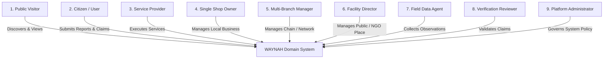
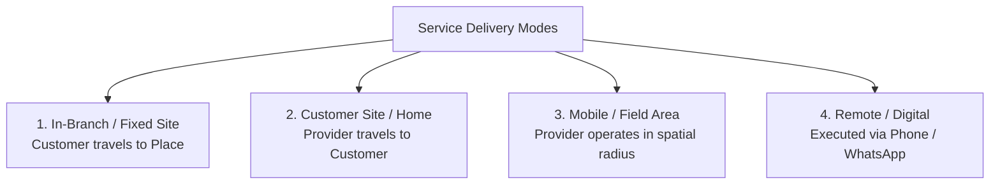
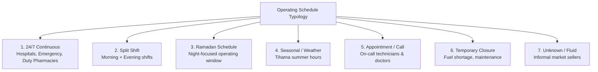
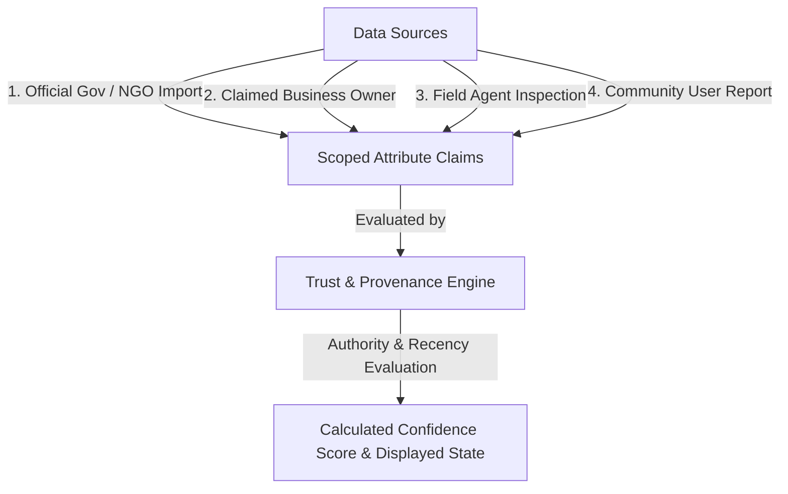
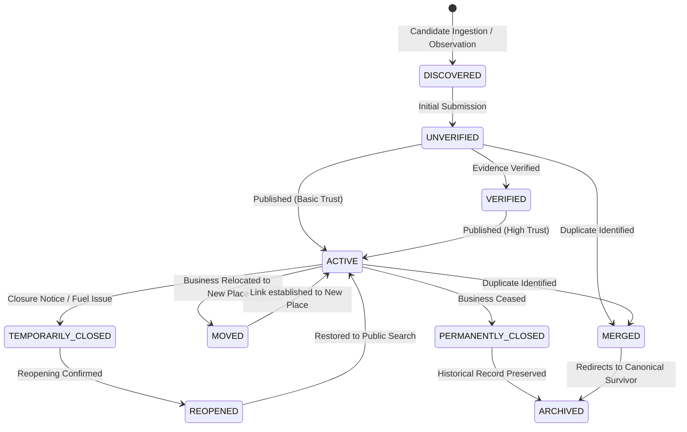

# WAYNAH — PHASE 2 DOMAIN / REAL-WORLD / OPERATIONAL LOGIC VALIDATION STUDY (V1.1)

> **PROJECT:** WAYNAH (وينه؟ — Geographic Discovery & Local Trust Platform)  
> **BRAND UMBRELLA:** M.GH.AL  
> **SCOPE:** Hajjah Governorate, Yemen (Initial Operational Geography) — Extensible Across Yemen  
> **DOCUMENT ID:** WAYNAH_PHASE_2_DOMAIN_OPERATIONAL_LOGIC_STUDY_V1_1  
> **STATUS:** PHASE 2 — READY FOR FINAL INDEPENDENT REVIEW  
> **REFERENCE DATE:** 1 October 2026  
> **AUDIT TRAIL & LINEAGE:**  
> This V1.1 document represents a formal normalized Pass over V1.0 (`WAYNAH_PHASE_2_DOMAIN_OPERATIONAL_LOGIC_STUDY.md`). It preserves all verified core conceptual foundations while removing unsupported certainty, applying explicit statement taxonomy (`FACT`, `ASSUMPTION`, `HYPOTHESIS`, `DOMAIN DECISION`, `UNKNOWN / VALIDATION REQUIRED`), strictly separating domain rules from technical implementation candidates, and correcting phase alignment references.  
> **BOUNDARIES:** ZERO Source Code Changes | ZERO Schema/Database Changes | ZERO API Changes | ZERO Implementation  

---

## 1. EXECUTIVE SUMMARY

This document represents the normalized **Phase 2 Domain, Real-World, and Operational Logic Validation Study (V1.1)** for the WAYNAH platform.

Following the formal closure of the Phase 1 security gate (remediation and independent re-review of security findings F-02 and F-06), this study establishes the domain foundation for WAYNAH before any formal Domain Modeling (Phase 3), System Architecture (Phase 4), or Implementation occurs.

WAYNAH is not a generic e-commerce marketplace, nor a static business directory, nor a western-style map application. It is a **geographic discovery and local trust platform** specifically designed to function within the socio-geographic, infrastructure, and operational realities of **Hajjah Governorate, Yemen**, while maintaining complete architectural extensibility across all 22 governorates of Yemen.

### 1.1 Primary Operational Purpose
WAYNAH enables citizens, visitors, and field workers to answer fundamental real-world questions:
* *What is this place?*
* *Where exactly is it located in human and geographic terms?*
* *What services or capabilities does it currently offer?*
* *Is it open right now under real-world Yemeni operating schedules?*
* *How can I reliably contact the operator or provider?*
* *Who operates this facility or business, and under what authority?*
* *How trustworthy is this information, who reported it, and when was it last verified?*
* *How does the system represent uncertainty, temporary closures, relocations, duplicates, and conflicting claims?*

### 1.2 Core Domain Principles Preserved in V1.1
1. **Real-World Reality First `[DOMAIN DECISION]`**: The domain model must conform to how physical locations, informal businesses, shared spaces, and service delivery actually operate in Hajjah, Yemen—not to generic SaaS assumptions.
2. **Strict Entity Separation `[DOMAIN DECISION]`**: Places, Businesses, Operating Branches, Service Providers, and Services are distinct domain concepts with independent lifecycles (`Place ≠ Business ≠ Branch ≠ Provider ≠ Service`).
3. **Multi-Source Claim & Trust Engine `[DOMAIN DECISION]`**: Truth is never a static boolean flag (`verified: true`). Information consists of scoped, time-stamped claims backed by evidence, provenance, and confidence scoring.
4. **Addressing Grounded in Local Reality `[DOMAIN DECISION]`**: Formal street/building addressing may be incomplete or variable in some areas; landmarks and local descriptions therefore provide important complementary location references ("Near X", "Opposite Y").
5. **Preservation of Historical Provenance `[DOMAIN DECISION]`**: Real-world entities mutate over time (relocate, rename, temporarily close, merge). History is never overwritten; state changes produce explicit audit events and temporal transitions.
6. **Decoupling Experience from Truth `[DOMAIN DECISION]`**: Subjective user reviews/ratings are strictly separated from objective factual data claims.

---

## 2. DOMAIN SCOPE & PROJECT PHASE ALIGNMENT

### 2.1 Project Phase Sequence
To ensure clear architectural boundaries, WAYNAH adheres to the following explicit phase sequence:

```
Phase 1: Security & Codebase Safety Gate ──► [CLOSED]
  └── Phase 2: Domain / Real-World Logic Validation (V1.1) ──► [CURRENT PHASE - READY FOR FINAL INDEPENDENT REVIEW]
       └── Phase 3: Domain Model (Bounded Contexts & Entities) ──► [NEXT PHASE - NOT STARTED]
            └── Phase 4: System Architecture (Tech Stack, Storage, APIs) ──► [FUTURE PHASE]
                 └── Phase 5: UX/UI Design System ──► [FUTURE PHASE]
                      └── Phase 6+: Engineering, Implementation & Validation ──► [FUTURE PHASE]
```

> **CRITICAL BOUNDARY RULE**: Phase 2 is strictly a study phase. It does NOT define database tables, Prisma schemas, SQL types, API endpoints, or search algorithms. Phase 3 (Domain Model) and Phase 4 (System Architecture) remain completely separate future activities.

### 2.2 Functional Scope: What WAYNAH Is vs. Is Not

| Capability Scope | Domain Characterization | Classification |
|---|---|---|
| **Geographic Discovery Engine** | Spatial discovery indexed by administrative context, landmark proximity, category, and real-world service capability. | `[DOMAIN DECISION]` |
| **Local Trust & Verification Layer** | Multi-source provenance system evaluating confidence, freshness, and dispute status of place attributes. | `[DOMAIN DECISION]` |
| **Operational Presence Directory** | Dynamic operational registry representing fixed facilities, mobile providers, home-based services, and informal operators. | `[DOMAIN DECISION]` |
| **Public Information Resource** | Accessible public platform for essential emergency, public, commercial, and community locations in Hajjah. | `[DOMAIN DECISION]` |
| **E-Commerce Marketplace** | WAYNAH does NOT force shops to list product inventory, process digital payments, or manage shopping carts (Explicitly out of scope). | `[DOMAIN DECISION]` |
| **Logistics / Delivery Carrier** | WAYNAH does NOT operate platform delivery drivers or assume freight carrier liability (Explicitly out of scope). | `[DOMAIN DECISION]` |
| **Static Yellow Pages** | WAYNAH does NOT treat listings as static text cards without temporal state, schedules, or crowd resolution (Explicitly out of scope). | `[DOMAIN DECISION]` |

---

## 3. REAL-WORLD CONTEXT: HAJJAH GOVERNORATE & YEMEN GEOGRAPHY

### 3.1 Geographic and Administrative Structure of Hajjah `[FACT]`
Hajjah Governorate is an administrative region of Yemen comprising **31 administrative districts** (*مديريات*), spanning urban centers, mountainous highlands, border corridors, and lowland coastal plains:

```
Yemen (الجمهورية اليمنية) `[FACT]`
 └── Hajjah Governorate (محافظة حجة) `[FACT]`
      ├── Urban / Administrative Hubs (e.g. Hajjah City / مدينة حجة, Abs / عبس) `[FACT]`
      ├── Rural & Agricultural Districts (e.g. Ku'aydinah / كعيدنة, Mabyan / مبين, Al-Mahabishah / المحابشة) `[FACT]`
      ├── Border & Transit Corridors (e.g. Haradh / حرض, Mustaba / مستبأ) `[FACT]`
      └── Coastal / Lowland Tihama Regions (e.g. Midi / ميدي, Hayran / حيران) `[FACT]`
```

### 3.2 Administrative Hierarchy Classification
The administrative structure below the district level varies across datasets and regions:

* **Governorate (محافظة)**: First-level administrative boundary establishing regional context. `[FACT]`
* **District / Directorate (مديرية)**: Primary official administrative geographic unit for local governance and service discovery (31 districts in Hajjah). `[FACT]`
* **Sub-District & Village Hierarchy**: Administrative levels below district are dataset/country-context dependent and must remain flexible. `[FACT]`
* **Specific Sub-District (Uzlah) / Village Coverage**: Specific administrative mapping and coverage below district level. `[UNKNOWN / VALIDATION REQUIRED]`
* **Landmark (معلم)**: Major physical reference point essential for human navigation. `[DOMAIN DECISION]`

> **NORMALIZATION NOTE**: While *Governorate → District* is a universally stable administrative fact in Yemen `[FACT]`, sub-district (*Uzlah*) data completeness varies across sources (e.g., OCHA datasets vs local municipal lists). Administrative levels below district are dataset/country-context dependent and must remain flexible `[FACT]`, while specific *Uzlah* coverage requires verification `[UNKNOWN / VALIDATION REQUIRED]`.

### 3.3 Humanitarian Datasets, P-Codes, & Gazetteers
* **P-codes / Geographic Place Identification Codes**: UN OCHA (Office for the Coordination of Humanitarian Affairs) COD-AB datasets utilize standardized alphanumeric P-codes (e.g., `YE17` series for Hajjah Governorate) to identify administrative units. (Note: P-codes represent geographic place identification codes, not postal codes.) `[FACT]`
* **Specific P-Code String Mappings**: Specific P-code string mappings for individual districts (e.g., mapping `YE1722` to Abs District) require verification against official OCHA COD-AB release files prior to dataset ingestion. `[UNKNOWN / VALIDATION REQUIRED]`

### 3.4 Socio-Economic & Infrastructure Operational Factors
1. **Informal & Unnamed Commerce `[ASSUMPTION]`**: Significant economic activity occurs in unnamed shops, weekly traditional souks (*سوق الأربعاء بعبس*, *سوق الثلاثاء بالمحابشة*), roadside kiosks, and mobile service vehicles. The exact quantified prevalence requires field research `[UNKNOWN / VALIDATION REQUIRED]`.
2. **Communication Channels `[ASSUMPTION]`**: Direct mobile calls and WhatsApp are assumed to be widely used by local businesses, but exact digital adoption rates require field validation `[UNKNOWN / VALIDATION REQUIRED]`. Physical websites or corporate email addresses are rare.
3. **Operating Schedule Fluidity `[ASSUMPTION]`**: Operating schedules are assumed to fluctuate due to reliance on private solar systems, local commercial generators (*مواطير خاصة*), and fuel supply variations `[UNKNOWN / VALIDATION REQUIRED]`.
4. **Seasonal & Cultural Shifts `[ASSUMPTION]`**: Operating hours shift during Ramadan, religious holidays, agricultural harvests, and peak summer heat in lowland Tihama.
5. **Informal Landmark Addressing `[ASSUMPTION]`**: Formal street/building addressing may be incomplete or variable in some areas; landmarks and local descriptions therefore provide important complementary location references. The extent of formal street naming across all 31 districts remains to be verified `[UNKNOWN / VALIDATION REQUIRED]`.

---

## 4. ACTORS: USER PERSONAS & OPERATIONAL ROLES

WAYNAH models 9 conceptual domain actors interacting with the system:



| Actor Role | Real-World Operational Context | Primary Conceptual Scope | Authority Level |
|---|---|---|---|
| **1. Public Visitor** | Unauthenticated citizen searching for a hospital, open pharmacy, or workshop in Hajjah. | Read-only discovery, map viewing, obtaining contact info. | None (Public read) `[DOMAIN DECISION]` |
| **2. Citizen Contributor** | Registered local resident reporting place observations, edits, or operational status. | Suggesting places, submitting attribute claims, reporting closures. | Low (Subject to triage/consensus) `[DOMAIN DECISION]` |
| **3. Independent Provider** | Skilled technician (electrician, plumber, driver) operating without a storefront. | Defining service coverage area, availability status, direct contact. | Medium (Self-managed service profile) `[DOMAIN DECISION]` |
| **4. Small Business Operator** | Owner of a single shop, pharmacy, or workshop in Hajjah. | Claiming business identity, managing hours, updating WhatsApp/phone. | High for claimed business profile `[DOMAIN DECISION]` |
| **5. Multi-Branch Manager** | Manager overseeing a bank, pharmacy chain, or commercial distributor. | Managing multi-branch profiles, assigning local branch managers. | High for parent business scope `[DOMAIN DECISION]` |
| **6. Facility Administrator** | Director of a government hospital, public school, or NGO office. | Maintaining official facility information and emergency contacts. | High for official facility scope `[DOMAIN DECISION]` |
| **7. Field Data Agent** | Authorized surveyor conducting physical data collection in Hajjah districts. | Submitting structured field observations, GPS pins, shopfront photos. | High for observational evidence `[DOMAIN DECISION]` |
| **8. Verification Reviewer** | Trusted domain moderator reviewing disputed claims and field audit data. | Resolving data conflicts, reviewing evidence, issuing scoped verification. | High for verification decisions `[DOMAIN DECISION]` |
| **9. Platform Administrator** | System governor managing category structures and system governance policy. | Managing global category taxonomies, review queues, audit logs. | System Governance Scope `[DOMAIN DECISION]` |

---

## 5. PLACES: PHYSICAL LOCATION VS. BUSINESS IDENTITY

### 5.1 What Qualifies as a Place? `[DOMAIN DECISION]`
A **Place** in WAYNAH is a canonical, discoverable, real-world geographic location with a distinct physical presence or human reference value.

### 5.2 Decoupling Place from Business Identity `[DOMAIN DECISION]`
A core domain foundation of WAYNAH is the **conceptual separation of Physical Place from Business Identity**:

```text
┌─────────────────────────────────────────┐         ┌─────────────────────────────────────────┐
│              PHYSICAL PLACE             │         │            BUSINESS IDENTITY            │
├─────────────────────────────────────────┤         ├─────────────────────────────────────────┤
│ • Spatial Location (Coordinates)        │         │ • Commercial / Trade Name               │
│ • Administrative District Context       │  Operates │ • Owner / Operator Identity             │
│ • Physical Land Parcel / Structure      │ ◄───────► │ • Brand Identity & Logo                 │
│ • Spatial Landmark Anchor               │   In      │ • Registration / License (if any)       │
│ • Physical Accessibility Characteristics│         │ • Parent Organizational Hierarchy       │
└─────────────────────────────────────────┘         └─────────────────────────────────────────┘
```

#### Key Domain Implications:
* **Place Without Business `[DOMAIN DECISION]`**: A public square (*سوق ميدان*), historic fort (*قلعة القاهرة*), public water well (*بئر ماء مجتمعي*), or municipal office is a Place with no commercial Business.
* **Business Without Public Place `[DOMAIN DECISION]`**: A mobile solar repair technician or home-based catering service has a Business identity but no public physical Place for customer visitation.
* **Multi-Tenant Place `[DOMAIN DECISION]`**: A commercial building (*عمارة تجارية*) or market ground (*سوق كعيدنة المركزي*) is one physical Place hosting multiple distinct Businesses.
* **Place Relocation `[DOMAIN DECISION]`**: When a business relocates, the *Business* updates its location link to a new *Place*; the original *Place* remains in the spatial registry and may later host a different business.

### 5.3 Place Categories & Taxonomies `[DOMAIN DECISION]`
WAYNAH organizes Places across core functional categories reflecting Yemeni operational realities:
* **Health & Medical**: Hospitals, Health Centers, Rural Health Units, Pharmacies, Laboratories.
* **Essential Utilities**: Water Tanker Stations, Power Generator Stations, Gas Cylinder Distribution, Petrol Stations.
* **Emergency & Public Safety**: Civil Defense, Police Stations, Security Checkpoints, Ambulance Posts.
* **Commercial & Retail**: Groceries, Bakeries, Grain Mills, Solar Equipment, Agricultural Supplies, Souk Grounds.
* **Specialized Workshops**: Auto Repair, Towing Services (*سطحات*), Solar Maintenance, Plumbing/Electrical Workshops.
* **Civic & Educational**: Public Schools, Technical Institutes, Local Councils, Mosques, Community Halls.
* **Landmarks & Transit**: Mountain Passes, Valley Junctions, Transport Hubs (*فرزات*), Heritage Sites.

---

## 6. PROVIDERS & ORGANIZATIONS

### 6.1 Provider Typology `[DOMAIN DECISION]`
WAYNAH models organizations and service providers across six domain types:
1. **Independent Freelancer (مزود مستقل)**: Individual skilled worker operating without a physical storefront.
2. **Sole Proprietorship (نشاط فردي / محل)**: Owner-operated single-location commercial shop.
3. **Multi-Branch Enterprise (شركة / نشاط متعدد الفروع)**: Entity managing multiple operational branches.
4. **Government Entity (جهة حكومية)**: State administrative body, public hospital, or municipal council.
5. **NGO / Humanitarian Org (منظمة أهلية / إنسانية)**: Non-profit agency operating relief or health facilities.
6. **Informal / Street Operator (نشاط غير رسمي / بائع متجول)**: Unregistered or mobile provider offering vital local goods/services.

---

## 7. SERVICES: OFFERINGS, AVAILABILITY, & DELIVERY MODES

### 7.1 Service Concept `[DOMAIN DECISION]`
A **Service** in WAYNAH is an intangible work, utility, or specialized capability performed for a customer or community member.

$$\text{Service} \neq \text{Product}$$
$$\text{Service} = \text{Action / Execution / Capability under spatial and temporal conditions}$$
$$\text{Product} = \text{Physical commodity / unit of sale}$$

### 7.2 Service Delivery Modes `[DOMAIN DECISION]`
Services are categorized into four distinct execution modes:



1. **In-Branch / Fixed Site (خدمة في مقر الفرع)**: Customer physically visits the Place (e.g., medical exam, car repair).
2. **Customer Site / Home (خدمة منزلية / بموقع العميل)**: Provider travels to the customer location (e.g., home plumbing, electrical wiring).
3. **Mobile / Field Area (خدمة ميدانية متغيرة)**: Provider operates dynamically within a district or spatial radius (e.g., water tanker delivery, vehicle towing).
4. **Remote / Digital (خدمة عن بُعد)**: Service executed via telecommunications (e.g., phone advice, remote consultation).

---

## 8. GEOGRAPHY & ADDRESSING: THE DUAL-LAYER ADDRESS MODEL

### 8.1 Dual-Layer Address Model `[DOMAIN DECISION]`
Because formal street/building addressing may be incomplete or variable in some areas, landmarks and local descriptions provide essential location references. WAYNAH models addresses using a **Dual-Layer Geographic Representation**:

```text
┌─────────────────────────────────────────────────────────────────────────────────┐
│                          DUAL-LAYER ADDRESS MODEL                               │
├─────────────────────────────────────────────────────────────────────────────────┤
│ LAYER 1: MATHEMATICAL & ADMINISTRATIVE SPATIAL ANCHOR                           │
│ • Geographic Coordinates (WGS84 Latitude & Longitude)                           │
│ • Administrative Hierarchy Context (Governorate, District P-code)               │
│ • Spatial Reference Point / Plus Code (Optional Spatial Code)                    │
├─────────────────────────────────────────────────────────────────────────────────┤
│ LAYER 2: HUMAN-READABLE LOCAL DESCRIPTIVE ADDRESS                               │
│ • Governorate Name (محافظة حجة)                                                  │
│ • District Name (مديرية عبس)                                                    │
│ • Uzlah / Village / Neighborhood Name (if available)                            │
│ • Primary Landmark Reference ("50m South of Grain Silos" / جنوب صوامع الغلال)   │
│ • Spatial Orientation ("Opposite Al-Hikmah Pharmacy" / مقابل صيدلية الحكمة)     │
│ • Access Description ("Unpaved side road turning East from main highway")       │
└─────────────────────────────────────────────────────────────────────────────────┘
```

---

## 9. OPERATING HOURS & YEMEN SCHEDULE TYPOLOGY

### 9.1 Schedule Structure Typology `[DOMAIN DECISION]`
Operating hours in Hajjah reflect complex cultural, economic, and infrastructure factors. WAYNAH models 7 schedule types:



1. **Continuous 24/7 (24 ساعة / طوارئ)**: Emergency rooms, hospitals, designated duty pharmacies.
2. **Split Shift (نظام الفترتين)**: Morning operating window + mid-day rest break + evening operating window.
3. **Ramadan Schedule (جدول شهر رمضان المبارك)**: Post-Iftar night shift as the primary operational window.
4. **Seasonal / Weather Schedules**: Adjusted for severe summer heat in lowland Tihama or harvest cycles.
5. **Appointment / On-Call Only (بالطلب / عند الاتصال)**: Mobile technicians and drivers without open storefronts.
6. **Temporary Closure (إغلاق مؤقت)**: Facility closed temporarily due to fuel shortages, power issues, or restocking.
7. **Unknown / Fluid Schedule (غير منتظم)**: Informal vendors whose availability depends on daily market foot traffic.

> **NORMALIZATION NOTE**: Specific hour values (e.g. 08:00–12:30 or Ramadan 20:00–02:30) are **illustrative data examples** `[HYPOTHESIS]`, NOT hard-coded system constants. The domain model supports the schedule *structures*, while exact times remain user- or provider-submitted data.

---

## 10. TELECOM & CONTACT INFORMATION REALITIES

### 10.1 Telecom Prefixes & Numbering Plan

* **Historical Telecom Numbering Plan `[FACT]`**: Historical ITU documentation records the following telecom numbering plan series for Yemen:
  * 77x Series: Yemen Mobile (CDMA / LTE)
  * 73x Series: You / formerly MTN (GSM / LTE)
  * 71x Series: SabaFon (GSM / LTE)
  * 70x Series: Y Telecom
  * Landline Area Code: Hajjah geographic area code: 7
* **Current 2026 Operator Prefix Assignments `[UNKNOWN / VALIDATION REQUIRED]`**: Active operator assignments, prefix routing, and mobile number portability status in 2026 require authoritative current verification.

### 10.2 Prefix Identity Domain Rule `[DOMAIN DECISION]`
> **RULE**: Telecom prefixes provide useful network context, but they MUST NEVER become immutable identity keys for a provider or person. Mobile numbers can be ported, transferred, or reassigned over time.

### 10.3 WhatsApp Communication Channel `[ASSUMPTION]`
* **Working Assumption `[ASSUMPTION]`**: WhatsApp is assumed to be a widespread communication channel for local business messaging, location sharing, and direct contact in Yemen.
* **Field Validation Requirement `[UNKNOWN / VALIDATION REQUIRED]`**: The exact quantitative adoption rate of WhatsApp across urban vs. rural businesses in Hajjah requires empirical field verification.

---

## 11. TRUST & VERIFICATION: MULTI-SOURCE CLAIM ENGINE

### 11.1 The Multi-Source Provenance Principle `[DOMAIN DECISION]`
Truth in WAYNAH is never a binary boolean flag (`verified: true / false`). Information about a place originates from multiple sources with varying authority, freshness, and evidence:



### 11.2 Authority Evaluation Principle `[DOMAIN DECISION]`
> **RULE**: Authority is relative to the attribute scope, source type, evidence quality, recency, and verification context. Universal numeric weights (e.g. `Gov = 100`, `Owner = 80`) MUST NOT be hard-coded as absolute domain rules.

---

## 12. DUPLICATES, IDENTITY, & REVERSIBLE RESOLUTION

### 12.1 Duplicate Matching Heuristics `[HYPOTHESIS]`
Duplicate candidate detection relies on multi-vector spatial, phonetic, and contact matching. Exact distance thresholds (e.g. `<30m`, `<100m`) are **candidate heuristics** `[HYPOTHESIS]` that require empirical geospatial testing in dense souks versus sparse rural districts.

### 12.2 Reversible Merge / Split Domain Rules `[DOMAIN DECISION]`
1. **Canonical Survivor Selection `[UNKNOWN / VALIDATION REQUIRED]`**: Canonical survivor selection policy is deferred. Criteria for choosing between duplicate records (such as verification tier or claim authority) require Phase 3 policy definition and empirical validation.
2. **Alias Preservation `[DOMAIN DECISION]`**: The deprecated duplicate ID is retained in the identity registry as a redirect alias. No historical observations are deleted.
3. **Reversible Unmerge Capability `[DOMAIN DECISION]`**: Merges must be domain-reversible. If two distinct adjacent shops were incorrectly merged, an `UNMERGE` operation restores both entities with historical provenance intact.

---

## 13. CANDIDATE CONCEPTUAL LIFECYCLE `[DOMAIN DECISION]`

> **CONCEPTUAL NOTICE**: These states and transitions are conceptual candidates only and are not a finalized domain state machine. Phase 3 will define the precise relationship between operational states, verification/trust states, domain events, and aggregate boundaries.

Places transition through candidate conceptual states over their operational lifecycle:



---

## 14. REVIEWS & RATINGS VS. FACTUAL DATA CLAIMS

### 14.1 Strict Domain Separation `[DOMAIN DECISION]`
WAYNAH enforces a strict separation between **User Experience Reviews** and **Factual Data Claims**:

```text
┌──────────────────────────────────────────┐         ┌──────────────────────────────────────────┐
│         FACTUAL DATA CLAIMS              │         │        USER EXPERIENCE REVIEWS           │
├──────────────────────────────────────────┤         ├──────────────────────────────────────────┤
│ • "Is the hospital open 24/7?"           │         │ • "The waiting time was long."           │
│ • "What is the correct WhatsApp phone?"  │   VS    │ • "The technician was polite & skilled." │
│ • "Is the place located in Abs District?"│         │ • "Overall rating: 4 out of 5 stars."    │
├──────────────────────────────────────────┤         ├──────────────────────────────────────────┤
│ Evaluated via: Evidence, Provenance,     │         │ Evaluated via: Community Guidelines,     │
│ Verification & Scoped Claims Engine.     │         │ Anti-Spam & Moderation Rules.            │
└──────────────────────────────────────────┘         └──────────────────────────────────────────┘
```

---

## 15. SEARCH & DISCOVERY LOGIC

### 15.1 Search Intent Vectors `[DOMAIN DECISION]`
Citizens in Hajjah search using diverse mental models:
* **Category / Need Intent**: "Looking for an open pharmacy in Abs"
* **Name / Brand Intent**: "Al-Shifa Hospital"
* **Spatial Proximity Intent**: "Auto repair near Abs roundabout"
* **Service Capability Intent**: "Solar inverter maintenance"
* **Phone / Contact Intent**: "Search by phone 771234567"
* **Local Dialect / Vernacular**: "وايت ماء" (Water tanker), "سطحة" (Towing truck)

### 15.2 Search Ranking Weights `[HYPOTHESIS]`
While discovery considers relevance, spatial proximity, operational state, trust confidence, data freshness, and category match `[DOMAIN DECISION]`, exact ranking formulas and numeric point bonuses (e.g. `+25` for open now, `+35` for 24/7) are **product/engineering hypotheses** `[HYPOTHESIS]` deferred to Phase 6+ validation.

---

## 16. DOMAIN ANTI-PATTERNS TO IDENTIFY & AVOID

WAYNAH explicitly rejects 14 dangerous domain simplifications:

| # | Anti-Pattern | Real-World Failure Reason in Yemen | Correct WAYNAH Domain Rule | Classification |
|---|---|---|---|---|
| 1 | **Place = Business** | Places are physical locations; Businesses are operating entities. A place can exist without a business; a mobile business has no public place. | Decouple `Place` (location) from `Business` (identity). | `[DOMAIN DECISION]` |
| 2 | **Provider = Place** | A provider (doctor, plumber) is a human actor, not a building. A doctor may visit 3 clinics. | Treat `Provider` as a distinct actor who can operate across multiple Places. | `[DOMAIN DECISION]` |
| 3 | **Address = One Text Field** | Formal street addressing is incomplete or absent in many areas. | Model addresses as dual-layer: spatial coords + administrative PCODE + local landmarks. | `[DOMAIN DECISION]` |
| 4 | **Verified = Single Boolean** | A boolean `verified: true` fails to capture *what* was verified, *by whom*, and *when*. | Implement scoped, time-stamped, evidence-backed `Claims`. | `[DOMAIN DECISION]` |
| 5 | **Open/Closed = Static Boolean** | Real schedules include split shifts, Friday closures, and Ramadan night shifts. | Model schedules as dynamic temporal schedule structures. | `[DOMAIN DECISION]` |
| 6 | **Phone = Single String** | Yemeni businesses use multiple networks (77, 73, 71, 70), WhatsApp, and landlines, sometimes shared with neighbors. | Model contact info as multi-entry collections with channel metadata and shared phone flags. | `[DOMAIN DECISION]` |
| 7 | **Category = One Fixed Enum** | Real places offer multi-functional capabilities (e.g. grocery shop operating a gas cylinder exchange). | Support primary categories alongside multi-capability service tagging. | `[DOMAIN DECISION]` |
| 8 | **Rating = Factual Truth** | User star ratings reflect subjective opinion, not factual existence. | Strictly separate subjective `User Reviews` from `Factual Data Claims`. | `[DOMAIN DECISION]` |
| 9 | **User Submission = Trusted Fact** | Crowdsourced inputs contain typos or errors. Overwriting DB directly destroys integrity. | Treat user inputs as candidate `Claims` subject to consensus or triage queues. | `[DOMAIN DECISION]` |
| 10 | **Duplicate = Same Name** | Two shops named "صيدلية الأمل" may exist in different districts; "مستشفى عبس" and "المستشفى الجمهوري" are identical. | Perform entity resolution using multi-vector matching: Spatial + Phonetic + Phone. | `[DOMAIN DECISION]` |
| 11 | **Location = Coordinates Only** | Pure GPS coordinates are useless to a human navigating on foot or talking to a taxi driver. | Pair mathematical PostGIS coordinates with human-readable local descriptive landmarks. | `[DOMAIN DECISION]` |
| 12 | **Closure = Record Deletion** | Deleting records when a shop closes destroys historical provenance and creates duplicate re-additions. | Transition closed places to explicit temporal states (`TEMPORARILY_CLOSED`, `PERMANENTLY_CLOSED`). | `[DOMAIN DECISION]` |
| 13 | **History = Overwritten Data** | Overwriting old data makes it impossible to trace provenance or handle user disputes. | Retain full audit logs and historical claims; updates preserve historical event streams. | `[DOMAIN DECISION]` |
| 14 | **Review = Factual Claim** | Conflating reviews with factual reporting allows malicious users to falsify business attributes. | Enforce distinct moderation workflows for Reviews versus Attribute Claims. | `[DOMAIN DECISION]` |

---

## 17. ILLUSTRATIVE NON-BINDING TECHNICAL POSSIBILITIES

> **ARCHITECTURAL BOUNDARY NOTICE**: None of the technologies or algorithms listed below constitutes a Phase 2 architectural decision. They are listed solely as an illustrative record of deferred implementation candidates for Phase 4+.

To prevent technical implementation candidates from masquerading as locked domain rules, WAYNAH enforces a strict separation:

| Domain Concept (Phase 2 / Phase 3 Scope) | Technical Implementation Candidate (Phase 4+ Scope - DEFERRED) |
|---|---|
| **Physical Place & Spatial Context** | PostGIS `geography(Point, 4326)`, GiST spatial indexing, `ST_DWithin` spatial queries. |
| **Administrative Hierarchy** | Relational foreign keys (`governorateId`, `districtId`), SQL boundary polygon queries (`ST_Covers`). |
| **Scoped Claim & Provenance Engine** | Audit log event tables, append-only JSON claim stores, Redis confidence cache. |
| **Operating Schedule Types** | JSON-B schedule schemas, Cron-like time window evaluators, timezone helpers. |
| **Entity Resolution & Duplicates** | Levenshtein / Soundex string distance, PostGIS spatial radius filters, background queue workers. |
| **API & Client Interaction** | REST / GraphQL endpoints, DTO validation schemas, JWT authorization headers, React components. |

---

## 18. STATEMENT CLASSIFICATION & EVIDENCE MATRIX

The following matrix classifies all material statements made in this Phase 2 Study using strictly one of the five normalized statement taxonomy categories (`FACT`, `ASSUMPTION`, `HYPOTHESIS`, `DOMAIN DECISION`, `UNKNOWN / VALIDATION REQUIRED`):

| Statement / Topic | Classification | Evidence / Source | Confidence Level | Action |
|---|---|---|---|---|
| Hajjah Governorate has 31 administrative districts | `[FACT]` | Sourced administrative dataset (UN OCHA COD-AB Yemen) | High | Retain as geographic fact |
| Hierarchy below district is dataset/country-context dependent | `[FACT]` | OCHA Yemen gazetteer structure analysis | High | Retain as flexible administrative rule |
| Specific Sub-District (Uzlah) / Village coverage | `[UNKNOWN / VALIDATION REQUIRED]` | Requires verification against local municipal/OCHA lists | Medium | Validate during data ingestion |
| UN OCHA P-codes identify administrative units | `[FACT]` | UN OCHA COD-AB specification | High | Retain as standard geographic identifier |
| Specific P-code string mappings (e.g. `YE1722 = Abs`) | `[UNKNOWN / VALIDATION REQUIRED]` | Requires verification against official COD-AB release file | Medium | Validate before ingestion; do not hardcode |
| Historical telecom numbering-plan records (77, 73, 71, 70, area code 7) | `[FACT]` | Historical ITU documentation | High | Retain as historical numbering plan |
| Current 2026 telecom operator prefix assignments | `[UNKNOWN / VALIDATION REQUIRED]` | Requires authoritative verification of 2026 operator routing | Medium | Defer identity lock; treat as mutable metadata |
| Phone prefix is mutable metadata, not identity | `[DOMAIN DECISION]` | Domain analysis of number portability & reassignment | High | Lock as domain rule |
| WhatsApp prevalence among businesses | `[ASSUMPTION]` | Working market assumption | Medium | Validate via field survey |
| Split shift & Ramadan schedules occur in Yemen | `[FACT]` | Yemeni commercial operational reality | High | Retain as operational reality |
| Exact operating hour time strings (e.g. 08:00-12:30) | `[HYPOTHESIS]` | Illustrative data example | Low | Treat as user data, not system constants |
| Pharmacy duty rotation rules | `[UNKNOWN / VALIDATION REQUIRED]` | Local health syndicate announcements | Medium | Validate against local sources |
| Search ranking weights & point bonuses (`+25`) | `[HYPOTHESIS]` | Candidate product scoring heuristic | Low | Defer to Phase 6+ product tuning |
| Duplicate spatial distance thresholds (`<30m`) | `[HYPOTHESIS]` | Candidate geospatial matching rule | Low | Defer to Phase 4+ geospatial testing |
| Canonical survivor selection policy | `[UNKNOWN / VALIDATION REQUIRED]` | Policy deferred to Phase 3 & field evidence | Medium | Defer survivor policy lock |
| Scoped claim provenance model | `[DOMAIN DECISION]` | WAYNAH core domain architecture decision | High | Lock as Phase 2 domain decision |
| Place ≠ Business decoupling | `[DOMAIN DECISION]` | WAYNAH core domain architecture decision | High | Lock as Phase 2 domain decision |

---

## 19. DECISIONS THAT MUST NOT BE LOCKED BEFORE VALIDATION

The following 12 items MUST NOT be locked as permanent domain rules or implementation constants in Phase 2:

1. **Exact Administrative Hierarchy Below District**: Uzlah and village structures vary by dataset and must remain flexible attributes `[FACT]`.
2. **Specific P-Code String Mappings**: P-code assignments must be validated against official UN OCHA COD-AB release files `[UNKNOWN / VALIDATION REQUIRED]`.
3. **Current Telecom Operator Prefix Assignment**: Current 2026 operator prefix assignments require authoritative verification `[UNKNOWN / VALIDATION REQUIRED]`.
4. **Quantitative WhatsApp Prevalence Statistics**: Exact usage percentages require empirical field survey confirmation `[UNKNOWN / VALIDATION REQUIRED]`.
5. **Universal Business Opening Hour Values**: Opening hours are user-submitted data, not hard-coded software rules `[HYPOTHESIS]`.
6. **Pharmacy Duty Rotation Rules**: Duty rotations are local source-dependent inputs `[UNKNOWN / VALIDATION REQUIRED]`.
7. **Universal Numeric Trust Authority Weights**: Hardcoded numeric authority weights (`Gov = 100`) must not be locked `[HYPOTHESIS]`.
8. **Search Ranking Numeric Weights**: Search weights and bonus points are candidate heuristics deferred to product validation `[HYPOTHESIS]`.
9. **Duplicate Geospatial Distance Thresholds**: Numeric distance bounds (`<30m`) require geospatial field testing `[HYPOTHESIS]`.
10. **Canonical Survivor Selection Policy**: Policy for canonical survivor selection between duplicate records is deferred `[UNKNOWN / VALIDATION REQUIRED]`.
11. **Exact Freshness Decay Windows**: Attribute freshness decay periods require empirical data analysis `[HYPOTHESIS]`.
12. **Review Scoring & Moderation Formulas**: Review aggregation weights belong to future moderation policy validation `[HYPOTHESIS]`.

---

## 20. CANDIDATE DOMAIN CONTEXTS FOR PHASE 3 `[DOMAIN DECISION]`

> **CONCEPTUAL NOTICE**: These are candidate conceptual boundaries and are subject to validation and refinement during Phase 3. Bounded contexts are not considered final or settled in Phase 2.

The following candidate conceptual entities and bounded context concepts are identified for further validation during **Phase 3 (Domain Model)**:

```text
CANDIDATE BOUNDED CONTEXTS FOR PHASE 3:
├── 1. Geographic Context (Governorate, District, Administrative Context, Spatial Location, Landmark Anchor)
├── 2. Place Registry (Canonical Place, Facility Type, Category Taxonomy, Temporal State)
├── 3. Business & Operating Presence (Business Identity, Operating Branch, Provider, Membership)
├── 4. Service Offerings (Service Capability, Service Delivery Mode, Coverage Area)
├── 5. Trust & Provenance (Claim, Source Provenance, Evidence, Scoped Verification State, Dispute)
├── 6. Community & Moderation (User Contribution, Report, Experience Review, Audit Queue)
└── 7. Identity & Resolution (Canonical Survivor, Deprecated Alias, Reversible Merge/Split)
```

> **REMINDER**: Phase 3 will define Bounded Contexts, Aggregates, Value Objects, and Domain Events conceptually. It will NOT create database tables, Prisma schemas, or API code.

---

## 21. OPEN QUESTIONS CATALOG

| ID | Open Question | Operational Significance | Current Status | Required Evidence | Target Phase |
|---|---|---|---|---|---|
| **OQ-P2-01** | Verification procedures for duty pharmacy (*صيدليات المناوبة*) rotation schedules in Hajjah City & Abs | Critical for night medical emergency accuracy | `[OPEN]` | Health Syndicate / Ministry announcement data | Phase 3/4 |
| **OQ-P2-02** | Representation model for fluctuating fuel-dependent service costs (water tankers, towing) | Prevents misleading static price displays during fuel crises | `[OPEN]` | Local field interviews with water tanker drivers in Abs | Phase 3 |
| **OQ-P2-03** | Visual trust indicators for "Unverified Community Data" vs "Field Verified Data" for Yemeni citizens | Prevents user confusion without overloading UI | `[OPEN]` | UX user testing with Yemeni citizens | Phase 5 |
| **OQ-P2-04** | Privacy boundary rules for home-based craft services (district-only vs spatial pin) | Protects personal safety & privacy of home service providers | `[OPEN]` | Domain privacy policy review | Phase 3 |
| **OQ-P2-05** | Maximum spatial distance threshold for auto-flagging duplicate candidate places | Prevents false merges in dense souks vs rural areas | `[OPEN]` | Geospatial dataset distance analysis | Phase 4 |
| **OQ-P2-06** | Place entry handling for facilities in active conflict or security-restricted zones | Ensures safety & prevents displaying hazardous locations | `[OPEN]` | Humanitarian security policy guidelines | Phase 3 |
| **OQ-P2-07** | Community reputation & anti-spam mechanisms for crowdsourced edit claims | Encourages contributions while preventing malicious edits | `[OPEN]` | Moderation policy analysis | Phase 3 |

---

## 22. KNOWN / ASSUMED / UNKNOWN MATRIX

| Domain Area | KNOWN (Established Facts) `[FACT]` | ASSUMED (Working Hypotheses) `[ASSUMPTION]` | UNKNOWN (Requires Field Research) `[UNKNOWN / VALIDATION REQUIRED]` | DOMAIN RISK | DECISION NEEDED |
|---|---|---|---|---|---|
| **Geography & Addressing** | Hajjah has 31 administrative districts `[FACT]`. Administrative levels below district are dataset-dependent `[FACT]`. Landmark descriptions are essential `[DOMAIN DECISION]`. | OCHA P-codes provide reliable district filtering `[ASSUMPTION]`. | Exact sub-district (Uzlah) coverage for all 31 districts `[UNKNOWN / VALIDATION REQUIRED]`. Specific P-code string mappings `[UNKNOWN / VALIDATION REQUIRED]`. | Misassignment of places near district borders. | Lock dual-layer addressing concept `[DOMAIN DECISION]`. |
| **Places & Facilities** | Places exist independently of businesses `[DOMAIN DECISION]`. Multi-tenant places exist `[DOMAIN DECISION]`. | Most commercial shops operate from fixed storefronts `[ASSUMPTION]`. | Percentage of informal vs formal registered shops in Abs `[UNKNOWN / VALIDATION REQUIRED]`. | Over-structuring informal places discourages entry. | Lock Place-Business decoupling `[DOMAIN DECISION]`. |
| **Operating Hours** | Split shifts and Ramadan schedules occur in Yemen `[FACT]`. | Businesses can report split shifts via simple inputs `[ASSUMPTION]`. | Frequency of temporary closures during fuel crises `[UNKNOWN / VALIDATION REQUIRED]`. Exact duty pharmacy rotation schedules `[UNKNOWN / VALIDATION REQUIRED]`. | Users arrive at closed places due to stale data. | Lock 7 schedule structure types `[DOMAIN DECISION]`. |
| **Contact Channels** | Historical ITU numbering plan records 77, 73, 71, 70 series and Hajjah area code 7 `[FACT]`. | WhatsApp is assumed to be widely used for business communication `[ASSUMPTION]`. | Current 2026 operator prefix assignments `[UNKNOWN / VALIDATION REQUIRED]`. Ratio of landline vs mobile usage in government offices `[UNKNOWN / VALIDATION REQUIRED]`. | Shared neighbor numbers cause false duplicate matches. | Lock multi-channel contact model `[DOMAIN DECISION]`. |
| **Trust & Verification** | Single boolean `verified` flag is insufficient for Yemeni data reality `[DOMAIN DECISION]`. | Scoped claims provide clear trust signals to citizens `[ASSUMPTION]`. | Optimal consensus threshold for auto-validating edits `[UNKNOWN / VALIDATION REQUIRED]`. | Overly strict rules keep valuable places unpublished. | Lock scoped claim provenance model `[DOMAIN DECISION]`. |
| **Duplicates & Identity** | Transliteration and local aliases produce duplicate records `[FACT]`. Alias preservation and reversible merge/split are required `[DOMAIN DECISION]`. | Multi-vector matching detects duplicate candidates `[HYPOTHESIS]`. | Canonical survivor selection policy `[UNKNOWN / VALIDATION REQUIRED]`. Complete list of local place aliases `[UNKNOWN / VALIDATION REQUIRED]`. | Incorrectly merging distinct adjacent shops. | Defer canonical survivor policy; lock reversible merge/split `[DOMAIN DECISION]`. |

---

## 23. PHASE 2 EXIT & GATE CRITERIA

Phase 2 Domain / Real-World / Operational Logic Validation is ready for final independent review when:

- [x] Comprehensive domain study normalized with explicit statement taxonomy (`FACT`, `ASSUMPTION`, `HYPOTHESIS`, `DOMAIN DECISION`, `UNKNOWN / VALIDATION REQUIRED`).
- [x] Decoupling of Places, Businesses, Branches, Providers, and Services established.
- [x] Dual-layer addressing, operating schedules, contact channels, and trust mechanisms analyzed.
- [x] 14 domain anti-patterns explicitly identified and countered.
- [x] Statement Classification Matrix, Non-Locked Decisions List, and Candidate Domain Contexts List added.
- [x] Strict boundary enforced: Zero source code changes, zero Prisma/schema changes, zero DB migrations, zero API code.
- [x] V1.1 study document saved to `docs/WAYNAH_PHASE_2_DOMAIN_OPERATIONAL_LOGIC_STUDY_V1_1.md`.

---

# STOP CONDITION REACHED

> **STATUS: PHASE 2 — READY FOR FINAL INDEPENDENT REVIEW**
>
> The formal Phase 2 Domain / Real-World / Operational Logic Validation Study V1.1 is normalized and ready for final independent review.
>
> **DO NOT MARK PHASE 2 AS CLOSED.**  
> **DO NOT BEGIN DOMAIN MODELING (PHASE 3).**  
> **DO NOT CREATE PRISMA MODELS OR SCHEMAS.**  
> **DO NOT IMPLEMENT CODE.**  
>
> Await formal independent review and explicit authorization before proceeding to Phase 3.
