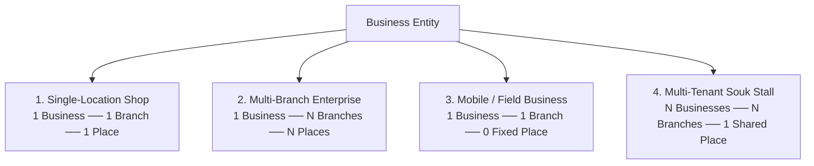
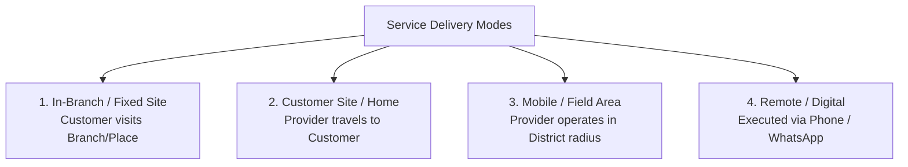
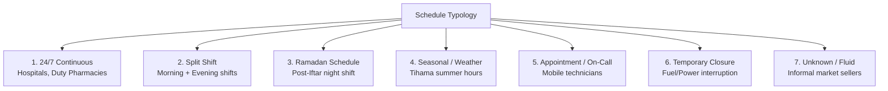
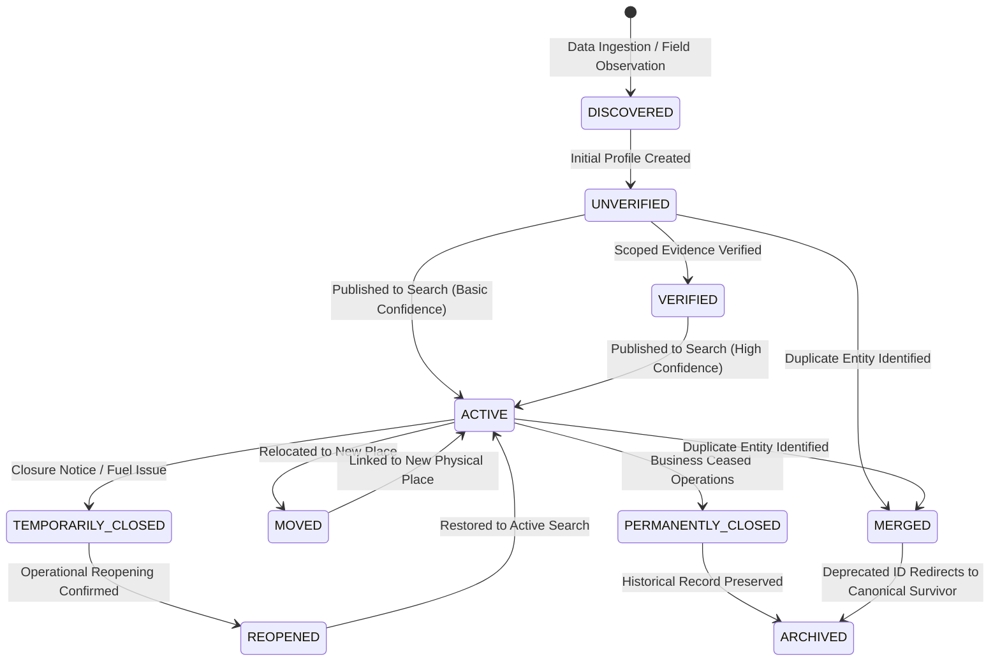

# WAYNAH — PHASE 3 DOMAIN MODEL MASTER STUDY (V1.0)

> **PROJECT:** WAYNAH (وينه؟ — Geographic Discovery & Local Trust Platform)  
> **BRAND UMBRELLA:** M.GH.AL  
> **OPERATIONAL GEOGRAPHY:** Hajjah Governorate, Yemen (Initial Operational Geography) — Extensible Across Yemen  
> **DOCUMENT ID:** WAYNAH_PHASE_3_DOMAIN_MODEL_STUDY_V1  
> **REFERENCE DATE:** 1 October 2026  
> **PHASE STATUS:** PHASE 3 — READY FOR FINAL INDEPENDENT REVIEW  
> **PREVIOUS PHASES:** PHASE 1 — CLOSED | PHASE 2 — CLOSED  
> **BOUNDARIES:** ZERO Source Code Changes | ZERO Schema/Database Changes | ZERO API Changes | ZERO Implementation  

---

## 1. EXECUTIVE SUMMARY

This document constitutes the formal **Phase 3 Domain Model Master Study (V1.0)** for the WAYNAH platform. 

Building directly upon the closed foundations of **Phase 1 (Security & Codebase Safety Gate)** and **Phase 2 (Domain, Real-World, and Operational Logic Validation Study V1.1)**, this study translates domain realities, operational patterns, and business logic into a formal, systematic **Domain Model**.

The primary objective of Phase 3 is to establish pure conceptual domain boundaries, entity definitions, value concepts, relationship matrices, domain invariants, lifecycle concepts, domain events, aggregate candidates, and candidate bounded contexts. 

WAYNAH is a **geographic discovery and local trust platform** tailored to the socio-geographic, infrastructure, and operational realities of **Hajjah Governorate, Yemen**, while remaining fully extensible across all 22 governorates of Yemen.

### 1.1 Core Domain Thesis Preserved in Phase 3
WAYNAH models the real world as it exists on the ground in Hajjah, Yemen:
* Physical locations exist independently of commercial businesses (`Place ≠ Business`).
* Commercial entities operate through distinct physical or virtual operational units (`Business ≠ Branch`).
* Service providers execute work across physical or field areas (`Provider ≠ Business`, `Provider ≠ Place`).
* Services represent intangible execution capabilities, not physical commodities (`Service ≠ Product`).
* Truth is not a static boolean flag; it consists of scoped, temporal claims backed by evidence and provenance (`Claim ≠ Truth`, `Verification ≠ Permanent Truth`).
* Human experience and subjective ratings are strictly decoupled from objective factual data (`Review ≠ Factual Truth`).
* Real-world identity and location descriptions are grounded in physical landmarks and local vernacular, not hard-coded database keys (`Address ≠ One Text Field`, `Phone Number ≠ Immutable Identity`).

---

## 2. PHASE SCOPE & PROJECT ALIGNMENT

### 2.1 Project Phase Sequence
WAYNAH strictly adheres to a sequential, gated domain and system engineering process:

```
Phase 1: Security & Codebase Safety Gate ──► [CLOSED]
  └── Phase 2: Domain / Real-World Logic Validation (V1.1) ──► [CLOSED]
       └── Phase 3: Domain Model Master Study (V1.0) ──► [CURRENT PHASE - READY FOR FINAL INDEPENDENT REVIEW]
            └── Phase 4: System Architecture (Tech Stack, Storage, APIs) ──► [NEXT PHASE - NOT STARTED]
                 └── Phase 5: UX/UI Design System ──► [FUTURE PHASE]
                      └── Phase 6+: Engineering, Implementation & Validation ──► [FUTURE PHASE]
```

> **HARD ARCHITECTURAL BOUNDARY**: Phase 3 is strictly a conceptual domain modeling phase. It does NOT define database tables, Prisma models, SQL types, API routes, UI components, or search engine indexes. Phase 4 (System Architecture) remains a completely separate future phase.

### 2.2 Functional Scope Definition `[DOMAIN DECISION]`

| System Scope Dimension | Included in WAYNAH Domain Scope | Explicitly Excluded from Scope | Classification |
|---|---|---|---|
| **Core Purpose** | Spatial discovery, local operational presence, multi-source trust verification. | E-Commerce inventory, shopping carts, checkout engines. | `[DOMAIN DECISION]` |
| **Geographic Model** | Administrative hierarchy, landmark anchors, dual-layer descriptive addressing. | Global generic address standardization (postal codes/street numbers). | `[DOMAIN DECISION]` |
| **Operational Model** | Storefronts, shared market stalls, mobile technicians, duty services, field areas. | Platform-managed delivery driver fleets or freight carrier liability. | `[DOMAIN DECISION]` |
| **Trust Model** | Scoped attribute claims, source provenance, evidence audit logs, dispute tracking. | Single boolean `verified: true` flags or unverified instant overwrites. | `[DOMAIN DECISION]` |
| **Community Model** | Moderated citizen reports, experience reviews, verified field observations. | Unmoderated social feeds, public messaging forums, direct peer chat. | `[DOMAIN DECISION]` |

---

## 3. MODELING PRINCIPLES

Phase 3 is governed by 12 mandatory real-world domain modeling principles:

1. **Real-World Reality First `[DOMAIN DECISION]`**: The domain model reflects physical geography, local operating habits, and field conditions in Hajjah, Yemen—not software framework convenience.
2. **Place ≠ Business `[DOMAIN DECISION]`**: A physical place is a spatial location; a business is an operating organization. Places exist without businesses; businesses exist without public places.
3. **Business ≠ Branch `[DOMAIN DECISION]`**: A business is an organizational umbrella; a branch is an operational unit with specific hours, staff, contact, and location.
4. **Provider ≠ Business `[DOMAIN DECISION]`**: A provider is an individual or team executing services; a business is a commercial entity. Independent providers operate without commercial storefronts.
5. **Provider ≠ Place `[DOMAIN DECISION]`**: Human providers move between locations or operate across field areas; they are not fixed buildings.
6. **Service ≠ Product `[DOMAIN DECISION]`**: A service is an intangible action performed under temporal and spatial conditions; a product is a physical commodity unit.
7. **Claim ≠ Truth `[DOMAIN DECISION]`**: Information consists of asserted attributes from specific sources. Claims may be conflicting, outdated, or unverified.
8. **Claim ≠ Review `[DOMAIN DECISION]`**: Factual attribute claims (e.g. "Open 24/7") are distinct from subjective opinion reviews (e.g. "Great customer service").
9. **Review ≠ Factual Truth `[DOMAIN DECISION]`**: User reviews express personal experience sentiment and must never automatically alter factual data attributes.
10. **Current State ≠ History `[DOMAIN DECISION]`**: System entities mutate over time. Current state is the active view; historical state events are preserved immutably.
11. **Address ≠ One Text Field `[DOMAIN DECISION]`**: Addressing combines administrative context, coordinates, spatial landmarks, and local directional descriptions.
12. **Phone Number ≠ Immutable Identity `[DOMAIN DECISION]`**: Phone numbers are mutable contact attributes; they can be ported, transferred, or shared.

---

## 4. DOMAIN TAXONOMY — STRICT

Every material statement in this Phase 3 study strictly belongs to exactly one of the five normalized taxonomy categories:

* **`[FACT]`**: Verified, immutable reality or official baseline fact (e.g., administrative structure of Yemen, UN OCHA P-code standards).
* **`[ASSUMPTION]`**: Working contextual assumption derived from local operational understanding (e.g., WhatsApp usage prevalence among commercial shops).
* **`[HYPOTHESIS]`**: Unverified candidate heuristic or rule deferred to future empirical testing (e.g., exact spatial duplicate radius of 30 meters).
* **`[DOMAIN DECISION]`**: Immutable core domain architectural rule locked for the WAYNAH platform model.
* **`[UNKNOWN / VALIDATION REQUIRED]`**: Unresolved decision or missing empirical dataset explicitly flagged for future validation (e.g., specific sub-district Uzlah gazetteer coverage).

---

## 5. CORE DOMAIN ENTITIES

Phase 3 defines 18 core domain entities organized into 6 functional domain clusters:

```
WAYNAH DOMAIN ENTITY CLUSTERS
├── 1. Geographic & Spatial Cluster (Governorate, District, Uzlah, Village, Landmark, Spatial Context)
├── 2. Physical Place Cluster (Place, Location Reference)
├── 3. Operating Presence Cluster (Business, Branch, Provider)
├── 4. Service Capability Cluster (Service Offering)
├── 5. Trust & Provenance Cluster (Claim, Evidence, Verification Record, Data Source)
└── 6. Community & Identity Cluster (Review, Contribution, Duplicate Candidate, Alias)
```

### 5.1 Geographic & Spatial Cluster
* **Governorate (`[FACT]`)**: Primary first-level administrative region of Yemen (e.g., Hajjah Governorate).
* **District (`[FACT]`)**: Second-level administrative division establishing official municipal boundaries (31 districts in Hajjah).
* **Uzlah / Sub-District (`[FACT]`)**: Administrative sub-division below district level (coverage varies across datasets `[UNKNOWN / VALIDATION REQUIRED]`).
* **Village / Neighborhood (`[FACT]`)**: Local population center or urban quarter (*حارة / قرية*).
* **Landmark (`[DOMAIN DECISION]`)**: Prominent physical or spatial reference point essential for human navigation (*دوار / صوامع / جامع*).
* **Spatial Context (`[DOMAIN DECISION]`)**: Mathematical coordinates (WGS84), accuracy radius, and spatial reference bounding.

### 5.2 Physical Place Cluster
* **Place (`[DOMAIN DECISION]`)**: A canonical, discoverable, real-world physical location with spatial coordinates and physical presence.
* **Location Reference (`[DOMAIN DECISION]`)**: Detailed spatial positioning metadata including coordinates, landmark proximity, and directional descriptions.

### 5.3 Operating Presence Cluster
* **Business (`[DOMAIN DECISION]`)**: Commercial, institutional, or organizational entity possessing trade identity and governance authority.
* **Branch (`[DOMAIN DECISION]`)**: Specific physical or operational unit of a Business managing local presence, schedules, and staff.
* **Provider (`[DOMAIN DECISION]`)**: Individual skilled actor, professional team, or operator executing services.

### 5.4 Service Capability Cluster
* **Service Offering (`[DOMAIN DECISION]`)**: Intangible capability, work, or utility offered by a Provider or Branch under specific spatial and temporal conditions.

### 5.5 Trust & Provenance Cluster
* **Claim (`[DOMAIN DECISION]`)**: Asserted statement regarding an attribute value of an entity, bound to a source, timestamp, and scope.
* **Evidence (`[DOMAIN DECISION]`)**: Supporting artifact (field photo, official document, GPS trace, inspector log) validating a Claim.
* **Verification Record (`[DOMAIN DECISION]`)**: Formal decision artifact recording an evaluation of Claims against Evidence for a specific scope.
* **Data Source (`[DOMAIN DECISION]`)**: Originator of data inputs (Official Import, Field Agent, Business Owner, Citizen Contributor).

### 5.6 Community & Identity Cluster
* **Review (`[DOMAIN DECISION]`)**: Subjective user evaluation reporting personal experience sentiment regarding a Place, Business, or Service.
* **User Contribution (`[DOMAIN DECISION]`)**: Suggested edit, new place submission, or operational status flag generated by a citizen.
* **Duplicate Candidate (`[DOMAIN DECISION]`)**: Pair of entities identified by multi-vector heuristics as potentially representing the same physical/operating real-world entity.
* **Entity Alias (`[DOMAIN DECISION]`)**: Alternate historical, vernacular, or transliterated name associated with a canonical entity.

---

## 6. ENTITY RESPONSIBILITIES

| Core Entity | Primary Domain Responsibility | Entity Boundary & Scope | Lifecycle Owner |
|---|---|---|---|
| **Governorate** | Maintains top-level administrative regional boundary and context. | Immutable reference entity. | Platform Admin / Official Data `[FACT]` |
| **District** | Defines municipal boundary, administrative P-code, and discovery zone. | Official district context (31 in Hajjah). | Platform Admin / Official Data `[FACT]` |
| **Uzlah / Sub-District** | Provides sub-district administrative mapping where available. | Optional lower administrative layer. | Reference Data Ingestion `[FACT]` |
| **Village / Neighborhood** | Identifies local neighborhood or rural settlement center. | Descriptive settlement context. | Reference Data Ingestion `[FACT]` |
| **Landmark** | Serves as human navigation anchor for descriptive addressing. | Physical landmark reference point. | Community / Field Agent `[DOMAIN DECISION]` |
| **Place** | Maintains canonical physical location, spatial pin, and site history. | Physical location (decoupled from Business). | System / Field Data Triage `[DOMAIN DECISION]` |
| **Business** | Manages trade identity, brand, ownership claims, and overall policy. | Commercial / organizational identity. | Business Owner / Manager `[DOMAIN DECISION]` |
| **Branch** | Manages local storefront operation, operating hours, and local contacts. | Operational unit of a Business. | Branch Manager / Owner `[DOMAIN DECISION]` |
| **Provider** | Manages individual service execution capabilities and mobility coverage. | Human actor / execution team. | Provider Actor `[DOMAIN DECISION]` |
| **Service Offering** | Defines service scope, execution mode, availability, and pricing context. | Intangible execution capability. | Branch / Provider `[DOMAIN DECISION]` |
| **Claim** | Encapsulates single attribute assertion with source, time, and confidence. | Scoped attribute statement. | Data Source Originator `[DOMAIN DECISION]` |
| **Evidence** | Stores proof artifacts verifying attribute claims. | Verification proof metadata. | Field Agent / Reviewer `[DOMAIN DECISION]` |
| **Verification Record** | Records explicit verification decision, scope, reviewer, and expiry. | Scoped verification decision. | Verification Reviewer `[DOMAIN DECISION]` |
| **Data Source** | Tracks provenance authority, reliability tier, and source lineage. | Originating source identity. | System Governance `[DOMAIN DECISION]` |
| **Review** | Stores citizen subjective feedback, ratings, and experience reports. | Subjective sentiment (Review ≠ Fact).| Citizen Contributor `[DOMAIN DECISION]` |
| **User Contribution** | Captures crowdsourced submissions prior to verification triage. | Unverified edit candidate. | Citizen Contributor `[DOMAIN DECISION]` |
| **Duplicate Candidate** | Holds spatial/phonetic match signals between candidate entities. | Potential duplicate pair record. | Resolution Engine / Triage `[DOMAIN DECISION]` |
| **Entity Alias** | Retains alternate names, vernacular titles, and historical titles. | Name lookup redirect alias. | System Resolution `[DOMAIN DECISION]` |

---

## 7. IDENTITY MODEL

### 7.1 Entity Identity vs. Attribute Identifiers `[DOMAIN DECISION]`
WAYNAH enforces a strict distinction between **Internal Entity Identity** and **External/Attribute Identifiers**:

```text
┌─────────────────────────────────────────────────────────────────────────────────┐
│                           WAYNAH IDENTITY MODEL                                 │
├─────────────────────────────────────────────────────────────────────────────────┤
│ ENTITY IMMUTABLE IDENTITY                                                       │
│ • Domain Entity ID: System-generated, immutable UUID (Never changes)            │
├─────────────────────────────────────────────────────────────────────────────────┤
│ MUTABLE ATTRIBUTE IDENTIFIERS (MUST NOT BECOME ENTITY IDENTITY)                  │
│ • Phone Number: Mutable contact channel (Can be ported, assigned, or shared)    │
│ • Human-Readable Name: Transliterated, local, or commercial name (Can mutate)   │
│ • Spatial Coordinates: Physical location (Can change on relocation)             │
│ • External P-Code: UN OCHA geographic place code (Administrative identifier)    │
│ • Commercial License: Government registration number (Attribute claim)           │
└─────────────────────────────────────────────────────────────────────────────────┘
```

### 7.2 Entity Type Identity Decoupling `[DOMAIN DECISION]`
* **Place Identity**: Identifies the physical spatial location. If a shop relocates, Place ID remains at the physical site; Business ID receives a new Place ID link.
* **Business Identity**: Identifies the trade/corporate organization. Remains constant across re-branding or opening/closing branches.
* **Branch Identity**: Identifies a specific operational site of a Business. Tied to 1 Business and 0..1 Place.
* **Provider Identity**: Identifies a human service actor or team. Independent of physical storefronts.

### 7.3 Geographic Identification & P-Codes
* **P-codes (`[FACT]`)**: Standardized UN OCHA place identification codes (e.g. `YE17` series) represent geographic administrative identification codes, NOT postal codes.
* **Specific P-Code Mappings (`[UNKNOWN / VALIDATION REQUIRED]`)**: Mappings of specific string codes to individual districts require verification against official COD-AB release files prior to dataset ingestion.

---

## 8. RELATIONSHIP MODEL

The matrix below defines all primary domain entity relationships, cardinalities, lifecycle implications, and classifications:

| Source Entity | Relationship | Target Entity | Cardinality | Business Meaning | Lifecycle & Provenance Implications | Classification |
|---|---|---|---|---|---|---|
| **Governorate** | Contains | **District** | 1 ── * | Governorate comprises administrative districts. | District cannot exist without Governorate. | `[FACT]` |
| **District** | Contains | **Uzlah** | 1 ── 0..* | District contains administrative sub-districts. | Uzlah coverage dataset-dependent. | `[FACT]` |
| **Uzlah** | Contains | **Village** | 1 ── 0..* | Uzlah contains villages/quarters. | Optional administrative level. | `[FACT]` |
| **District** | Anchors | **Place** | 1 ── * | Every Place belongs to an administrative District. | Relocation across District updates context. | `[DOMAIN DECISION]` |
| **Place** | Refers to | **Landmark** | * ── 0..* | Place references nearby physical landmarks. | Landmark reference assists human navigation. | `[DOMAIN DECISION]` |
| **Place** | Hosts | **Business** | 1 ── 0..* | Place hosts 0, 1, or multiple Businesses. | Multi-tenant places (souk/building) supported. | `[DOMAIN DECISION]` |
| **Business** | Operates | **Branch** | 1 ── 1..* | Business operates 1 or more Branches. | Closing Business closes all Branches. | `[DOMAIN DECISION]` |
| **Branch** | Located at | **Place** | * ── 0..1 | Branch occupies a physical Place (if fixed). | Mobile branch has no fixed Place link. | `[DOMAIN DECISION]` |
| **Provider** | Employs / Operates | **Business** | 0..1 ── * | Provider operates independent or corporate Business.| Provider can be independent freelancer. | `[DOMAIN DECISION]` |
| **Branch** | Offers | **Service** | 1 ── 0..* | Branch provides specific service capabilities. | Deactivating Branch disables Branch services. | `[DOMAIN DECISION]` |
| **Provider** | Offers | **Service** | 1 ── 0..* | Independent Provider offers field services. | Provider mobility defines service area. | `[DOMAIN DECISION]` |
| **Entity** | Subject of | **Claim** | 1 ── 1..* | Attributes of any entity are stated via Claims. | Attribute values derived from Claims. | `[DOMAIN DECISION]` |
| **Claim** | Backed by | **Evidence** | 1 ── 0..* | Claim is supported by evidence proof artifacts. | Evidence strengthens claim confidence. | `[DOMAIN DECISION]` |
| **Claim** | Issued by | **Data Source** | * ── 1 | Claim traces directly to originating Source. | Source authority influences triage. | `[DOMAIN DECISION]` |
| **Entity** | Evaluated by | **Review** | 1 ── 0..* | Entity receives subjective experience feedback. | Reviews NEVER modify factual claims directly. | `[DOMAIN DECISION]` |
| **Entity** | Contacted via | **Contact Method** | 1 ── 0..* | Entity reached via phone, WhatsApp, etc. | Phone is contact method, not entity ID. | `[DOMAIN DECISION]` |
| **Branch** | Operates on | **Schedule** | 1 ── 0..* | Branch operates under specific schedule rules. | Schedule types handle split shifts/Ramadan. | `[DOMAIN DECISION]` |
| **Entity** | Known as | **Alias** | 1 ── 0..* | Entity possesses vernacular/alternate titles. | Aliases preserved during record merges. | `[DOMAIN DECISION]` |
| **Entity** | Traced by | **Historical Event** | 1 ── 0..* | Entity state changes produce audit stream events. | Immutably preserves entity history. | `[DOMAIN DECISION]` |
| **Entity** | Paired with | **Duplicate Candidate**| 1 ── 0..* | Entity flagged as potential duplicate match. | Duplicate resolution must be domain-reversible.| `[DOMAIN DECISION]` |

---

## 9. VALUE CONCEPTS

Phase 3 explicitly identifies 13 **Value Concepts**—structured domain attributes that express specific properties without requiring independent aggregate identity:

1. **Coordinates `[DOMAIN DECISION]`**: Mathematical point (WGS84 Latitude, Longitude, Accuracy Radius in meters).
2. **Address Description `[DOMAIN DECISION]`**: Human-readable descriptive location string ("Near Abs Roundabout, South of Grain Silos").
3. **Contact Method `[DOMAIN DECISION]`**: Structured contact attribute (Type: Mobile/Landline/WhatsApp, Value, IsShared, Priority).
4. **Phone Number `[DOMAIN DECISION]`**: Standardized digit string, country code (`+967`), operator prefix context.
5. **WhatsApp Contact `[DOMAIN DECISION]`**: Mobile number formatted for WhatsApp messaging, direct URL link capability.
6. **Opening Interval `[DOMAIN DECISION]`**: Time window boundary (Start Time, End Time, Shift Index: Morning/Evening).
7. **Schedule Rule `[DOMAIN DECISION]`**: Structural schedule metadata (Schedule Type, Operating Days, Seasonal Window).
8. **Service Delivery Mode `[DOMAIN DECISION]`**: Execution mode enum (In-Branch, Customer Site, Mobile Field Area, Remote Digital).
9. **Verification Scope `[DOMAIN DECISION]`**: Attribute-level scope boundary (Attribute Name, Verified Authority Tier, Expiry Date).
10. **Evidence Reference `[DOMAIN DECISION]`**: Proof artifact descriptor (Artifact URI, Inspector ID, Collection Method, Timestamp).
11. **Confidence Context `[DOMAIN DECISION]`**: Evaluated trust metadata (Confidence Score, Corroborating Sources, Conflict Flag).
12. **Local Name / Alias `[DOMAIN DECISION]`**: Vernacular title (Language Code, Name Type: Official/Vernacular/Transliterated, String).
13. **Operating Status `[DOMAIN DECISION]`**: Operational state descriptor (State Enum, Reason Code, Effective Timestamp).

---

## 10. GEOGRAPHIC MODEL

### 10.1 Administrative Hierarchy `[FACT]`
WAYNAH anchors all discovery in the official administrative geography of Yemen:

$$\text{Yemen (الجمهورية اليمنية)} \longrightarrow \text{Governorate (محافظة)} \longrightarrow \text{District (مديرية)}$$

* **Governorate → District (`[FACT]`)**: A universally stable administrative relationship across all official Yemen gazetteers (e.g., Hajjah Governorate contains 31 districts).
* **District → Uzlah → Village (`[FACT]`)**: Lower administrative levels are dataset-dependent. Completeness below district level varies across sources and must remain flexible (`[UNKNOWN / VALIDATION REQUIRED]`).

### 10.2 Spatial Anchors & Gazetteers
* **P-codes (`[FACT]`)**: UN OCHA COD-AB place codes provide standardized spatial filters.
* **Landmark Anchors (`[DOMAIN DECISION]`)**: Major physical landmarks (mountain passes, market roundabouts, central mosques) serve as spatial anchors for human orientation.
* **Plus Codes / Grid Codes (`[DOMAIN DECISION]`)**: Optional supplementary alphanumeric spatial codes used where formal street names are absent.

---

## 11. ADDRESS MODEL

### 11.1 Dual-Layer Address Architecture `[DOMAIN DECISION]`
Because formal street/building addressing is incomplete or absent in many districts of Hajjah `[FACT]`, WAYNAH mandates a **Dual-Layer Address Representation**:

```text
┌─────────────────────────────────────────────────────────────────────────────────┐
│                          DUAL-LAYER ADDRESS MODEL                               │
├─────────────────────────────────────────────────────────────────────────────────┤
│ LAYER 1: MATHEMATICAL & ADMINISTRATIVE SPATIAL ANCHOR                           │
│ • Geographic Coordinates: WGS84 Latitude & Longitude                            │
│ • Administrative Boundary: Governorate Name & District Administrative P-code    │
│ • Optional Grid Code: Open Location Plus Code                                   │
├─────────────────────────────────────────────────────────────────────────────────┤
│ LAYER 2: HUMAN-READABLE LOCAL DESCRIPTIVE ADDRESS                               │
│ • Administrative Hierarchy: Governorate, District, Uzlah/Village (if available) │
│ • Primary Landmark Anchor: "50 meters South of the Central Grain Silos"         │
│ • Orientation Indicator: "Opposite Al-Hikmah Pharmacy, East side of main street"│
│ • Physical Access Description: "Unpaved road accessible by standard vehicles"   │
└─────────────────────────────────────────────────────────────────────────────────┘
```

---

## 12. PLACE MODEL

### 12.1 Definition & Purpose `[DOMAIN DECISION]`
A **Place** is a canonical, discoverable, real-world physical location possessing spatial coordinates and physical site presence.

### 12.2 Decoupling Place from Business
```text
Place ≠ Business `[DOMAIN DECISION]`
```
* **Places Without Businesses**: Historic sites (*قلعة القاهرة*), public squares (*سوق ميدان*), municipal parks, public water points.
* **Businesses Without Public Places**: Mobile solar repair technicians, home-based bakeries, field towing services.
* **Multi-Tenant Places**: Commercial centers (*عمارة تجارية*) or souk grounds (*سوق عبس*) hosting dozens of independent shops.

### 12.3 Relocation & Site History Preservation `[DOMAIN DECISION]`
When a business relocates:
1. The `Business` entity updates its active relationship link to point to a new `Place` entity.
2. The original `Place` entity remains unchanged in the spatial registry (it may later host a new business).
3. The historical transition is preserved in the entity audit stream (`BranchMoved` event).

---

## 13. BUSINESS MODEL

### 13.1 Identity & Governance `[DOMAIN DECISION]`
A **Business** represents the commercial, trade, or organizational entity. It encapsulates brand identity, ownership authority, legal/informal registration, and overall operational policy.

### 13.2 Business Typology & Operating Scenarios `[DOMAIN DECISION]`



---

## 14. BRANCH MODEL

### 14.1 Why Branch is an Independent Entity `[DOMAIN DECISION]`
A **Branch** is a distinct operational unit of a Business. It is required as an independent domain concept because:
* A business with 3 branches in Hajjah City, Abs, and Haradh has 3 distinct operating schedules, local phone numbers, local managers, and physical locations.
* Closing one branch does not close the parent Business.
* Relocating one branch affects only that branch's Place link.

---

## 15. PROVIDER MODEL

### 15.1 Provider Typology `[DOMAIN DECISION]`
WAYNAH categorizes service providers into 6 distinct domain types:

1. **Independent Freelancer (`[DOMAIN DECISION]`)**: Skilled individual technician (plumber, electrician, private driver) operating without a commercial storefront.
2. **Sole Proprietorship (`[DOMAIN DECISION]`)**: Owner-operated single shop or workshop.
3. **Multi-Branch Enterprise (`[DOMAIN DECISION]`)**: Corporate or chain commercial entity.
4. **Government Entity (`[DOMAIN DECISION]`)**: Public hospital, civil defense station, municipal council.
5. **NGO / Humanitarian Org (`[DOMAIN DECISION]`)**: Relief agency operating health centers or water distribution points.
6. **Informal / Street Operator (`[DOMAIN DECISION]`)**: Unregistered mobile vendor or seasonal souk seller.

$$\text{Provider} \neq \text{Business} \quad \text{and} \quad \text{Provider} \neq \text{Place} \quad \text{`[DOMAIN DECISION]`}$$

---

## 16. SERVICE MODEL

### 16.1 Service Definition & Distinction `[DOMAIN DECISION]`
A **Service** is an intangible action, execution capability, or utility performed for a customer under specific temporal and spatial conditions.

$$\text{Service} \neq \text{Product} \quad \text{`[DOMAIN DECISION]`}$$

### 16.2 Service Delivery Modes `[DOMAIN DECISION]`



---

## 17. CONTACT MODEL

### 17.1 Multi-Channel Contact Structure `[DOMAIN DECISION]`
Contact methods are modeled as multi-entry attribute collections:
* **Mobile Phone (`[DOMAIN DECISION]`)**: Primary voice channel (Yemeni mobile networks).
* **Landline Phone (`[FACT]`)**: Fixed regional landline (Hajjah area code: `07`).
* **WhatsApp Contact (`[ASSUMPTION]`)**: Business WhatsApp channel for location sharing and messaging.
* **Physical Contact Point (`[DOMAIN DECISION]`)**: Designated reception desk or physical inquiry point.

### 17.2 Telecom Operator Context & Numbering Plan
* **Historical Telecom Plan (`[FACT]`)**: 77x (Yemen Mobile), 73x (You/MTN), 71x (SabaFon), 70x (Y Telecom), Landline area code 07.
* **Current 2026 Prefix Assignments (`[UNKNOWN / VALIDATION REQUIRED]`)**: Active prefix routing and number portability status require authoritative validation.
* **Prefix Identity Rule (`[DOMAIN DECISION]`)**: Phone numbers are contact attributes, NEVER immutable entity keys.

---

## 18. SCHEDULE MODEL

### 18.1 Schedule Structure Typology `[DOMAIN DECISION]`
Operating hours reflect Yemeni operational realities via 7 structured schedule types:



> **DOMAIN RULE**: Universal opening times MUST NOT be hard-coded (`[DOMAIN DECISION]`). Exact hour strings (e.g. 08:00–12:30) are user/provider data claims (`[HYPOTHESIS]`), NOT system constants.

---

## 19. CLAIM / EVIDENCE / PROVENANCE MODEL

### 19.1 Provenance Model Architecture `[DOMAIN DECISION]`
Truth in WAYNAH is modeled as a multi-source, time-stamped, scoped claim structure:

```text
┌─────────────────────────────────────────────────────────────────────────────────┐
│                      CLAIM / EVIDENCE / PROVENANCE FLOW                         │
├─────────────────────────────────────────────────────────────────────────────────┤
│ Target Entity ──► Claim (Asserted Attribute + Scope + Value)                    │
│                    ├── Originating Data Source (Gov Import, Agent, Owner, User) │
│                    ├── Timestamp & Temporal Validity Window                     │
│                    ├── Corroborating Evidence Artifacts (Photos, Docs, GPS)     │
│                    └── Verification Decision (Scoped Authority Evaluation)      │
└─────────────────────────────────────────────────────────────────────────────────┘
```

### 19.2 Claim States `[DOMAIN DECISION]`
A Claim exists in one of five explicit domain states:
1. **CURRENT**: Active, authoritative claim currently representing the attribute value.
2. **OUTDATED**: Claim whose temporal validity window has expired without re-verification.
3. **CONFLICTING**: Claim contradicting another active claim from a different source.
4. **UNSUPPORTED**: Claim lacking minimal required evidence artifacts.
5. **SUPERSEDED**: Historical claim replaced by a newer verified claim.

$$\text{Claim} \neq \text{Truth} \quad \text{and} \quad \text{Verification} \neq \text{Permanent Truth} \quad \text{`[DOMAIN DECISION]`}$$

---

## 20. TRUST / VERIFICATION MODEL

### 20.1 Scoped Verification vs. Single Boolean `[DOMAIN DECISION]`
WAYNAH explicitly rejects the single boolean flag (`verified: true`). Verification is always **scoped to specific attributes, evidence quality, source authority, and temporal validity**:

```text
┌─────────────────────────────────────────────────────────────────────────────────┐
│                          SCOPED VERIFICATION RECORD                             │
├─────────────────────────────────────────────────────────────────────────────────┤
│ Target Entity: Al-Shifa Pharmacy (Branch ID: BR-1042)                           │
│ Verified Attribute Scope: Physical Location Coordinates & 24/7 Duty Schedule   │
│ Evidence Artifact: Field Agent Inspection Photo #8841 + Health Syndicate List   │
│ Verification Authority: Level 2 Field Triage Reviewer                           │
│ Effective Date: 1 October 2026 | Expiry Date: 1 April 2027                      │
│ Unverified Attributes: WhatsApp Phone Number (Pending Owner Verification)        │
└─────────────────────────────────────────────────────────────────────────────────┘
```

---

## 21. LIFECYCLE MODEL

### 21.1 Candidate Entity Lifecycle States `[DOMAIN DECISION]`
Places and Operating Entities transition through 10 candidate conceptual states over their operational lifecycle:



### 21.2 Category Disambiguation `[DOMAIN DECISION]`
* **State**: Current operational posture (e.g. `ACTIVE`, `TEMPORARILY_CLOSED`).
* **Event**: Temporal transition occurrence (e.g. `BranchMoved`, `ClaimSubmitted`).
* **History**: Immutable chronological log of all past events and claims.
* **Claim**: Asserted attribute value undergoing verification evaluation.

---

## 22. DOMAIN EVENTS

Phase 3 defines 18 candidate domain events categorized by functional scope:

| Event Name | Domain Category | Event Description | Provenance & Audit Impact |
|---|---|---|---|
| **PlaceDiscovered** | Domain Event | New physical place observed or ingested. | Initializes spatial registry record. |
| **BusinessCreated** | Domain Event | New commercial/institutional entity registered. | Establishes trade identity umbrella. |
| **BranchOpened** | Domain Event | Operational branch established at a Place. | Links Business to physical site. |
| **BranchMoved** | Domain Event | Branch relocated to a new physical Place. | Updates active Place link; logs relocation.|
| **BusinessTemporarilyClosed** | Operational Event | Entity temporarily paused operations. | Flags operational status; updates search. |
| **BusinessReopened** | Operational Event | Entity resumed normal operations. | Restores active search status. |
| **BusinessPermanentlyClosed** | Operational Event | Entity permanently ceased operations. | Archives active profile; preserves history. |
| **ServiceAdded** | Domain Event | New service capability attached to Branch. | Expands service availability index. |
| **ServiceRemoved** | Domain Event | Service capability retired or disabled. | Removes capability from active search. |
| **ContactUpdated** | Domain Event | Phone or WhatsApp contact attribute modified. | Generates attribute update Claim. |
| **ScheduleUpdated** | Domain Event | Operating hours or schedule type altered. | Generates schedule Claim update. |
| **ClaimSubmitted** | Workflow Event | Data claim submitted by source actor. | Enters verification triage queue. |
| **EvidenceAdded** | Workflow Event | Proof photo or document attached to Claim. | Increases claim confidence context. |
| **VerificationPerformed** | Workflow Event | Reviewer issued scoped verification decision.| Updates scoped verification record. |
| **ConflictDetected** | Audit Event | Opposite claims submitted for same attribute. | Flags conflict; triggers moderation queue. |
| **DuplicateDetected** | Audit Event | Multi-vector engine flagged candidate pair. | Creates Duplicate Candidate record. |
| **EntityMerged** | Resolution Event | Deprecated record merged into Canonical Survivor.| Preserves aliases; redirects lookup. |
| **EntitySeparated** | Resolution Event | Incorrectly merged records split apart. | Domain-reversible unmerge operation. |

---

## 23. REVIEW / COMMUNITY MODEL

### 23.1 Strict Domain Separation `[DOMAIN DECISION]`
```text
Review ≠ Claim  and  Review ≠ Factual Truth `[DOMAIN DECISION]`
```
* **User Review**: Subjective user opinion reporting personal experience sentiment (e.g., waiting time, staff politeness, value perception).
* **Factual Claim**: Objective, verifiable data attribute (e.g., physical coordinates, emergency status, phone number).

### 23.2 Review Model Attributes `[DOMAIN DECISION]`
A Review comprises: Target Entity ID, Author Identity, Timestamp, Experience Date, Subjective Rating (1-5 scale), Text Commentary, Moderation Status (Pending/Approved/Flagged), and Eligibility Proof Flag.

---

## 24. DUPLICATE / RESOLUTION MODEL

### 24.1 Multi-Vector Duplicate Signals `[HYPOTHESIS]`
Duplicate candidate detection evaluates multi-vector similarity signals:
1. Spatial Proximity Vector (Geospatial distance between points).
2. Phonetic Name Vector (Arabic string distance & local transliteration similarity).
3. Contact Vector (Overlapping phone numbers or WhatsApp contacts).
4. Category & Provider Vector (Shared parent organization or provider identity).

### 24.2 Domain Invariants for Entity Resolution `[DOMAIN DECISION]`
* **Reversible Merge (`[DOMAIN DECISION]`)**: Merging duplicate entities preserves the deprecated ID as an Entity Alias redirect. No historical observations are deleted.
* **Reversible Split (`[DOMAIN DECISION]`)**: If two adjacent distinct market stalls were incorrectly merged, an `EntitySeparated` operation restores both entities with full historical lineage intact.
* **Canonical Survivor Selection (`[UNKNOWN / VALIDATION REQUIRED]`)**: Specific policy criteria for selecting the survivor entity between candidate duplicates are deferred to Phase 3/4 validation.

---

## 25. SEARCH DOMAIN MODEL

### 25.1 Discovery Intent Dimensions `[DOMAIN DECISION]`
Citizens search WAYNAH across 6 real-world mental models:
* **Category Intent**: "Open pharmacy in Abs District"
* **Name Intent**: "Al-Shifa Hospital"
* **Proximity Intent**: "Auto repair shop near Abs Roundabout"
* **Service Intent**: "Solar inverter maintenance"
* **Phone Intent**: "Search entity by mobile number 771234567"
* **Local Vernacular Intent**: "وايت ماء" (Water tanker), "سطحة" (Towing truck)

### 25.2 Search Ranking Factors `[DOMAIN DECISION]`
Search evaluation considers 6 domain ranking factors: Query Relevance, Spatial Proximity, Operational State (Open/Duty), Verification Confidence, Data Freshness, and Category Match.

> **HARD BOUNDARY**: Exact numeric scoring weights, point bonuses, and search engine architecture belong strictly to future engineering phases (`[HYPOTHESIS]`).

---

## 26. OWNERSHIP / CONTRIBUTION / MODERATION MODEL

### 26.1 Conceptual Actor Authority Matrix `[DOMAIN DECISION]`

```text
┌─────────────────────────────────────────────────────────────────────────────────┐
│                   OWNERSHIP & MODERATION AUTHORITY MATRIX                       │
├─────────────────────────────────────────────────────────────────────────────────┤
│ ACTOR ROLE           │ READ │ SUBMIT CLAIM │ CLAIM OWNER │ VERIFY │ GOVERN SYSTEM│
├──────────────────────┼──────┼──────────────┼─────────────┼────────┼──────────────┤
│ 1. Public Visitor    │ YES  │ NO           │ NO          │ NO     │ NO           │
│ 2. Citizen User      │ YES  │ YES          │ NO          │ NO     │ NO           │
│ 3. Provider Actor    │ YES  │ YES (Self)   │ YES (Self)  │ NO     │ NO           │
│ 4. Small Shop Owner  │ YES  │ YES (Profile)│ YES (Profile│ NO     │ NO           │
│ 5. Multi-Branch Mgr  │ YES  │ YES (Chain)  │ YES (Chain) │ NO     │ NO           │
│ 6. Facility Admin    │ YES  │ YES (Facility│ YES (Facil) │ NO     │ NO           │
│ 7. Field Data Agent  │ YES  │ YES (Field)  │ NO          │ NO     │ NO           │
│ 8. Verification Rev  │ YES  │ YES          │ NO          │ YES    │ NO           │
│ 9. Platform Admin    │ YES  │ YES          │ NO          │ YES    │ YES          │
└─────────────────────────────────────────────────────────────────────────────────┘
```

> **NOTE**: This matrix defines domain governance authority concepts. It does NOT constitute a technical RBAC software implementation.

---

## 27. DOMAIN INVARIANTS

Phase 3 locks 14 mandatory domain invariants:

1. **Place ≠ Business (`[DOMAIN DECISION]`)**: `Place` identity must remain distinct from `Business` identity.
2. **Provider ≠ Business (`[DOMAIN DECISION]`)**: `Provider` identity must remain distinct from `Business` identity.
3. **Service ≠ Product (`[DOMAIN DECISION]`)**: `Service` is an intangible capability, not a physical commodity unit.
4. **Review ≠ Fact (`[DOMAIN DECISION]`)**: `Review` represents subjective opinion and cannot establish factual data truth.
5. **Phone ≠ Identity (`[DOMAIN DECISION]`)**: A phone number is a contact attribute and cannot serve as immutable entity identity.
6. **Immutable History (`[DOMAIN DECISION]`)**: Historical entity events and observations must never be overwritten or deleted upon entity closure.
7. **Reversible Resolution (`[DOMAIN DECISION]`)**: Entity merge operations must be domain-reversible without provenance data loss.
8. **Relocation Lineage (`[DOMAIN DECISION]`)**: Relocating an entity updates its spatial Place link while preserving entity identity lineage.
9. **Claim Provenance (`[DOMAIN DECISION]`)**: Data claims require source attribution, timestamp, and evidence context.
10. **Scoped Verification (`[DOMAIN DECISION]`)**: Verification applies to specific attribute scopes and temporal validity windows.
11. **Business Without Place (`[DOMAIN DECISION]`)**: A `Business` may exist without a public physical `Place`.
12. **Place Without Business (`[DOMAIN DECISION]`)**: A `Place` may exist without a commercial `Business`.
13. **Mandatory Geography (`[FACT]`)**: Governorate to District administrative hierarchy is mandatory for spatial context.
14. **Flexible Sub-Geography (`[FACT]`)**: Administrative levels below District must remain flexible due to dataset variations.

---

## 28. AGGREGATE CANDIDATE ANALYSIS

Phase 3 analyzes 9 Candidate Aggregates to establish conceptual transactional consistency boundaries:

### 1. Place Aggregate `[DOMAIN DECISION]`
* **Aggregate Root**: `Place`
* **Consistency Boundary**: Physical coordinates, administrative district reference, landmark references, site status.
* **Key Invariants**: Place location must fall within a valid District; spatial pin immutably tracked.
* **Why Aggregate**: Manages physical location identity and site lifecycle independently of businesses.

### 2. Business Aggregate `[DOMAIN DECISION]`
* **Aggregate Root**: `Business`
* **Consistency Boundary**: Trade name, corporate profile, ownership claims, authorized business members.
* **Key Invariants**: Ownership claims must be verified before administrative transfer.
* **Why Aggregate**: Controls brand identity and organizational policy across all branches.

### 3. Branch Aggregate `[DOMAIN DECISION]`
* **Aggregate Root**: `Branch`
* **Consistency Boundary**: Branch identity, parent Business link, physical Place link, local contacts, operating schedules.
* **Key Invariants**: Branch belongs to exactly 1 parent Business; local schedule rules enforced internally.
* **Why Aggregate**: Handles operational presence, operating hours, and local storefront state.

### 4. Provider Aggregate `[DOMAIN DECISION]`
* **Aggregate Root**: `Provider`
* **Consistency Boundary**: Provider identity, professional category, mobility status, service coverage area.
* **Key Invariants**: Provider can operate independently without a fixed Branch or Place.
* **Why Aggregate**: Encapsulates human service actor capabilities and field area coverage.

### 5. Service Offering Aggregate `[DOMAIN DECISION]`
* **Aggregate Root**: `Service Offering`
* **Consistency Boundary**: Service identity, delivery mode, availability conditions, pricing context.
* **Key Invariants**: Service belongs to a Branch or Provider; execution mode dictates location requirements.
* **Why Aggregate**: Manages intangible execution capabilities independently of physical products.

### 6. Claim & Provenance Aggregate `[DOMAIN DECISION]`
* **Aggregate Root**: `Claim`
* **Consistency Boundary**: Target entity ref, attribute scope, asserted value, source ref, evidence refs, verification state.
* **Key Invariants**: Claim immutable once submitted; evidence additions alter confidence context.
* **Why Aggregate**: Encapsulates multi-source trust evaluation and provenance tracking.

### 7. User Contribution Aggregate `[DOMAIN DECISION]`
* **Aggregate Root**: `User Contribution`
* **Consistency Boundary**: Contributor ref, target entity ref, suggested edit payload, triage status.
* **Key Invariants**: Unverified edits remain candidate submissions until triaged.
* **Why Aggregate**: Manages crowdsourced submission queues prior to claim integration.

### 8. Review Aggregate `[DOMAIN DECISION]`
* **Aggregate Root**: `Review`
* **Consistency Boundary**: Reviewer ref, target entity ref, rating, sentiment text, moderation status.
* **Key Invariants**: Review belongs to 1 author; cannot modify factual claims.
* **Why Aggregate**: Manages citizen experience feedback and anti-spam moderation workflows.

### 9. Geographic Context Aggregate `[FACT]`
* **Aggregate Root**: `Governorate`
* **Consistency Boundary**: Governorate ref, District collection, UN OCHA P-codes, boundary metadata.
* **Key Invariants**: District hierarchy strictly enforced.
* **Why Aggregate**: Protects administrative reference geographic boundaries.

---

## 29. CANDIDATE DOMAIN CONTEXTS `[DOMAIN DECISION]`

Phase 3 organizes the domain model into 7 candidate conceptual Bounded Contexts:

```text
CANDIDATE BOUNDED CONTEXTS FOR WAYNAH:
├── 1. Geographic Context (Administrative hierarchy, P-codes, landmark anchors, spatial indexing)
├── 2. Place Registry Context (Canonical physical locations, site lifecycle, multi-tenant places)
├── 3. Business & Operating Presence Context (Businesses, branches, providers, memberships, storefronts)
├── 4. Service Offerings Context (Service capabilities, execution delivery modes, service coverage areas)
├── 5. Trust & Provenance Context (Claims, evidence artifacts, scoped verification records, disputes)
├── 6. Community & Moderation Context (User contributions, reports, experience reviews, triage queues)
└── 7. Identity & Resolution Context (Duplicate candidate matching, entity aliases, reversible merge/split)
```

> **NOTE**: These candidate contexts represent conceptual domain boundaries. Phase 4 (System Architecture) will evaluate them for technical service and storage design.

---

## 30. DEFERRED DECISIONS

Phase 3 explicitly defers 12 unresolved decisions to future phases:

1. **Specific P-Code String Mappings (`[UNKNOWN / VALIDATION REQUIRED]`)**: Direct string mapping of P-codes to individual districts requires verification against official UN OCHA COD-AB release files.
2. **Current 2026 Telecom Operator Assignments (`[UNKNOWN / VALIDATION REQUIRED]`)**: Active 2026 prefix routing and mobile number portability rules require authoritative telecom validation.
3. **Sub-District (Uzlah) & Village Gazetteer Coverage (`[UNKNOWN / VALIDATION REQUIRED]`)**: Complete sub-district mapping across all 31 districts of Hajjah requires data ingestion verification.
4. **Quantitative WhatsApp Adoption Rates (`[UNKNOWN / VALIDATION REQUIRED]`)**: Exact business adoption percentages in rural vs urban districts require field survey confirmation.
5. **Pharmacy Duty Rotation Verification (`[UNKNOWN / VALIDATION REQUIRED]`)**: Official syndicate data feeds for night duty pharmacies require operational verification.
6. **Canonical Survivor Selection Policy (`[UNKNOWN / VALIDATION REQUIRED]`)**: Rule criteria for choosing canonical survivor entity during duplicate merges deferred to field policy evaluation.
7. **Numeric Trust Authority Weights (`[HYPOTHESIS]`)**: Hard-coded numeric authority scores (`Gov = 100`) deferred to future confidence algorithm tuning.
8. **Search Ranking Formula Weights (`[HYPOTHESIS]`)**: Numeric scoring bonuses (`+25` for open now) deferred to product search tuning.
9. **Duplicate Spatial Distance Thresholds (`[HYPOTHESIS]`)**: Exact meter distance bounds (`<30m`) deferred to geospatial field testing.
10. **Data Freshness Decay Windows (`[HYPOTHESIS]`)**: Attribute freshness expiry windows deferred to empirical data decay analysis.
11. **Verification SLA & Triage SLA (`[HYPOTHESIS]`)**: Queue SLA turn-around targets deferred to field operations planning.
12. **Review Scoring & Sentiment Algorithms (`[HYPOTHESIS]`)**: Rating aggregation formulas deferred to UX/Moderation policy design.

---

## 31. DOMAIN MODEL VALIDATION MATRIX

| Domain Question | Current Model Representation | Classification | Evidence / Reason | Needs Phase 3 Decision? | Deferred? |
|---|---|---|---|---|---|
| Are Places distinct from Businesses? | Model decouples `Place` (location) from `Business` (identity). | `[DOMAIN DECISION]` | Places exist without businesses; mobile businesses exist without places. | YES — Resolved | NO |
| Are Businesses distinct from Branches? | Model separates `Business` (umbrella) from `Branch` (operating site). | `[DOMAIN DECISION]` | Branches have distinct hours, staff, contacts, and locations. | YES — Resolved | NO |
| Are Providers distinct from Businesses? | Model separates `Provider` (human actor) from `Business` (company). | `[DOMAIN DECISION]` | Independent technicians operate without commercial companies. | YES — Resolved | NO |
| Are Services distinct from Products? | Model enforces `Service` (action) $\neq$ `Product` (commodity). | `[DOMAIN DECISION]` | Services depend on spatial/temporal execution conditions. | YES — Resolved | NO |
| Is `verified: true` sufficient for trust? | Replaced by attribute-scoped, time-stamped `Claims`. | `[DOMAIN DECISION]` | Attributes originate from diverse sources with varying evidence. | YES — Resolved | NO |
| Are Reviews equivalent to Factual Claims? | Strictly decoupled (`Review` $\neq$ `Claim`). | `[DOMAIN DECISION]` | Reviews express subjective opinion; claims state factual attributes. | YES — Resolved | NO |
| Can a Phone Number be Entity Identity? | Phone modeled as mutable contact attribute. | `[DOMAIN DECISION]` | Phone numbers can be ported, transferred, or shared. | YES — Resolved | NO |
| Is formal addressing required for places? | Dual-Layer Model (Coords + Co-located Landmarks). | `[DOMAIN DECISION]` | Formal street/building addressing is incomplete in Hajjah. | YES — Resolved | NO |
| Are duplicate merges reversible? | Reversible merge & split via alias preservation. | `[DOMAIN DECISION]` | Prevents data loss when adjacent shops are incorrectly merged. | YES — Resolved | NO |
| What are the specific P-code string mappings? | UN OCHA P-code place identifier concept locked. | `[UNKNOWN / VALIDATION REQUIRED]` | Official COD-AB file verification required during ingestion. | NO | YES |
| What are the current 2026 telecom prefix assignments? | Historical ITU plan documented; current routing open. | `[UNKNOWN / VALIDATION REQUIRED]` | Active 2026 operator routing requires authoritative check. | NO | YES |
| What is the canonical survivor selection policy? | Duplicate detection signals defined; survivor rule open. | `[UNKNOWN / VALIDATION REQUIRED]` | Policy criteria deferred to field triage validation. | NO | YES |
| What are the exact numeric search ranking weights? | Search intent dimensions locked; weights open. | `[HYPOTHESIS]` | Scoring formulas belong to future product/search tuning. | NO | YES |

---

## 32. ANTI-PATTERN VERIFICATION

Phase 3 verifies that the Domain Model successfully avoids all 14 dangerous anti-patterns:

1. **Place = Business**: Decoupled (`Place` = physical location, `Business` = operating identity).
2. **Provider = Place**: Decoupled (`Provider` = human actor, `Place` = physical site).
3. **Address = One Text Field**: Replaced by Dual-Layer Address Model (Coordinates + Landmarks).
4. **Verified = Single Boolean**: Replaced by Scoped Attribute Claims & Verification Records.
5. **Open/Closed = Static Boolean**: Replaced by 7 Structured Schedule Types (Split shifts, Ramadan).
6. **Phone = Immutable Identity**: Phone defined as mutable contact attribute collection.
7. **Category = One Fixed Enum**: Primary categories paired with multi-capability service tags.
8. **Rating = Factual Truth**: Reviews strictly decoupled from factual data claims.
9. **User Submission = Trusted Fact**: User submissions treated as unverified edit candidate claims.
10. **Duplicate = Same Name**: Multi-vector resolution (Spatial + Phonetic + Contact + Category).
11. **Location = Coordinates Only**: Coordinates paired with human-readable local landmark anchors.
12. **Closure = Record Deletion**: Closed places transition to explicit states (`TEMPORARILY_CLOSED`, `PERMANENTLY_CLOSED`).
13. **History = Overwritten Data**: Entity state mutations produce immutable domain audit events.
14. **Review = Factual Claim**: Distinct triage workflows for Reviews versus Attribute Claims.

---

## 33. PHASE 3 EXIT CRITERIA

Phase 3 is complete and ready for final independent review based on the following verified criteria:

- [x] Comprehensive Domain Model Master Study created and saved to `docs/WAYNAH_PHASE_3_DOMAIN_MODEL_STUDY_V1.md`.
- [x] Strict statement taxonomy (`FACT`, `ASSUMPTION`, `HYPOTHESIS`, `DOMAIN DECISION`, `UNKNOWN / VALIDATION REQUIRED`) enforced across all sections.
- [x] Core entity boundaries explicitly defined (`Place`, `Business`, `Branch`, `Provider`, `Service`).
- [x] Entity responsibilities, identity model, and relationship matrix fully detailed.
- [x] Dual-layer addressing, contact channels, operating schedules, and scoped claim provenance modeled.
- [x] 14 domain invariants and 14 anti-patterns counter-verified.
- [x] 9 Candidate Aggregates and 7 Candidate Bounded Contexts conceptually analyzed without defining software architecture.
- [x] All unresolved operational and technical decisions explicitly deferred to future phases.
- [x] Strict boundary enforced: ZERO source code changes, ZERO Prisma/schema changes, ZERO database migrations, ZERO API implementation.

---

## 34. PHASE 3 STATUS

`PHASE 3 — READY FOR FINAL INDEPENDENT REVIEW`
