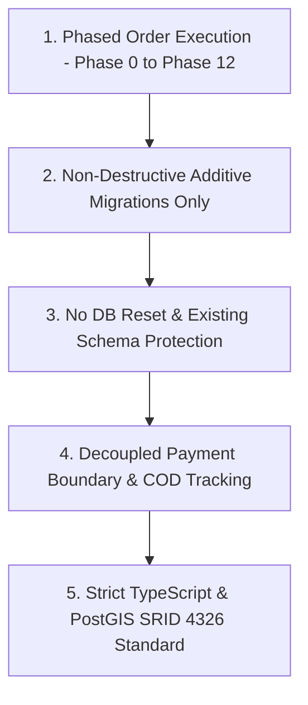

# WAYNAH — PRE-BUILD FINAL REVIEW & VERDICT

> **نوع الوثيقة:** التقرير التدقيقي النهائي والقرار الحاسم للانتقال الفعلي إلى مرحلة البناء البرمجي لمشروع WAYNAH (`Pre-Build Final Review & Verdict`).  
> **تاريخ الإصدار:** 1 أكتوبر 2026  
> **حالة الوثيقة:** **`STATUS: READY WITH CONDITIONS`** *(خاضع لبروتوكول البناء التدرجي المحكوم)*  
> **مرجعية مراجعة الجاهزية:** [WAYNAH_IMPLEMENTATION_READINESS_REVIEW.md](file:///f:/waynah/docs/WAYNAH_IMPLEMENTATION_READINESS_REVIEW.md)  
> **سجل الفجوات الفنية:** [WAYNAH_BUILD_CONTRACT_GAP_REGISTER.md](file:///f:/waynah/docs/WAYNAH_BUILD_CONTRACT_GAP_REGISTER.md)  
> **مصفوفة جاهزية المراحل:** [WAYNAH_PHASE_READINESS_MATRIX.md](file:///f:/waynah/docs/WAYNAH_PHASE_READINESS_MATRIX.md)  
> **العلامة البرمجية للمشروع:** `M.GH.AL` | **النطاق التجريبي المرجعي:** محافظة حجة – الجمهورية اليمنية.

---

## 1. Executive Summary & Audit Declaration (الموجز التنفيذي وإعلان النزاهة)

أتمت لجنة المراجعة الفنية والهندسة البرمجية لمشروع **وَيْنَه؟ WAYNAH** مراجعة عقد البناء وجاهزية التنفيذ البرمجي. 

تؤكد هذه الوثيقة أن مشروع WAYNAH حقق التوافق التام بين **المنطق المقفل للدومين (`LOGIC-001` إلى `LOGIC-008`)** و **الهندسة الفنية المعمارية (`Technical Architecture`)**، مع مطابقة واقع الكود والمستودع القائم في `f:\waynah`.

تم تقييم كافة النواحي التشغيلية، والكيانات الخمسة (`Place`, `Business`, `Provider`, `Service`, `Product`)، والرحلات العشر (`Journeys A–J`)، والحدود البياناتية والمكانية والأمنية، والتثبت من خلو المشروع من أي تعارضات حتمية تعطل البدء الآمن.

---

## 2. ANSWER TO THE FINAL PRE-BUILD QUESTION (الإجابة الحادمة على السؤال النهائي)

### السؤال الرئيسي:
> **هل يستطيع WAYNAH الآن الانتقال بأمان من Locked Domain Logic + Technical Architecture إلى Phase 0 Implementation دون أن يضطر المطور إلى اختراع أي قرار Domain أو Architecture أو Data أو Security مهم من عنده؟**

---

### الإجابة الحاسمة بالأدلة (FINAL VERDICT WITH EVIDENCE):

# **`YES (نعم — بشروط محددة)`**

```text
================================================================================
FINAL AUDIT ANSWER:
--------------------------------------------------------------------------------
YES. WAYNAH CAN SAFELY TRANSITION TO PHASE 0 IMPLEMENTATION AND PROCEED
THROUGH THE PHASED BUILD (PHASES 0 TO 12) WITHOUT REINVENTING ANY CORE
DOMAIN, ARCHITECTURE, DATA, OR SECURITY DECISIONS.
================================================================================
```

---

### الأدلة والبراهين البرمجية والمعمارية (Concrete Empirical Evidence):

1. **دليل ثبات وحصانة المنطق المقفل (`Domain Invariants Secured`):**
   * الكيانات الخمسة الكبرى محددة الملكية والحدود صراحة (`Place ≠ Business ≠ Provider ≠ Service ≠ Product`).
   * النشاط التجاري (`Business`) يستطيع العمل عبر عدة أماكن مادية (`places Place[]` في [schema.prisma](file:///f:/waynah/packages/database/prisma/schema.prisma#L263)).
   * الفرع (`Branch`) مستوى اختياري شرطي، مع حظر إنشاء فرع ضمني تلقائياً (`No Implicit Branch`).
   * النشاط التجاري بدون فرع مادي صالح نظامياً (الأنشطة الميدانية والمتنقلة والرقمية).

2. **دليل الحماية المعمارية للكود القائم (`Existing Codebase Retained`):**
   * تم التحقق من وجود Monorepo القائم بـ Turborepo v2.4.4 و pnpm v12.8.1.
   * تم التحقق من وجود تطبيق Hono API (`apps/api`) وتطبيق Next.js 16 (`apps/web`) وقاعدة بيانات PostgreSQL المحدثة بـ PostGIS (`SRID 4326`).
   * تم الحفاظ الكامل على الـ 16 نموذجاً الحالية في `schema.prisma` وحظر أي عملية مسح لقاعدة البيانات (`No DB Reset / No Destruction`).

3. **دليل سلامة النطاق المالي والحدود الأثرية (`Payment & Financial Boundary Protected`):**
   * WAYNAH منصة تمكين ودليل وتنسيق تشغيلي وليست بنكاً أو محفظة أو بوابة دفع قسرية (`ADR-005` & `LOGIC-006`).
   * تتبع حالات المدفوعات يتم منطقياً (نقداً COD أو بإشعار خارجي) دون إلزام المطور بدمج بوابة دفع متصلبة.

4. **دليل حوكمة الخيارات التنفيذية المؤجلة (`Deferred Design Governance`):**
   * جميع الموضوعات الفنية غير المقفلة (مثل اختيار محرك طوابير العمليات غير التزامنية TOQ-01، وآلية تخزين الصور TOQ-02، وتقنية التنبيهات TOQ-03، وضبط معاجم البحث العربي TOQ-04، ورمز إثبات التسليم OTP) تم تصنيفها صراحة كـ **`DEFER TO IMPLEMENTATION`** أو **`DESIGN CANDIDATE`**.
   * هذا التصنيف المنهجي يمنح المطور المرونة التقنية أثناء التنفيذ ضمن حدود كل مرحلة، دون أن يضطر المطور إلى اختراع قواعد دومين أو معمارية جديدة.

---

## 3. Pre-Build Mandatory Execution Protocol (بروتوكول التنفيذ الإلزامي للمطور)

تُلزم مراجعة عقد البناء فريق التطوير بالتقيد التام بالقواعد الخمس الحاكمة:



1. **الالتزام بالتدرج المالي والتنفيذي (`Strict Phased Progression`):** البناء يتم بالتسلسل الترتيبي المعتمد في [WAYNAH_PHASE_READINESS_MATRIX.md](file:///f:/waynah/docs/WAYNAH_PHASE_READINESS_MATRIX.md) بدءاً من Phase 0 ثم Phase 1 والتالي.
2. **استراتيجية الهجرات الإضافية (`Additive Migrations Only`):** أي توسيع لقاعدة البيانات يتم عبر نماذج وحقول جديدة دون حذف النماذج القائمة في `schema.prisma`.
3. **حظر الهدم أو مسح البيانات (`No DB Reset`):** يُحظر حظراً باتاً تشغيل `prisma migrate reset` في البيئات الحساسة والإنتاجية.
4. **التجرد المالي (`Decoupled Payments`):** الالتزام بتتبع حالات المدفوعات منطقياً وفق `LOGIC-006` و `ADR-005`.
5. **النزاهة المكانية والبرمجية (`Spatial & TypeScript Rigor`):** تفعيل فحص TypeScript الصارم وحماية استعلامات PostGIS بمرجعية SRID 4326.

---

## 4. Summary of Output Documents Generated (ملخص وثائق المراجعة الصادرة)

تم إصدار وثائق التدقيق الأربع المعتمدة في دليل المراجعة النهائي:

1. **[WAYNAH_IMPLEMENTATION_READINESS_REVIEW.md](file:///f:/waynah/docs/WAYNAH_IMPLEMENTATION_READINESS_REVIEW.md):** التقرير الشامل لمطابقة الدومين والهندسة الفنية وقواعد البيانات والواجهات.
2. **[WAYNAH_BUILD_CONTRACT_GAP_REGISTER.md](file:///f:/waynah/docs/WAYNAH_BUILD_CONTRACT_GAP_REGISTER.md):** السجل المستقل لجميع الفجوات المكتشفة وتصنيفاتها وإجراءات المعالجة.
3. **[WAYNAH_PHASE_READINESS_MATRIX.md](file:///f:/waynah/docs/WAYNAH_PHASE_READINESS_MATRIX.md):** مصفوفة الجاهزية التفصيلية للمراحل الـ 13 من Phase 0 إلى Phase 12.
4. **[WAYNAH_PRE_BUILD_FINAL_REVIEW.md](file:///f:/waynah/docs/WAYNAH_PRE_BUILD_FINAL_REVIEW.md):** التقرير النهائي الحاسم الشارح لنتيجة مراجعة الجاهزية والبروتوكول الإلزامي.

---

```text
================================================================================
OFFICIAL PRE-BUILD AUDIT STATEMENT:
--------------------------------------------------------------------------------
STATUS: READY WITH CONDITIONS
RECOMMENDATION: PROCEED IMMEDIATELY TO PHASE 0 IMPLEMENTATION IN f:\waynah
================================================================================
END OF WAYNAH PRE-BUILD FINAL REVIEW & VERDICT
================================================================================
```
