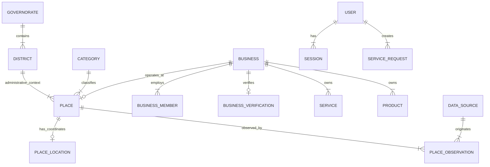
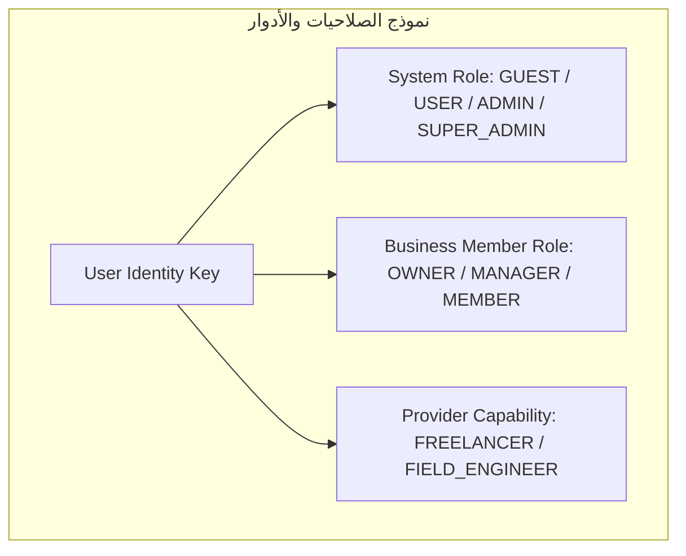
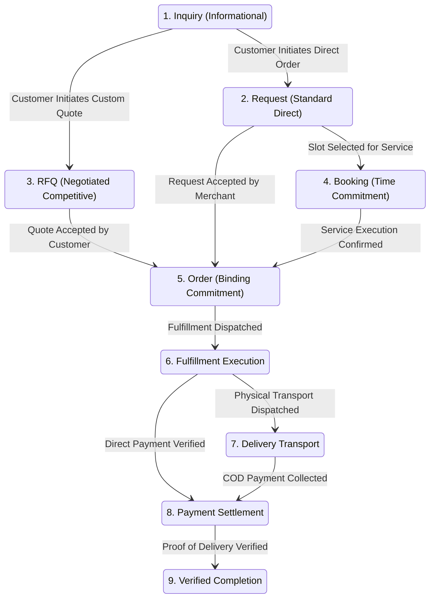
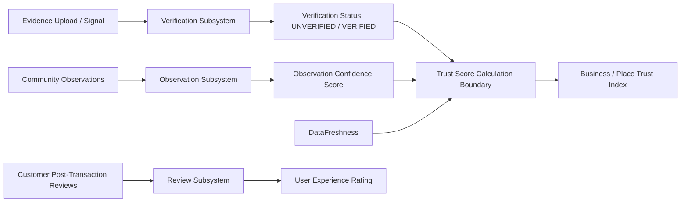

# WAYNAH — TECHNICAL ARCHITECTURE MASTER STUDY

> **عنوان الوثيقة:** دراسة البنية التحتية والهندسة البرمجية لمشروع WAYNAH (الدراسة الفنية المرجعية).  
> **حالة الهندسة الفنية:** **`STATUS: PROPOSED TECHNICAL ARCHITECTURE (PENDING FORMAL REVIEW)`**  
> **تاريخ الإصدار:** 1 أكتوبر 2026  
> **المرجعية المنطقية الحاكمة:** `LOCKED DOMAIN LOGIC` (`LOGIC-001` إلى `LOGIC-008`).  
> **العلامة البرمجية للمشروع:** `M.GH.AL` | **النطاق التجريبي المرجعي:** محافظة حجة – الجمهورية اليمنية.  
> **نهج الهندسة الفنية:** **`EVOLUTION / INTEGRATION ARCHITECTURE`** (البناء على الكود والنظام الفعلي القائم دون إعادة بناء أو مسح).

---

## 1. Executive Summary & Scope Grounding (الملخص التنفيذي وتأطير النطاق)

تحول هذه الوثيقة الدومين والمنطق المقفل في المرحلة الأولى (`LOGIC-001` إلى `LOGIC-008`) إلى **خريطة هندسية برمجية متكاملة (`Technical Systems Specification`)**. 

تلتزم هذه الهندسة الفنية بالتجرد الصارم من كتابة كود الإنتاج أو تنفيذ الهجرات البياناتية (`Migrations`) في هذه المرحلة، وتستند على فحص وتحليل **البنية الفهرسية الفعلية الموجودة في المشروع (`f:\waynah`)**.

### المبادئ التأسيسية للهندسة الفنية:
1. **الالتزام المطلق بالمنطق المقفل (`Domain-First Grounding`):** المنطق المقفل من `LOGIC-001` إلى `LOGIC-008` هو المرجع الوظيفي الأساسي. لا إعادة تعريف للكيانات، لا تغيير للرحلات A–J، ولا كسر لقواعد OQ المقفلة.
2. **التطور التكاملي (`Evolutionary Architecture`):** المشروع ليس فارغاً، بل يحتوي على Monorepo قائم، وSchema بيانات أولي مفعل بـ PostGIS، وبيئة Docker، وتطبيقات Next.js. الهندسة المقترحة تهدف للنمو والتكامل وليس الإعادة أو الهدم.
3. **الفصل بين الطبقات والحدود الأمنية:** فصل صارم بين واجهات العرض، منطق التطبيق، الدومين، البنية التحتية، وقواعد البيانات.

---

## 2. Technology Reality Check (الفحص الفعلي للتقنيات الحالية)

بناءً على الفحص الميداني والمباشر للملفات الفعلية (`package.json`, `prisma/schema.prisma`, `apps/web`, `packages/database`, `docker-compose.yml`):

| Layer | Current Reality | Evidence | Proposed Direction | Status |
| ----- | --------------- | -------- | ------------------ | ------ |
| **Monorepo Management** | Turborepo v2.4.4 + pnpm workspaces v12.8.1 | [package.json](file:///f:/waynah/package.json) | اعتماد البنية الجماعية للـ Apps و Packages وتوسيع نطاق الحزم | **`EXISTING / RETAIN`** |
| **Language & Typing** | TypeScript v5.8.2 | [package.json](file:///f:/waynah/package.json), `tsconfig.json` | الاعتماد التام على TypeScript المكتوبة بصارمة مع منع `any` | **`EXISTING / RETAIN`** |
| **Database & Engine** | PostgreSQL (v15+) + PostGIS Extension | [schema.prisma](file:///f:/waynah/packages/database/prisma/schema.prisma#L9), Docker | استخدام PostgreSQL كمحرك بيانات مركزي ودعم PostGIS المكاني | **`EXISTING / RETAIN`** |
| **ORM / Data Access** | Prisma ORM (v6.x) with `postgresqlExtensions` | [schema.prisma](file:///f:/waynah/packages/database/prisma/schema.prisma#L3) | توسيع Prisma Models لدعم كامل الكيانات وتجريد الاستعلامات المكانية | **`EVOLVE`** |
| **Web Presentation** | Next.js (App Router) + Tailwind CSS | [apps/web/package.json](file:///f:/waynah/apps/web/package.json) | استخدام Next.js للواجهات الأمامية واستخراج منطق APIs للـ Server Services | **`EVOLVE`** |
| **API Architecture** | Next.js API Routes / Shared API Services | `apps/api`, `apps/web/app/api` | توحيد API Boundary وتأطير استجابات REST وفق نمط موحد | **`EVOLVE`** |
| **Authentication & Session** | Session token model in DB (`Session`, `User`) | [schema.prisma](file:///f:/waynah/packages/database/prisma/schema.prisma#L189-L198) | تطوير محرك Session وتطعيمه بـ RBAC وتوثيق الهوية متعدد الأدوار | **`EVOLVE`** |
| **Spatial Authority** | PostGIS `geography(Point, 4326)` & `geography(MultiPolygon, 4326)` | [schema.prisma](file:///f:/waynah/packages/database/prisma/schema.prisma#L53), [GEOGRAPHIC_DATA_CONTRACT.md](file:///f:/waynah/docs/GEOGRAPHIC_DATA_CONTRACT.md) | تفعيل استعلامات `nearest-Place` وحفظ دالة `ST_Covers` للمستقبل | **`EXISTING / RETAIN`** |
| **State & Async Processing** | In-Memory / Synchronous | المشروع الفعلي | إدخال نمط المعالجة غير التزامنية (`Async Job Queue`) عند الحاجة | **`EVOLVE`** |

---

## 3. Architecture Principles (المبادئ المعمارية الحاكمة)

1. **Domain-first Architecture:** التراكيب البرمجية تتطابق هيكلياً مع الحدود المنطقية للمجال (`Domain Bounded Contexts`).
2. **Strict Modular Isolation:** كبسولة كل وحدة برمجية (`Module`) بحيث تصبح قائمة بذاتها وتمنع الاعتمادات المتبادلة العشوائية (`Circular Dependencies`).
3. **Secure by Default & RBAC Boundary:** التحقق من الهوية والصلاحيات يتم في طبقة التطبيق والتمرير البرمجي وليس كخيار ثانوي.
4. **Data Integrity & Invariant Preservation:** لا تسمح البنية البرمجية أو قاعدة البيانات بحفظ بيانات متناقضة مع القواعد المقفلة (مثلاً: `Branch` لا ينشأ تلقائياً، والـ `Product` مملوك لـ `Business`).
5. **Spatial Authority & Decoupling:** حصر التعامل مع البيانات الجغرافية في `Spatial Subsystem` يضمن النزاهة المكانية واستخدام SRID 4326 (WGS84).
6. **API Boundary Protection:** يمنع منعاً باتاً وصول واجهات المستخدم (`UI`) المباشر إلى قاعدة البيانات أو استعلامات ORM السطحية.
7. **Auditability & Provenance:** تسجيل جميع التعديلات والتعاملات الحساسة (التحقق، الإشراف، المبالغ، الصلاحيات) في سجل تدقيق غير قابل للتعديل (`Audit Log`).
8. **Evolvability without Over-Engineering:** المحافظة على النمط الموحد البسيط (`Modular Monolith within Monorepo`) دون اللجوء السريع لـ Microservices المعقدة.
9. **Offline / Unstable Network Resilience:** إعداد المعاملات والواجهات لدعم إعادة التوصيل وتسليم الإشعارات المتأخرة تناسباً مع الواقع اليمني.

---

## 4. Technical Domain Architecture (تفكيك الوحدات الفنية الـ 28)

تحول الهندسة الفنية المفاهيم المنطقية إلى **28 وحدة برمجية فنية (`Technical Modules`)** داخل Monorepo:

```mermaid
graph TD
    subgraph MonorepoPackages ["WAYNAH Technical Modules Architecture"]
        M01[1. Geography Module]
        M02[2. Place Module]
        M03[3. Business Module]
        M04[4. Branch Module]
        M05[5. Provider Module]
        M06[6. Activity Module]
        M07[7. Category Module]
        M08[8. Service Module]
        M09[9. Product Module]
        M10[10. Catalog Module]
        M11[11. Inquiry Module]
        M12[12. Request Module]
        M13[13. RFQ Module]
        M14[14. Booking Module]
        M15[15. Order Module]
        M16[16. Fulfillment Module]
        M17[17. Delivery Module]
        M18[18. Payment Module]
        M19[19. Trust Module]
        M20[20. Verification Module]
        M21[21. Observation Module]
        M22[22. Review Module]
        M23[23. Data Operations Module]
        M24[24. Moderation Module]
        M25[25. Exceptions Module]
        M26[26. Notifications Module]
        M27[27. Identity & Access Module]
        M28[28. Administration Module]
    end
end
```

### توصيف الوحدات البرمجية الـ 28 (Module Specifications):

1. **Geography Module:**  
   * **المسؤولية:** إدارة التقسيم الإداري (المحافظات، المديريات)، التثبت المكاني، وحفظ الاستعلامات الجغرافية.  
   * **المدخلات:** WGS84 Coordinates, Governorate/District Identifiers.  
   * **المخرجات:** Spatial Boundaries, Administrative Context, Nearest Place Queries.  
   * **سلطة الكتابة:** النظام الإداري فقط (`Admin Write`).
2. **Place Module:**  
   * **المسؤولية:** إدارة الكيان المكاني المجرد `Place` وإحداثياته المادية `PlaceLocation`.  
   * **البيانات المملوكة:** `places`, `place_locations`.  
   * **الاعتمادات:** `Geography Module`, `Category Module`.
3. **Business Module:**  
   * **المسؤولية:** إدارة الهوية التجارية `Business` والعضوية والملكية والمقر الرئيسي.  
   * **البيانات المملوكة:** `businesses`, `business_members`, `business_verifications`.
4. **Branch Module:**  
   * **المسؤولية:** إدارة نقاط الإتاحة التشغيلية والوفرة المكانية الاختيارية للأنشطة التجارية.  
   * **البيانات المملوكة:** `branches` (اختياري/شرطي).
5. **Provider Module:**  
   * **المسؤولية:** إدارة ملفات الموفرين الميدانيين والمستقلين والمهندسين وتراخيصهم التشغيلية.
6. **Activity & Category Modules:**  
   * **المسؤولية:** إدارة الوصف الدلالي الواقعي (`Activity`) وهيكل التصفية والاكتشاف (`Category`).
7. **Service & Product Modules:**  
   * **المسؤولية:** إدارة الخدمات والمنتجات المملوكة منطقياً لـ `Business` وصفاتها وتنوعاتها (`Variant Attributes`).
8. **Catalog Module:**  
   * **المسؤولية:** تجميع منطقي وعرض (`Logical View / Container`) لكتالوجات الأعمال دون إنشاء جداول إجبارية متصلبة.
9. **Inquiry, Request, RFQ Modules:**  
   * **المسؤولية:** إدارة مسارات التفاعل (الاستعلام الاسترشادي، الطلب المباشر للخدمات المعيارية، والمسار التفاوضي التنافسي RFQ).
10. **Booking & Order Modules:**  
    * **المسؤولية:** إدارة التعهدات الزمانية/السعوية (`Booking`) والتعهدات التشغيلية/المالية الملزمة (`Order`).
11. **Fulfillment & Delivery Modules:**  
    * **المسؤولية:** إدارة أنماط الوفاء الشامل (ذاتي، موصل، استلام، ميداني، عن بُعد) وتتبع التسليم وإثبات الاكتمال (`Proof of Delivery`).
12. **Payment Module:**  
    * **المسؤولية:** تتبع حالات المدفوعات (غير مدفوع، مدفوع، إشعار خارجي) ودورة التسوية دون اختيار بوابة دفع محددة.
13. **Trust, Verification, Observation, Review Modules:**  
    * **المسؤولية:** إدارة المنظومة الرباعية المستقلة (الأدلة والتوثيق الرسمية، مؤشر الثقة، الرصد الميداني، ومراجعات المستخدمين).
14. **Data Operations & Moderation Modules:**  
    * **المسؤولية:** دورة حياة البيانات، حداثة البيانات (`Data Freshness`)، هدم الثقة الزمني، وتصفية المحتوى والنزاعات.
15. **Exceptions, Notifications, Identity, Administration Modules:**  
    * **المسؤولية:** معالجة الفشل والاستثناءات، إرسال التنبيهات عبر القنوات، إدارة المستخدمين والـ RBAC، واللوحات الإدارية.

---

## 5. Architectural Layers (طبقات النظام والحدود المعمارية)

تعتمد WAYNAH بنية طبقات محكمة لمنع الاقتران الضعيف (`Tight Coupling`) وضمان النزاهة:

```mermaid
graph TD
    Presentation Layer (Next.js App Router / UI Components) --> Application Layer (Use Cases / Services / DTOs)
    Application Layer --> Domain Layer (Entities / Invariants / Business Rules)
    Application Layer --> Infrastructure Layer (Prisma ORM / PostGIS / Mailers / External Storage)
    Infrastructure Layer --> Data Layer (PostgreSQL Database / Spatial Indexes)
    Domain Layer -.->|No Direct Dependency| Infrastructure Layer
```

### حدود وصلاحيات الطبقات:
* **Presentation Layer (الواجهات):** مسؤولة حصرياً عن تجربة المستخدم وإظهار الشاشات واستقبال المدخلات. يُمنع كتابة أي استعلامات قواعد بيانات أو منطق حاسوبي داخل المكونات.
* **Application Layer (التطبيق والخدمات):** تنسيق حالات الاستخدام (`Use Cases`)، فحص الصلاحيات (`RBAC Policy Check`)، وتوليد الأحداث.
* **Domain Layer (المجال والحوكمة):** تحتوي على قواعد المنطق الحاكمة والكيانات المجردة. لا تعتمد على أي مكتبات خارجية أو ORM.
* **Infrastructure Layer (البنية التحتية):** تطبيق الاتصال بقواعد البيانات عبر Prisma، تنفيذ الاستعلامات الجغرافية بـ PostGIS، والاتصال بالمكونات الخارجية.
* **Data Layer (البيانات):** قاعدة بيانات PostgreSQL مع امتداد PostGIS والفهارس الجغرافية.

---

## 6. Data Architecture Specification (مواصفات بنية البيانات)

### 6.1 مخطط الكيانات والعلاقات التقني (Technical Entity-Relationship Concept)

تعتمد بنية البيانات توسيع وتطوير المخطط الفعلي القائم في [schema.prisma](file:///f:/waynah/packages/database/prisma/schema.prisma) مع الحفاظ الكامل على الحقول والجداول الحالية:



### 6.2 قواعد النزاهة والمسح اللطيف والتدقيق (Integrity, Soft Deletion & Audit)
1. **سياسة الحذف اللطيف (`Soft Deletion Policy`):** الكيانات الرئيسية (`Place`, `Business`, `Product`, `Service`) لا تُحذف فيزيائياً من قاعدة البيانات، بل تستخدم حقل `deletedAt DateTime?` أو تحول حالتها التشغيلية لـ `INACTIVE / ARCHIVED` لحفظ السجل التاريخي وقابلية الاسترجاع.
2. **سجل التدقيق والتتبع (`Audit Columns`):** جميع الجداول تحتوي إجبارياً على `createdAt` و `updatedAt` مع الربط بمعرف المستخدم المحدث عند التعديلات الحساسة.
3. **التعيين البياناتي للعناصر (Technical Classification):**
   * **`LOCKED DOMAIN REQUIREMENT`**: استقلالية Place عن Business، ملكية Business للمنتجات، والفرع الاختياري.
   * **`TECHNICAL DESIGN`**: استخدام PostgreSQL UUID v4 للمفاتيح الرئيسية، وحقول الجغرافيا بـ WGS84 SRID 4326.
   * **`IMPLEMENTATION DETAIL`**: فهارس GiST على حقول `geom` المكانية وفهارس B-Tree على الحقول الاستعلامية الشائعة.

---

## 7. Spatial Architecture (الهندسة المكانية والجغرافية)

تستند الهندسة المكانية في WAYNAH على المبادئ المقفلة في عقد الجغرافيا `GEOGRAPHIC_DATA_CONTRACT.md`:

```mermaid
flowchart TD
    subgraph SpatialArchitecture ["الهندسة المكانية والجغرافية"]
        PointInput[WGS84 Latitude / Longitude] --> ValidCheck{Valid Coordinates?}
        ValidCheck -- Yes --> MakePoint[ST_MakePoint - Longitude, Latitude]
        MakePoint --> SetSRID[ST_SetSRID - SRID 4326]
        SetSRID --> PostGISPoint[geography Point, 4326]
        
        PostGISPoint --> NearestPlaceQuery[nearest-Place Spatial Heuristic - ACTIVE NOW]
        NearestPlaceQuery --> DistrictAssignment[Assigned District Context]
        
        BoundaryData[Future Polygon Boundary] -.->|ST_Covers / ST_Contains| DeferredBoundary[DEFER TO IMPLEMENTATION]
    end
end
```

### القواعد الفنية المعمارية للجغرافيا:
1. **ترتيب المحاور المعتمد (`Axis Order`):** اعتمادات PostGIS الصارمة: `ST_MakePoint(longitude, latitude)` حيث X=Longitude و Y=Latitude.
2. **المرجعية الجغرافية الفعالة (`Active Spatial Heuristic`):**
   * **الوضع الفعال حالياً:** استخدام خوارزمية **`nearest-Place`** القائمة على المسافة النقطية (`ST_DWithin` / `ST_Distance`) لتحديد أقرب موقع أو مديرية.
   * **الوضع المؤجل:** مطابقة الحدود بالـ Polygons عبر **`ST_Covers`** مؤجلة صراحة حتى استيراد الحدود الرسمية المعتمدة من OCHA Yemen COD-AB.
3. **فهارس الأداء المكاني:** إنشاء فهارس **GiST (Generalized Search Tree)** على كافة حقول الجغرافيا (`PlaceLocation.geom`, `District.boundary`, `PlaceObservation.geom`).

---

## 8. Identity, Authentication & Authorization Architecture (الهوية والصلاحيات)

### 8.1 البنية الهرمية للمستخدم والأدوار (Multi-Role RBAC Model)

تطور الهندسة الفنية جدول `User` الحالي لدعم نموذج الأدوار المتعددة والمحكمة (`Role-Based Access Control - RBAC`):



### 8.2 فحص الصلاحيات والملكية (`Ownership & Resource Authorization`)
* **فحص الهوية (`Authentication Boundary`):** يتم التحقق من الجلسات عبر التوكن المرمز (`Session Token`) ومقاطعته مع جدول `sessions` في البنية التحتية.
* **فحص الملكية (`Resource Ownership Check`):** يُمنع الموفر أو صاحب العمل من تعديل منتجات أو طلبات أو كتالوجات لا تنتمي صراحة لـ `BusinessId` المرتبط بعضويته الفعلية في `business_members`.

---

## 9. API Architecture Specification (مواصفات الواجهات البرمجية)

تُحدد البنية التحتية للواجهات البرمجية (`API Boundaries`) أربعة مستويات وصول صادرة عن نظام موحد:

| API Category | Access Level | Primary Consumers | Example Endpoints / Services | Audit Requirements |
|---|---|---|---|---|
| **Public Discovery APIs** | Public (Unauthenticated) | Anonymous Users / Mobile App | `GET /v1/geography/governorates`<br>`GET /v1/places/search`<br>`GET /v1/businesses/:id/catalog` | Low (Rate Limit Only) |
| **Authenticated Customer APIs** | Authenticated User | Registered Customers | `POST /v1/requests`<br>`POST /v1/rfq`<br>`POST /v1/orders`<br>`POST /v1/reviews` | Medium (User ID & IP Logged) |
| **Merchant / Provider APIs** | Authenticated Merchant | Business Owners / Providers | `POST /v1/products`<br>`PUT /v1/orders/:id/status`<br>`POST /v1/quotes` | High (Business Ownership Audited) |
| **System Administration APIs** | Admin Only (RBAC Admin) | System Moderators / Admins | `POST /v1/admin/verifications/review`<br>`POST /v1/admin/moderation/action` | Critical (Full Immutable Audit Trail) |

### النمط القياسي لمعالجة الاستجابات والأخطاء (`Standard Error & Response Model`):
تعتمد جميع الواجهات استجابة مجهزة بنظام JSON النمطي:
```json
{
  "success": true,
  "data": { ... },
  "error": null,
  "meta": {
    "requestId": "req_uuid",
    "timestamp": "2026-10-01T02:15:00Z"
  }
}
```

---

## 10. Transaction & Workflow Architecture (هندسة المعاملات والتدفقات)

تربط البنية التحتية البرمجية بين مراحل التفاعل المختلفة عبر محرك حالات محكم (`State Engine Context`):



---

## 11. Trust & Verification Technical Architecture (هندسة الثقة والتحقق)

تنفذ البنية الفنية التفكيك الرباعي المقفل لـ `LOGIC-007`:



---

## 12. Exception, Security & Deployment Architecture (الاستثناءات والأمن والنشر)

### 12.1 معالجة الاستثناءات الفنية (`Exception Technical Architecture`)
* **فئات الفشل البرمجي:** تقسم الاستثناءات تقنياً إلى أخطاء قابلة للاستعادة (`Recoverable Errors` مثل انقطاع الشبكة المؤقت وتنفذ عبر إعادة المحاولة وتأكيد التكرار `Idempotency Key`) وأخطاء غير قابلة للاستعادة (`Non-Recoverable Errors` مثل عدم تلبية الصلاحيات).

### 12.2 الأمن والحماية (`Security Architecture`)
* **حماية الإدخال:** فحص وتعقيم كافة البيانات المدخلة لمنع هجمات SQL Injection و Cross-Site Scripting (XSS).
* **إدارة الأسرار والتشفير:** تشفير الحقول الحساسة (كلمات المرور بـ Argon2/Bcrypt) وحفظ مفاتيح البيئة عبر `.env` المؤمّن.

### 12.3 بنية النشر والتكامل (`Deployment Integration Architecture`)
* **استمرار النشر القائم:** المحافظة على البيئة المحلية القائمة عبر Docker Compose لتشغيل قواعد البيانات الملحقة بـ PostGIS، مع تجهيز المشروع للبناء الآلي عبر Turborepo في بيئات CI/CD المستقبلي.

---

```text
================================================================================
STATUS: TECHNICAL ARCHITECTURE MASTER STUDY COMPLETED (PROCEED TO FORMAL REVIEW)
================================================================================
```
