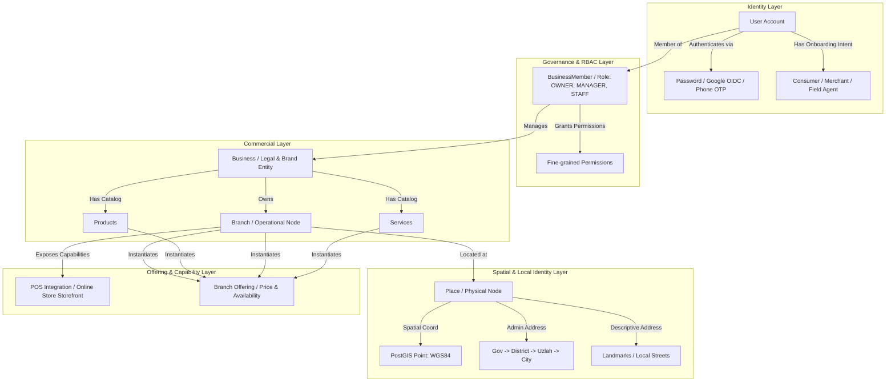
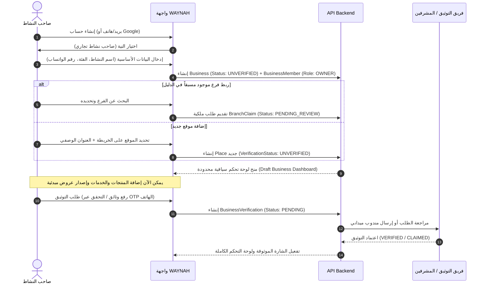
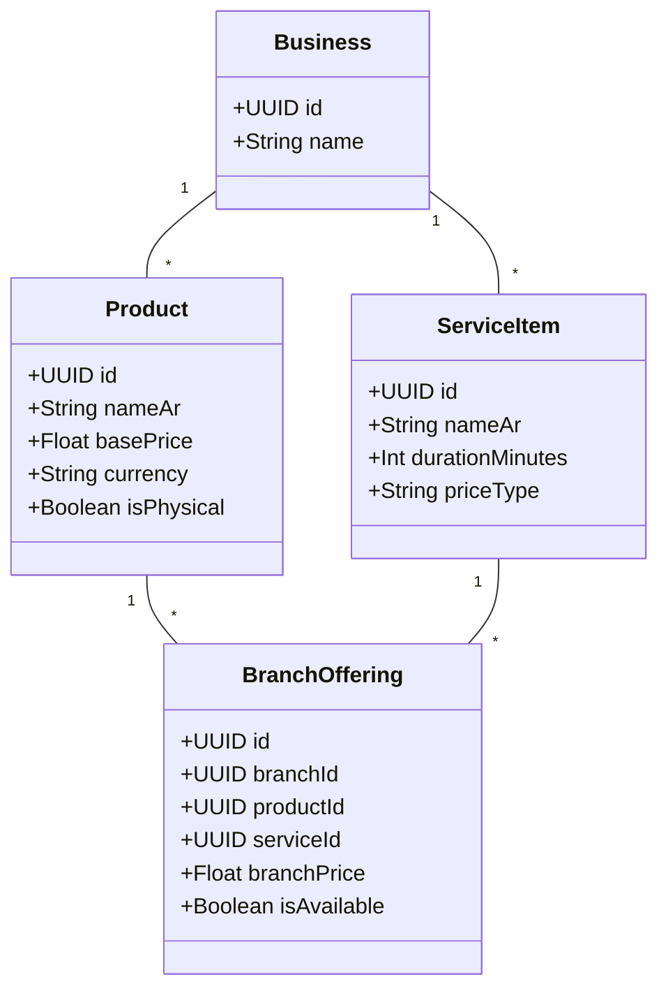
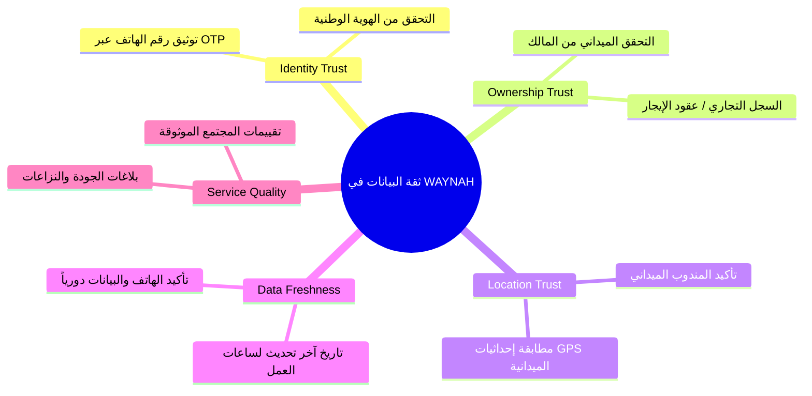
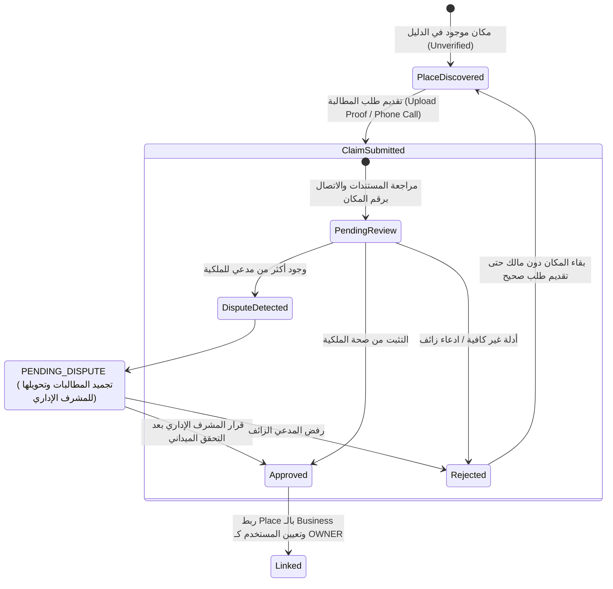
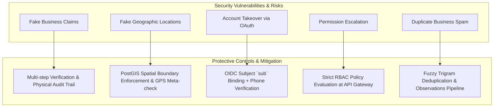
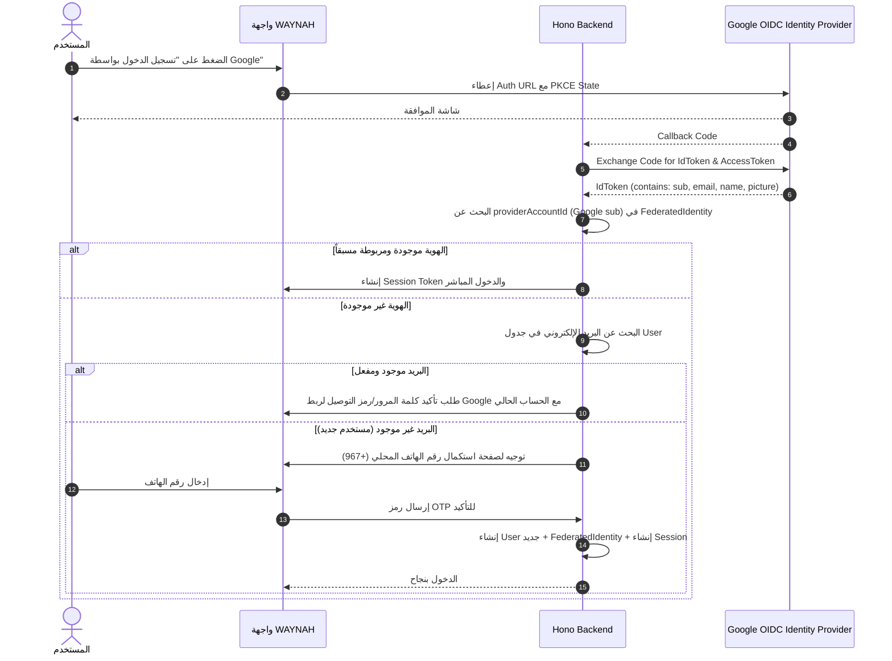

# 📄 دراسة بحثية واستراتيجية معمارية مستقبلية: منظومة الحسابات التجارية، الفروع، نقاط البيع، المتاجر الإلكترونية، والتحقق الجغرافي لمشروع WAYNAH (وَيْنَه؟)

> **نوع الوثيقة**: دراسة بحثية واستراتيجية منتج (Future Product Strategy & Conceptual Architecture Study)  
> **حالة الدراسة**: بحث مستقبلي موجه للمستقبل - **لا تؤثر على خطة الإطلاق الحالية ولا تعيد فتح أي مراحل مكتملة**  
> **اسم المنصة**: WAYNAH / وَيْنَه؟  
> **التاريخ**: أكتوبر 2026  
> **المرجعية المعمارية الأساسية**: v0.12.0 (Turborepo, Next.js 16, Hono API, Prisma 6.4, Supabase PostgreSQL 17 + PostGIS)  

---

> [!IMPORTANT]
> **تنويه منهجي وإداري صارم**:  
> هذه الدراسة هي **بحث استراتيجي وتصور معماري للمراحل المستقبلية**. المنظومة الحالية لمنصة **WAYNAH** في حالة جاهزية عالية للإطلاق (Production Ready)، وتخضع لااختبارات الجودة والتشغيل الإشعالي. **لا تفرض أي من نتائج هذه الدراسة أي تعديل فوري أو إعادة فتح للمراحل البرمجية (Phases) المكتملة**.

---

## 1. الملخص التنفيذي (Executive Summary)

تهدف منصة **WAYNAH (وَيْنَه؟)** إلى توفير **طبقة موثوقة لاكتشاف الأماكن والمعلومات المحلية في اليمن**، سادّة الفجوة بين البيانات الجغرافية الدقيقة والعناوين الوصفية الشائعة والنشاط التجاري الفعلي.

تطرح هذه الدراسة **النموذج المعماري المستقبلي** لإدارة الكيانات التجارية والتشغيلية عبر المنظومة المترابطة:
$$\text{User} \longrightarrow \text{Business} \longrightarrow \text{Branch} \longrightarrow \text{Place} \longrightarrow \text{Offering (Product / Service)}$$

### أبرز التوصيات الجوهرية للدراسة:
1. **فصل أدوار المستخدم عن إمكانية الكيان (Capability vs Role)**:  
   أنواع الحسابات مثل "محل تجاري"، "نقطة بيع"، "متجر إلكتروني" ليست أدوار مستخدم (User Roles) ولا أنواع حسابات برمجية صلبة، بل هي **إمكانيات تشغيلية (Branch Capabilities / Digital Presences)** يتم تفعيلها للكيان التجاري دون تغيير الهيكل الأساسي لنظام التحكم بالوصول (RBAC).
2. **فصل إرادة الاستخدام (User Intent) عن الصلاحيات الإدارية**:  
   عند التسجيل، يحدد المستخدم **النية التشغيلية (Onboarding Intent)** لتكييف واجهة المستخدم والتوجيه المباشر، لكن الامتيازات الإدارية لا تُمنح إلا بعد المرور بتدفق التوثيق وربط الكيان (Claim / Registration Flow).
3. **عدم تحويل WAYNAH إلى نظام إدارة موارد (ERP) أو متجر إلكتروني ضخم**:  
   تتوقف مسؤولية WAYNAH عند **الاستكشاف، التوثيق، وعرض المنتجات/الخدمات، واستقبال الاستفسارات والطلبات المبدئية (Lead Generation / Order Inquiry)**، مع ترك إدارة المخزون التفصيلي (Inventory Level)، والمحاسبة المالية، وإدارة الكاش خارج حدود المنصة، أو ربطها عبر Webhooks مع أنظمة POS/ERP خارجية.
4. **أبعاد الثقة المتعددة (Multidimensional Trust Framework)**:  
   تفكيك مفهوم التوثيق إلى 5 محاور مستقلة (هوية الشخص، ملكية النشاط، موقع المكان الجغرافي، حداثة البيانات، جودة الخدمة) لتجنب التقييم السطحي الثنائي (Verified / Unverified).
5. **الواقعية المحلية اليمنية**:  
   تصميم المنظومة لتراعي العناوين الوصفية المعلمية، ازدواجية العملة (YER صنعاء / YER عدن / SAR / USD)، ضعف شبكات الاتصالات (2G/3G)، والمستويات المتفاوتة للوثائق الرسمية للأنشطة الصغيرة والمستقلة.

---

## 2. النتائج الأساسية للبحث (Core Findings)

بناءً على التحليل المقارن ودراسة سلوك السوق المحلي وأنظمة الأدلة الجغرافية والتجارية العالمية، استخلصت الدراسة النتائج التالية:

* **نتيجة 1: خلط الأدوار مع الكيانات يسبب اختناقاً معمارياً (Role Escalation Antipattern)**  
  العديد من المنصات تقع في خطأ اعتبار "نقطة بيع" أو "صاحب متجر" كـ Role في قاعدة البيانات. في WAYNAH، المستخدم هو شخص مستمر، بينما الأدوار (`OWNER`, `MANAGER`, `STAFF`) هي علاقات ربط محددة النطاق (`BusinessMember`) بشركة أو فرع.
* **نتيجة 2: الموقع الجغرافي يتبع المكان (Place) وليس النشاط التجاري (Business)**  
  الشركة (`Business`) هي كيان قانوني/تجاري معنوي لا يملك موقعاً جغرافياً مباشراً، بينما الفرع (`Branch`) هو الكيان التشغيلي الذي يرتبط بالضرورة بمكان فيزيائي موثق (`Place`) يملك إحداثيات WGS84 وعنواناً إدارياً ووصفياً.
* **نتيجة 3: المنتجات والخدمات تحتاج طبقة عروض مشتركة (Offering Layer)**  
  المنتج أو الخدمة يُعرّف على مستوى النشاط التجاري (`Business Catalog`)، لكن توفره وسعره قد يختلفان من فرع لآخر. بالتالي، الكيان المستقبلي `Offering` هو المحور الذي يربط المنتجات والخدمات بالفرع المحدّد.
* **نتيجة 4: رقم الهاتف والهوية الوطنية هما ركيزة الثقة المحلية في اليمن**  
  في البيئة المحلية، البريد الإلكتروني ليس وسيلة تواصل أساسية للأنشطة التجارية الصغرى. الاعتماد على التوثيق عبر رقم الهاتف، الواتساب، والتحقق الميداني هو الوسيلة الأكثر موثوقية مقارنة بالاعتماد الصرف على Google OAuth أو السجلات التجارية الورقية التي قد لا تتوفر لدى الأنشطة غير الرسمية.

---

## 3. المعمارية المستقبلية الموصى بها (Recommended Future Architecture)

ترتكز المعمارية المستقبلية على بناء **طبقات فصل مسؤوليّات صريحة (Separation of Concerns)** تمنع تداخل النطاقات، وتسمح بزيادة الميزات دون إعادة بناء القاعدة الأساسية:



---

## 4. نموذج الحسابات والصلاحيات (Account Types vs Roles vs Permissions)

توصي الدراسة بالتمييز الصارم بين المفاهيم التسعة التالية لضمان المرونة البرمجية:

| المفهوم | التعريف والهدف في WAYNAH | النطاق في النظام | مثال عملي |
| :--- | :--- | :--- | :--- |
| **User Type / Intent** | النية البصرية والتدفق الأول للمستخدم أثناء التسجيل لتكييف الواجهة. | مؤقت / الواجهة الأمامية | مستخدم عادي vs صاحب نشاط تجاري |
| **Account Type** | تصنيف الحساب من حيث حالة التوثيق الفردي والتفعيل. | جدول `User` | حساب فردي عادي vs حساب شخصي موثق |
| **Organization** | كيان تنظيمي أعلى يضم مجموعة شركات أو أنشطة تجارية (مستقبلي). | جدول `Organization` | مجموعة هائل سعيد أنعم / مجموعة الشيباني |
| **Business** | العلامة التجارية أو المؤسسة التجارية التي تملك المنتجات والخدمات. | جدول `Business` | مطاعم الشيباني الملكي |
| **Branch** | نقطة تشغيلية فيزيائية أو رقيمة تابعة للـ Business وتتصل بـ Place. | جدول `Branch` / `Place` | فرع حدة - صنعاء |
| **Store (Digital Storefront)** | إمكانية عرض متجر إلكتروني وتلقي طلبات الشراء أونلاين. | Capability داخل `Branch` | متجر فرع صنعاء الإلكتروني |
| **Point of Sale (POS)** | إمكانية قبول المحافظ الإلكترونية والتكامل مع أنظمة الدفع المحلية. | Capability داخل `Branch` | نقطة بيع حاسب/جوالي فرع حدة |
| **Provider** | مقدم خدمة فردي مرتبط بالنشاط التجاري (طبيب، مهندس، سائق). | جدول `Provider` | د. محمد علي (في عيادة الأمل) |
| **Role & Permission** | الدور الامتيازي لربط المستخدم بالنشاط التجاري أو الفرع. | جدول `BusinessMember` | `OWNER` يملك كافّة الـ `Permissions` |

### نموذج الصلاحيات الموصى به:
- **المستوى الأول**: `System Role` على مستوى المنصة (`SUPER_ADMIN`, `ADMIN`, `USER`).
- **المستوى الثاني**: `Business Role` على مستوى النشاط التجاري (`OWNER`, `MANAGER`, `STAFF`, `VIEWER`).
- **المستوى الثالث**: `Branch Role / Permission Scope` لتحديد ما إذا كان الـ `MANAGER` يملك صلاحية إدارة فرع واحد محدد أم كافة الفروع.

---

## 5. رحلة تسجيل صاحب النشاط (Business Onboarding Journey)

تصمم الدراسة الرحلة لتكون **تدريجية ولا تفرض التوثيق المعقد في الخطوات الأولى**:



### سياسة البيانات المطلوبة والمؤجلة:
* **البيانات الإلزامية فوراً**: اسم النشاط التجاري باللغة العربية، الفئة الأساسية (Category)، رقم هاتف/واتساب للتواصل، الموقع الجغرافي (إحداثيات أو اختيار مديرية/حي).
* **البيانات الاختيارية والمؤجلة**: السجل التجاري الورقي، الشعار والصور الاحترافية، ساعات العمل التفصيلية، قائمة المنتجات والخدمات الكاملة.
* **متى تصبح الجهة فعالة للجمهور؟**: 
  تظهر الجهة فوراً في نتائج البحث كـ `UNVERIFIED` (مع توضيح أنها غير موثوقة رسمياً بعد)، وتترقى في الترتيب والمزايا عند تحولها إلى `VERIFIED` أو `CLAIMED`.
* **ماذا يحدث إذا رُفض التوثيق؟**: 
  يبقى النشاط متاحاً كمعلومات عامة اكتشافية (إذا كان المكان حقيقياً)، ولكن يُلغى ربط المستخدم الإداري به (`BranchClaim Rejected`) وتُحظر صلاحية تعديله.

---

## 6. نموذج الفرع الفيزيائي وإدارة الفروع المتعددة (Physical Branch Model)

الفرع هو الوحدة التشغيلية الحقيقية التي يتعامل معها الجمهور في الواقع.

### هيكلية الكيانات الموصى بها للفرع:
$$\text{Business} \quad \xrightarrow{1:N} \quad \text{Branch} \quad \xrightarrow{1:1} \quad \text{Place}$$

```text
Business: مطاعم الشيباني (Brand Level)
  ├── Branch 1: فرع حدة (Place ID: 101)
  │     ├── Place Location: 15.3241, 44.1952 (PostGIS Point)
  │     ├── Contact: +967 1 234567
  │     ├── Opening Hours: 08:00 AM - 12:00 AM
  │     └── Local Offerings: [وجبة الغداء, خدمة التوصيل المحلي]
  │
  └── Branch 2: فرع التحرير (Place ID: 102)
        ├── Place Location: 15.3521, 44.2081
        ├── Contact: +967 1 765432
        └── Local Offerings: [وجبة الغداء, سفري فقط]
```

### قواعد إدارة الفروع المتعددة:
1. **المركزية في الكتالوج، واللامركزية في العرض**: يضاف المنتج مرة واحدة في الـ Catalog التجاري الخاص بالـ Business، ويُربط بالفروع مع إمكانية تعديل السعر أو التوفر لكل فرع.
2. **عزل الصلاحيات**: يمكن تعيين مدير لفرع واحد فقط (`Branch Manager`) دون منحه صلاحية الاطلاع على تقارير أو عروض الفروع الأخرى.

---

## 7. المنتجات والخدمات (Products vs Services vs Offerings)

تؤكد الدراسة على **الفصل المعاهدي بين المنتج والخدمة** لمنع تعقيدات قواعد البيانات:



### الفروق الجوهرية وطبيعة التعامل:

1. **المنتج (Product)**: شيء مادي قابل للشراء والتسليم (مثل: عسل جالي، جهاز كمبيوتر).
   * يُحدد له: السعر، العملة، الصورة، الوحدة، وإمكانية التوفر (`isAvailable`).
2. **الخدمة (Service)**: نشاط غير مادي يُقدم للعميل (مثل: فحص طبي، استشارة قانونية، صيانة جوالات).
   * يُحدد لها: مدة التنفيذ المتوقعة (`durationMinutes`)، نوع السعر (ثابت، يبدأ من، أو بناءً على طلب سعر RFQ).
3. **المخزون (Inventory Bounds)**:
   * **قرار صريح**: **عدم بناء نظام إدارة مخزون تفصيلي (Stock Quantity / Warehouse Management) داخل WAYNAH**.
   * يكتفي النظام بمؤشر التوفر الثنائي (`IN_STOCK` / `OUT_OF_STOCK` / `AVAILABLE_ON_DEMAND`).
   * تترك إدارة الأعداد والمستودعات لأنظمة الـ ERP الخاصة للتجار، مع إمكانية تحديث التوفر في WAYNAH عبر API بسيط.

---

## 8. الهوية الجغرافية والعنوان المحلي في اليمن (Geographic Identity)

تصميم الهوية الجغرافية في اليمن يتطلب معالجة مزدوجة تجمع بين **الدقة الهندسية المعيارية** و**الواقع التطبيقي المحلي**:

### 1. الهيكل الهرمي الجغرافي الإداري:
$$\text{Governorate (محافظة)} \longrightarrow \text{District (مديرية)} \longrightarrow \text{Uzlah (عزلة)} \longrightarrow \text{Sub-zone / Village (حي / قرية)}$$

### 2. العنوان الوصفي المحلي (Descriptive Local Address):
نظراً لغياب الرمز البريدي والعناوين المرقّمة الرسمية في أغلب المدن اليمنية، يعتمد WAYNAH على **العنوان المعلمي المتقاطع**:
$$\text{المدينة} \longrightarrow \text{الشارع الرئيسي} \longrightarrow \text{السوق / المعلم البارز} \longrightarrow \text{الوصف الدقيق}$$
* **مثال**: *"صنعاء - مديرية السبعين - شارع حدة - مقابل مركز صخر للاتصالات - بجوار مسجد الصالح"*.

### 3. الإحداثيات الهندسية WGS84:
تخزن الإحداثيات في PostgreSQL باستخدام امتداد **PostGIS** بترميز `geography(Point, 4326)`:
* يتم تحديد المديرية تلقائياً عبر PostGIS Spatial Query (`ST_Covers`) لضمان صحة الاتساق الجغرافي وترابط المكان بالحدود الإدارية الرسمية.

### 4. الحالات الخاصة للمواقع:
* **الأنشطة المتنقلة (Mobile Services / Trucks)**: لا ترتبط بـ `Place` فيزيائي ثابت بباب ومحل، بل ترتبط بنطاق تغطية جغرافي (`Service Area / District Array`) مع نقطة انطلاق مرجعية اختيارية.
* **المتاجر الإلكترونية دون محل مفتوح (Pure Online Stores)**: ترتبط إدارياً بالـ `Business` مع تحديد مناطق التوصيل المخدومة، ولا تظهر كدبوس (Pin) في خريطة الأماكن العامة لتجنب إضلال المستخدم الباحث عن محل فيزيائي.

---

## 9. مفهوم نقطة البيع داخل WAYNAH (Point of Sale - POS)

تحدد الدراسة معنى "نقطة البيع" بدقة تجنباً للانحراف عن نطاق المشروع (Scope Creep):

> [!WARNING]
> **نقطة البيع (POS) في WAYNAH ليست نظام كاشير ولا تطبيق طابعة فواتير**.

### ما هي نقطة البيع في WAYNAH؟
هي **وسم إمكانية تشغيلية وشارة توثيق (Branch Capability & Integration Tag)** تعلن للجمهور أن هذا الفرع:
1. يقبل وسائل الدفع الرقمية والمحفظة المحلية (مثل: حاسب، جوالي، كريمي إكسبرس، فلوس، ون كاش).
2. يمتلك رابطاً تقنياً مباشراً لاستقبال طلبات الاستفسار والشراء السريع وربطها بنظام الكاشير الخارجي عبر API/Webhook.

### حدود المسؤوليّة:
* **تكتفي WAYNAH بـ**: إرسال إشعار الطلب/الاستفسار إلى رقم الكاشير/الواتساب أو تطبيق المباشر للتجار.
* **ينتهي دور WAYNAH عند**: ضغطة زر الطلب أو إرسال رمز التوثيق (OTP/QR)، ويبدأ دور نظام الـ POS الحقيقي للتجار في تسجيل المبيعات وإصدار الفاتورة الضريبية وتحديث الكاش.

---

## 10. المتجر الإلكتروني كحالة استخدام (Online Store Model)

تعامل الدراسة المتجر الإلكتروني داخل WAYNAH كـ **حضور رقمي وقناة تواصل مع العميل (Digital Storefront & Lead Intake System)** وليس كمنصة e-Commerce كاملة مثل Shopify.

### المكونات والحدود التشغيلية:

```mermaid
flowchart LR
    Consumer[المستخدم العادي] -->|تصفح الكتالوج| Storefront[واجهة المتجر الإلكتروني في WAYNAH]
    Storefront -->|1. استفسار عن منتج| Inquiry[Inquiry System]
    Storefront -->|2. طلب سعر| RFQ[RFQ System]
    Storefront -->|3. طلب شراء مباشر| OrderIntake[Order Intake System]
    
    OrderIntake -->|توجيه الطلب| Whatsapp[WhatsApp / Direct Call]
    OrderIntake -->|إشعار التاجر| MerchantDash[لوحة تحكم التاجر / إشعار]
    
    Note Over OrderIntake,MerchantDash: الدفع والتوصيل يتمان عبر الاتفاق المباشر أو المحافظ المحلية
```

* **الطلبات (Orders)**: هي طلبات حجز/استلام أو طلبات توصيل محلي مبسطة (Order Inquiry) تعتمد على الاتفاق المباشر بين المشترين والتاجر.
* **الدفع (Payments)**: لا تقوم WAYNAH بتحصيل الأموال نقدياً نيابة عن التاجر في هذه المرحلة، بل تسجل حالة الدفع (`CASH_ON_DELIVERY` أو `DIRECT_MERCHANT_TRANSFER`).
* **التوصيل (Delivery)**: يتم إما عبر التجميع من الفرع (`CUSTOMER_PICKUP`) أو عبر وسيلة التوصيل الخاصة بالتاجر (`MERCHANT_FULFILLMENT`).

---

## 11. نموذج التوثيق وأبعاد الثقة (Verification & Trust Model)

لتجنب التقييم السطحي، تعتمد المنظومة **نموذج الثقة خماسي الأبعاد (5-Dimensional Trust Model)**:



### مستويات التوثيق المعتمدة (Verification Tiers):

1. **Unverified (مستوى 0)**: مكان أو نشاط مُكتشف من مصدر بيانات عام أو إضافة مجتمعية لم تُراجع بعد.
2. **Claimed (مستوى 1)**: نشاط تقدم شخص بطلب إدارته، وهو تحت المراجعة.
3. **Contact Verified (مستوى 2)**: تم التثبت من صحة رقم الهاتف والواتساب بنجاح عبر رمز OTP.
4. **Location Verified (مستوى 3)**: تم التثبت من الموقع الجغرافي الفيزيائي عبر زيارة ميدانية أو صور مدمجة بإحداثيات GPS دقيقة.
5. **Owner Verified (مستوى 4)**: تم التثبت القانوني من ملكية النشاط عبر الوثائق أو التحقق المباشر مع المالك.
6. **Officially Verified (مستوى 5 - التوثيق الذهبي/الآزرق)**: كيان مكتمل التوثيق في كافة المحاور الخمسة ويحصل على الشارة الرسمية المعتمدة في المنصة.

---

## 12. نظام المطالبة بالنشاط التجاري وتسوية النزاعات (Claiming a Business)

تضع الدراسة حلاً محكماً لمشكلة "ظهور نشاط تجاري في WAYNAH مسبقاً ثم مجيء شخص يدعي ملكيته":



### التعامل مع الحالات الخاصة:
* **ادعاء الموظف وليس المالك**: يطلب الموظف الانضمام كـ `MANAGER` أو `STAFF` عن طريق إرسال دعوة (`BusinessInvitation`) من المالك الأصلي أو تقديم ما يثبت تفويضه.
* **انتقال النشاط التجاري لمكان آخر**: يُفصل رابط الـ `Branch` القديم وتُحدث حالة الـ `Place` القديم إلى `CLOSED` أو `MOVED` مع إنشاء `Place` جديد في الموقع الجغرافي الجديد وربطه بالفرع.

---

## 13. نموذج المستخدمين المتعددين للنشاط التجاري (Multi-User Memberships)

تدعم المعمارية وجود مستخدمين متعددين لنفس النشاط التجاري بفروع وصلاحيات مختلفة:

$$\text{User} \quad \xleftrightarrow{\quad \text{BusinessMember} \quad} \quad \text{Business}$$

### مصفوفة الأدوار داخل النشاط التجاري (Business Roles):

| الدور (Role) | الصلاحيات الأساسية | نطاق الوصول |
| :--- | :--- | :--- |
| **OWNER** | نقل الملكية، حذف النشاط، التوثيق، قبول المدراء، إضافة فروع، إدارة كافة المنتجات والمالية. | كامل النشاط وكافة الفروع |
| **MANAGER** | تعديل بيانات الفروع، إدارة المنتجات والخدمات، الاستجابة للطلبات، تعديل ساعات العمل. | الفروع المحددة له فقط |
| **STAFF / EDITOR** | تحديث توفر المنتجات، الرد على الاستفسارات، تحديث حالة الطلبات الحالية. | فرع محدد فقط |
| **VIEWER** | الاطلاع على التقارير والإحصائيات دون حق التعديل. | حسب التحديد |

---

## 14. مبادئ تجربة المستخدم (UX & UI Principles)

تضع الدراسة فلسفة تصميمية واضحة تمنع إرهاق المستخدم العادي الواصل للمنصة:

### 1. مبدأ الفصل البصري الصارم (Two-World UX Philosophy):
* **عالم المستكشف العادي (Calm Consumer Experience)**:
  واجهة بسيطة جداً، هادئة، تركز على الخريطة، البحث السريع، الاتصال المباشر، المعالم القريبة، وعرض العروض الموثوقة دون أي تعقيد تجاري.
* **عالم صاحب النشاط (Contextual Merchant Dashboard)**:
  واجهة تشغيلية منفصلة تماماً تظهر فقط عند التبديل إلى "لوحة التحكم"، مصممة بلغة دعم اللغة العربية أولاً (RTL-First)، وتعمل بمرونة على الشاشات الصغيرة والهواتف المتوسطة.

### 2. معايير الواجهة المحلية (Local Yemeni UX):
* **الاتصال بالواتساب بزر واحد**: توفير زر "تواصل عبر الواتساب" المباشر في كروت الأماكن والمنتجات نظراً لشعبية الواتساب الجارفة في اليمن.
* **التصفح بدون إنترنت قوي (Progressive & Fast)**: تحسين أداء الصور والواجهات لتنسجم مع سرعات 2G/3G وسعات البيانات المحدودة.

---

## 15. نموذج الأمان والمخاطر (Security & Risk Mitigation)

تحدد الدراسة المخاطر الأمنية والتشغيلية وضوابط الحماية الموصى بها:



---

## 16. نموذج الكيانات المفاهيمي (Conceptual Domain Model)

نموذج الكيانات المستقبلي المكتمل (Domain Conceptual Entities & Relationships):

```mermaid
erDiagram
    USER ||--o{ SESSION : has
    USER ||--o{ FEDERATED_IDENTITY : links
    USER ||--o{ BUSINESS_MEMBER : holds
    USER ||--o{ BRANCH_CLAIM : submits

    BUSINESS ||--o{ BUSINESS_MEMBER : has
    BUSINESS ||--o{ BRANCH : operates
    BUSINESS ||--o{ PRODUCT : catalog
    BUSINESS ||--o{ SERVICE_ITEM : catalog
    BUSINESS ||--o1 BUSINESS_VERIFICATION : undergoes

    BRANCH ||--|| PLACE : occupies
    BRANCH ||--o{ BRANCH_OFFERING : exposes
    BRANCH ||--o{ BRANCH_CAPABILITY : enables

    PRODUCT ||--o{ BRANCH_OFFERING : contextualized_in
    SERVICE_ITEM ||--o{ BRANCH_OFFERING : contextualized_in

    PLACE ||--|| PLACE_LOCATION : has_geom
    PLACE ||--o{ PLACE_OBSERVATION : benchmarked_by
    PLACE }|--|| DISTRICT : resides_in

    DISTRICT }|--|| GOVERNORATE : belongs_to
```

---

## 17. نموذج التوثيق عبر Google (Google Authentication Strategy)

تضع الدراسة استراتيجية محكمة لإضافة "المتابعة عبر Google" في المستقبل **دون التضحية برقم الهاتف الميداني**:

### 1. الاعتماد على المعرّف الفريد الثابت `sub`:
عدم الاعتماد المباشر على البريد الإلكتروني كمُعرّف فريد، بل استخدام حقل `sub` (Subject Identifier) المعياري في OIDC لمنع الثغرات الناجمة عن تغيير البريد في Google.

### 2. جدول الهويات الخارجية (`FederatedIdentity`):
```text
FederatedIdentity:
  - id: UUID
  - userId: UUID (Relates to User.id)
  - provider: "google"
  - providerAccountId: "109837261524389..." (Google sub)
  - emailAtLinking: "user@gmail.com"
  - createdAt: DateTime
```

### 3. تدفق ربط الحسابات وتجميع رقم الهاتف:



---

## 18. الواقع المحلي اليمني والقيود البيئية (Yemen-Specific Realities)

لضمان نجاح المنظومة في اليمن، يجب وضع الضوابط والحلول التالية في الاعتبار:

1. **التعامل مع التعدد النظدي للعملات**:
   توفير خيار تحديد عملة التسعير بالريال اليمني - طبعة صنعاء (`YER_SANAA`)، الريال اليمني - طبعة عدن (`YER_ADEN`)، الريال السعودي (`SAR`)، أو الدولار الأمريكي (`USD`) لمنع اللبس السعري في السوق.
2. **ضعف شبكات الاتصال والبيانات**:
   اعتماد حجم استجابة خفيف لرسائل REST API، واستخدام خوارزميات التخزين المحلي الصامت (Local PWA Caching).
3. **العناوين غير الرسمية والمعالم**:
   إعطاء الأولوية للعنوان الوصفي المعلمي المكتوب باللغة العربية، وعدم إجبار التاجر على إدخال رمزي بريدي أو رقم مبنى غير موجودين بالواقع.
4. **التوثيق المرن للأنشطة الصغيرة وعائلية**:
   عدم حرمان المحلات الصغيرة غير المسجلة رسمياً في وزارة التجارة من الظهور، بل منحها توثيقاً ميدانياً عبر المندوبين أو عبر توثيق رقم الهاتف والواتساب والتقييمات المجتمعية.

---

## 19. مقارنة مرجعية مع المنصات العالمية والاقليمية (Comparison Matrix)

| المنصة | نقاط القوة التي نتعلم منها | نقاط الضعف التي لا تناسب WAYNAH | موقف WAYNAH الاستراتيجي |
| :--- | :--- | :--- | :--- |
| **Google Business Profile** | قوة ربط الأماكن بالخرائط، نظام المطالبة الميداني. | صعوبة التوثيق في اليمن (الرمز البريدي لا يصل)، بطء الدعم البشري. | تبني الربط المكاني والمطالبة، مع استبدال التوثيق البريدي بالتوثيق الميداني/الواتساب. |
| **Shopify / WooCommerce** | قوة إدارة الكتالوج وخيارات المنتجات. | تعقيد عالي جداً، يفترض وجود نظام شحن ودفع إلكتروني متكامل لا يتوفر بسلاسة محلياً. | عدم بناء نظام متجر ضخم؛ نكتفي بكتالوج عروض خفيف وربطه بالمبيعات المباشرة. |
| **Square POS** | مرونة ربط المنتجات بنقاط البيع الفيزيائية. | نظام مغلق يتطلب أجهزة كاشير خاصة غير متوفرة في السوق المحلي. | جعل POS مجرد وسم إمكانية وتكامل تقني عبر Webhooks مع الأنظمة المحلية. |
| **OpenStreetMap (OSM)** | الدقة الجغرافية المفتوحة وقوة البيانات الهندسية. | غياب البعد التجاري والتوثيقي للملكية وإدارة المنتجات. | الاستفادة من الخرائط المفتوحة كطبقة رسم، وبناء طبقة الثقة والتجارة فوقها. |
| **Facebook Pages** | سهولة الانتشار والتواصل المباشر عبر الرسائل. | فوضى البيانات الجغرافية، صعوبة البحث المكاني الدقيق، انعدام الهيكلية الجغرافية. | تقديم هيكلية جغرافية منظمة وموثوقة تفوق فوضى صفحات الفيسبوك. |

---

## 20. مصفوفة القرارات وخارطة الطريق (Decision Matrix & Strategic Roadmap)

### مصفوفة القرارات للميزات المستقبلية (Decision Matrix):

| الميزة / الكيان | ضرورية؟ | مستقبلية؟ | مؤجلة؟ | التعقيد | القيمة | السبب |
| :--- | :---: | :---: | :---: | :---: | :---: | :--- |
| **ربط الكيانات المكانية والتجارية (Place + Business + Branch)** | نعم | حالياً | لا | متوسط | عالية جداً | جوهر معمارية WAYNAH الأساسية |
| **فصل المنتجات والخدمات عن المخزون التفصيلي** | نعم | حالياً | لا | متوسط | عالية | يمنع التعقيد ويحافظ على سرعة المنصة |
| **توثيق هاتف/واتساب الكيان التجاري** | نعم | حالياً | لا | منخفض | عالية جداً | ركيزة الثقة المحلية الأساسية |
| **Google Sign-In مع OIDC `sub` وربط الهاتف** | نعم | نعم | نعم | متوسط | متوسطة | تحسين تجربة الدخول دون تدمير موثوقية رقم الهاتف |
| **إمكانية "نقطة بيع" كعلامة تكامل (POS Capability)** | نعم | نعم | نعم | منخفض | متوسطة | إظهار جاهزية المحل للدفع الرقمي دون بناء ERP |
| **المتجر الإلكتروني المباشر (Lead Generation Storefront)** | نعم | نعم | نعم | متوسط | عالية | تمكين المحلات من استعراض المنتجات وتلقي الطلبات |
| **نظام إدارة المستودعات والمخزون التفصيلي (Inventory Level)** | لا | لا | نعم | مرتفع جداً | منخفضة | خارج نطاق WAYNAH ويسبب انتفاخ المعمارية (Scope Creep) |
| **نظام الكاشير وطباعة الفواتير المحاسبية** | لا | لا | نعم | مرتفع جداً | منخفضة جداً | مسؤوليّة أنظمة الـ POS التجارية الخارجية |
| **بوابة دفع إلكتروني إجبارية وتخليص مالي** | لا | لا | نعم | مرتفع جداً | منخفضة حالياً | عدم جاهزية البيئة المالية المحلية للتحصيل المالي الإجباري |

---

### التصنيف الصريح للميزات:

#### 1. DO NOW (مطبق ومُفعل في البناء الحالي v0.12.0)
- الفصل المفاهيمي بين `Place`, `Business`, `PlaceLocation` (PostGIS), `Category`.
- نظام التوثيق الأساسي والمطالبة بالأنشطة (`BranchClaim`, `BusinessVerification`).
- البحث الجغرافي المعلمي والمحلي وتقييم الثقة (`DuplicateCandidate`, `AuditLog`).

#### 2. DO LATER (يُصمم ويُنفذ في المراحل المستقبلية بعد الإطلاق)
- إضافة "متابعة عبر Google" باستخدام OIDC `sub` وربط رقم الهاتف.
- تفعيل كيان `BranchOffering` لتخصيص أسعار المنتجات والخدمات حسب كل فرع.
- إضافة وسم `POS Capability` للمحلات الداعمة للمحافظ الرقمية.
- لوحة تحكم سياقية مخصصة للتجار لتحديث العروض وساعات العمل.

#### 3. RESEARCH ONLY (يحتاج بحثاً ميدانياً وتجريبياً إضافياً)
- نظام التحقق الميداني التلقائي عبر صور الهاتف المدمجة بإحداثيات GPS مشفرة.
- تكامل Webhooks اللحظية مع برمجيات الكاشير المحاسبية الشهيرة في اليمن (مثل أنظمة الشامل، يمن سوفت).

#### 4. DO NOT BUILD (نوصي بصراحة بعدم بنائه أصلًا داخل WAYNAH)
- ❌ **لا تبنِ نظام إدارة مخزون تفصيلي (Warehouse Inventory Quantity)**.
- ❌ **لا تبنِ نظام كاشير وطباعة فواتير أو إدارة الصندوق المالي (POS Hardware/Software)**.
- ❌ **لا تبنِ سلة تسوق معقدة بنظام محرك دفع مالي ممرس وتخليص عمولات (Marketplace Checkout Engine)**.

---

## 21. الإجابة المباشرة والنهائية على الأسئلة الموجهة

> **س1: هل يستحق هذا المسار أن يصبح جزءًا من WAYNAH؟**  
> **الجواب**: **نعم، وبشدة**، شريطة التقيّد المنهجي بالحدود المفاهيمية المحررة في هذه الدراسة. المنظومة تمنح WAYNAH عمقاً استراتيجياً وقدرة على التحول من مجرد "دليل أماكن ساكن" إلى **"طبقة اكتشاف وتوثيق ونشاط تجاري محلي حية وموثوقة"**.

> **س2: ما الذي نأخذه منه؟**  
> 1. نموذج الكيانات الفصلية (`User -> Business -> Branch -> Place -> Offering`).  
> 2. نموذج أبعاد الثقة الخمسة والتحقق التدريجي.  
> 3. واجهات العرض الرقيمية واستقبال الاستفسارات والطلبات (Lead Generation Storefront).  
> 4. الربط الهيكلي بين العنوان الوصفي المحلي والإحداثيات الهندسية WGS84.

> **س3: ما الذي نؤجله؟**  
> 1. تسجيل الدخول عبر Google (Google OIDC `sub` integration).  
> 2. وسم وتكاملات نقاط البيع (POS Capabilities & Webhooks).  
> 3. العروض الخاصة والتسعير المخصص المتقدم لكل فرع (`BranchOffering`).  
> 4. الأدوار التفصيلية المتقدمة لمدراء الفروع المتعددة.

> **س4: وما الذي لا نبنيه أصلًا؟**  
> 1. 🛑 **نظام ERP محاسبي أو نظام إدارة مخزون تفصيلي**.  
> 2. 🛑 **برمجيات الكاشير وطباعة الفواتير أو إدارة المقبوضات النقدية في المحل**.  
> 3. 🛑 **محرك متجر إلكتروني معقد بآليات الدفع والتسوية المالية الآلية العابرة للحدود**.

---

<div align="center">
<b>تمت بحمد الله الدراسة الاستراتيجية والمعمارية المستقبلية لمنظومة الأعمال والتوثيق في WAYNAH</b>  
<i>إعداد وتوثيق: الفريق المعماري لمشروع WAYNAH / وَيْنَه؟</i>
</div>
