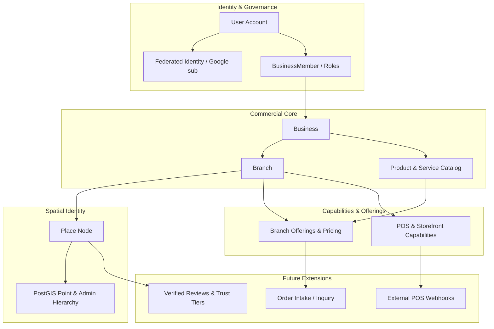

# 🏛️ وثيقة الماستر الاستراتيجية والمعمارية المستقبلية لمشروع WAYNAH (وَيْنَه؟)
## WAYNAH Future Master Development Study — Future Product Strategy & Architectural Reference

> **حالة الوثيقة**: مرجع استراتيجي ومستقبلي نهائي مائل للاعتماد (Master Future Strategy & Architecture Reference)  
> **الإصدار الأساسي للوضع الحالي**: Baseline `v0.12.0` (Monorepo Turborepo, Next.js 16 App Router, Hono API Gateway, Prisma 6.4 ORM, Supabase PostgreSQL 17 + PostGIS)  
> **نطاق التطبيق المنهجي**: **مستقبلي حتّامي وحصري — لا يغير الكود الحالي، ولا المهاجرات، ولا خطة الإطلاق الإنتاجي الحالي**  

---

> [!IMPORTANT]
> **القاعدة المنهجية الجوهرية والصارمة**:  
> هذه الدراسة هي **Master Product Strategy & Architecture Vision** للمراحل المستقبلية. المنظومة الحالية منصة **WAYNAH** (`v0.12.0`) في حالة جاهزية كاملة للإطلاق (Production Ready)، وتخضع لضوابط الجودة العامة. **لا تتحول أي من نتائج هذه الدراسة تلقائياً إلى تعديل كود، أو migration، أو إغلاق/إعادة فتح أي مرحلة (Phase 0–12) مكتملة**.

---

# 1. الملخص التنفيذي والتأطير الاستراتيجي (Executive Summary)

تعتبر منصة **WAYNAH (وَيْنَه؟)** البنية التحتية الجغرافية والتجارية الأولى المخصصة لـ **اكتشاف الأماكن والأنشطة والخدمات المحلية في اليمن وتأكيد موثوقيتها**.

تُعالج هذه الوثيقة السؤال المحوري المركزي للمستقبل:
> **ماذا يمكن أن يصبح WAYNAH مستقبلاً؟ وما الذي يستحق البناء فعلاً، وما الذي يجب تأجيله، وما الذي يجب حظره وحماية المنصة منه؟**

### أركان الهوية المستقبلية لمنصة WAYNAH:
$$\text{Discovery Layer} + \text{Spatial Identity} + \text{Local Context} + \text{Multidimensional Trust} + \text{Seamless Contact/Handoff}$$

تثبت هذه الدراسة أن قوة WAYNAH تكمن في **كونها طبقة استكشاف وتوثيق مسمار مدمجة (Discovery & Trust Layer)**، وليست منصة متجر متعدد التجار (Marketplace Engine)، ولا نظام إدارة موارد شركات (ERP)، ولا برنامج كاشير ومحاسبة (POS Hardware/Software)، ولا شبكة توصيل وسيطة (Logistics Platform).

---

# 2. حدود الوضع الحالي والجمود البرمجي (Current Baseline & Boundary Constraints)

### 1. معالم المرجعية الحالية (Baseline v0.12.0):
* **Architecture**: Monorepo managed by Turborepo `v2.4.4` & pnpm `v12.8.1`.
* **Frontend (`apps/web`)**: Next.js `v16.3.6` (App Router), React `v19.3.0`, Tailwind CSS `v4.3.3`, Leaflet `v1.9.4`.
* **API Gateway (`apps/api`)**: Hono Core `v4.13.10` over Node server / Vercel Serverless.
* **Database & Spatial (`packages/database`)**: PostgreSQL 17 (Supabase) + PostGIS 3.3.7 (`geography(Point, 4326)`) + `pg_trgm` + Prisma ORM 6.4.1 (17 Applied Migrations).
* **Search (`packages/search`)**: Arabic Orthographic Normalization + PostGIS Spatial Distance + Trigram Fuzzy Matching + Multi-factor Ranking.
* **Security & Governance**: RBAC (`SUPER_ADMIN`, `ADMIN`, `USER`, `BUSINESS_OWNER`), Persistent `AuditLog`, Data Conflict Engine, Branch Claiming Persistence.

### 2. حدود عدم المساس:
* **Frozen Phases**: جميع المراحل (Phase 0 إلى Phase 12) مغلقة ومجمدة Factually Verified & Closed.
* **Launch Gate**: لا تضاف أي فكرة مستقبيلة إلى معايير الإطلاق الحالي (Public Launch Gate).

---

# 3. الأفكار المستقبلية المكتشفة من السياق المرجعي (Historical Future Ideas Context)

بناءً على مراجعة السجلات التاريخية للمشروع والدراسات المنشورة في `docs/` (`WAYNAH_LOGIC_002` إلى `008` و `WAYNAH_PHASE_2` إلى `5`)، تم حصر وتقييم كافّة الأفكار السابقة:

1. **إدارة الكيانات المركبة**: فصل `Place` عن `Business` وعن `Branch` وعن `Provider`.
2. **عروض الأنشطة التجاريّة**: فصل `Product` عن `ServiceItem` وتأطير السعر والتوفر حسب الفرع (`BranchOffering`).
3. **التوثيق خماسي الأبعاد**: فصل توثيق الهوية، الملكية، الموقع الجغرافي، حداثة البيانات، وجودة الخدمة.
4. **تسجيل الدخول عبر Google**: ربط الهوية الخارجية OIDC عبر `sub` واستكمال رقم الهاتف المحلي.
5. **المحلات الرقمية والـ Lead Generation**: تمكين التصفح دون تحويل المنصة إلى محرك تسوية دفع مالي.
6. **الاهتمامات الصريحة (Explicit Interests)**: تفضيلات المستخدم دون تتبع سلوكي خفي.
7. **اكتشاف التعليم والخدمات الفردية**: استعراض المدارس، المعاهد، والأطباء دون التحول إلى LMS أو نظام حجز طبي معقد.

---

# 4. سجل الميزات المستقبلية الموحد (Future Feature Registry)

يحتوي السجل التالي على حصر وتصنيف وتقييم كافّة الميزات والأفكار المستقبلية:

| ID | Future Capability | Domain | User Value | Complexity | Risk | Dependencies | Status | Decision |
| :--- | :--- | :--- | :--- | :--- | :--- | :--- | :--- | :--- |
| **FEAT-01** | Multi-Branch Catalog & Pricing | Business | عالية | متوسط | منخفض | Business, Branch | PLANNED | **BUILD EVENTUALLY** |
| **FEAT-02** | Google OIDC (`sub`) Login & Linking | Auth | متوسطة | متوسط | متوسط | User, FederatedIdentity | FUTURE | **BUILD EVENTUALLY** |
| **FEAT-03** | Branch Offering Contextualization | Catalog | عالية | متوسط | منخفض | Product, Branch | FUTURE | **BUILD EVENTUALLY** |
| **FEAT-04** | POS Capability & Integration Tag | Commerce | متوسطة | منخفض | منخفض | Branch, Capability | DEFERRED | **DEFER / INTEGRATION** |
| **FEAT-05** | Lead Gen Online Storefront | Commerce | عالية | متوسط | منخفض | Business, Product | FUTURE | **BUILD EVENTUALLY** |
| **FEAT-06** | Remote & Mobile Provider Profiles | Providers | عالية | متوسط | متوسط | Provider, ServiceArea | FUTURE | **BUILD EVENTUALLY** |
| **FEAT-07** | Education Directory & Discovery | Discovery | متوسطة | منخفض | منخفض | Category, Place | FUTURE | **BUILD EVENTUALLY** |
| **FEAT-08** | Explicit Preference Discovery | Search | متوسطة | منخفض | منخفض | User, Category | RESEARCH | **RESEARCH FIRST** |
| **FEAT-09** | Order Inquiry & Handoff Intake | Commerce | عالية | متوسط | متوسط | OrderIntake, Product | DEFERRED | **DEFER** |
| **FEAT-10** | Verified Community Reviews | Reviews | عالية | متوسط | متوسط | Review, Audit | FUTURE | **BUILD EVENTUALLY** |
| **FEAT-11** | Full Warehouse Inventory Management | Inventory | منخفضة | مرتفع جداً | عالي | ERP Scope | REJECTED | ❌ **DO NOT BUILD** |
| **FEAT-12** | POS Cashier Hardware & Invoicing | POS | منخفضة جداً | مرتفع جداً | عالي | Hardware Scope | REJECTED | ❌ **DO NOT BUILD** |
| **FEAT-13** | E-Commerce Marketplace Payments Engine | Payments | منخفضة | مرتفع جداً | عالي جداً | Financial Scope | REJECTED | ❌ **DO NOT BUILD** |
| **FEAT-14** | Native Logistics & Delivery Fleet | Logistics | منخفضة | مرتفع جداً | عالي جداً | Fleet Scope | REJECTED | ❌ **DO NOT BUILD** |
| **FEAT-15** | LMS & Online Class Platform | Education | منخفضة | مرتفع جداً | عالي | Educational LMS | REJECTED | ❌ **DO NOT BUILD** |
| **FEAT-16** | Behavioral Privacy-Invasive Tracking | Analytics | منخفضة جداً | مرتفع | عالي جداً | AdTech Scope | REJECTED | ❌ **DO NOT BUILD** |

---

# 5. دراسة المجموعات الاستراتيجية الـ 30 (Strategic Group Studies)

تدرس كل مجموعة من المجموعات التالية الأفكار المحددة وفق منهجية التقييم الأحد عشرية:
$$\text{Idea} \rightarrow \text{Hypothesis} \rightarrow \text{Evidence} \rightarrow \text{Value} \rightarrow \text{Feasibility} \rightarrow \text{Arch Impact} \rightarrow \text{Ops Impact} \rightarrow \text{Security} \rightarrow \text{Yemen Fit} \rightarrow \text{Complexity} \rightarrow \text{Decision}$$

---

### المجموعات 1 - 4: بيئة الأعمال، الهوية، التحقق، وتجربة الحساب

#### 1. بيئة الأعمال (Business Ecosystem):
* **Idea**: التوسع في إدارة المنظمات (`Organization`)، الشركات (`Business`)، الفروع (`Branch`)، والمحافظة على المكان (`Place`).
* **5 Questions Analysis**:
  1. *المشكلة*: الشركات ذات الفروع المتعددة تحتاج إدارة مركزية للعلامة التجارية مع توزيع السلطة التشغيلية.
  2. *المستخدم*: أصحاب الشركات والمدراء الإقليميون.
  3. *ملائمة WAYNAH*: WAYNAH هو الكيان الوحيد الذي يربط الهوية المكانية بالهوية التجاريّة في اليمن.
  4. *التكلفة*: متوسطة (جدول `Organization` وربط `BranchRole`).
  5. *حد التوسع*: التوقف عند توزيع الصلاحيات الإدارية دون بناء نظام hr أو إدارة مرتيبات الموظفين.
* **القرار**: **BUILD EVENTUALLY (Future Tier 1)**.

#### 2. التحقق والثقة (Business Verification & Trust):
* **Idea**: اعتماد نموذج الثقة خماسي الأبعاد (Identity, Ownership, Location, Freshness, Quality).
* **الواقع المحلي في اليمن**: صعوبة التوثيق الورقي الرسمي للأنشطة الصغرى تُعالج عبر التوثيق الميداني وتأكيد الواتساب والتقييم المجتمعي.
* **القرار**: **BUILD EVENTUALLY (Future Tier 1)**.

#### 3. مصادقة Google الهجينة (Google OAuth & Identity):
* **Idea**: استخدام Google OIDC `sub` كمُعرّف خارجي مع إجبار استكمال رقم الهاتف المحلي (+967) قبل تفعيل الجلسة.
* **القرار**: **BUILD EVENTUALLY (Future Tier 2)**.

#### 4. نية المستخدم الحرة (Account Experience & Intent):
* **Idea**: تكييف الواجهة حسب نية التسجيل (`Consumer`, `Merchant`, `Provider`) دون منح صلاحيات إدارية تلقائية.
* **القرار**: **BUILD EVENTUALLY (Future Tier 1)**.

---

### المجموعات 5 - 8: المنتجات، الخدمات، المتاجر، ونقاط البيع

#### 5. المنتجات والخدمات (Products & Services):
* **Idea**: فصل المنتجات عن الخدمات وتأطير السعر والتوفر لكل فرع عبر `BranchOffering`.
* **الحد المعماري**: **عدم إدارة تتبع الكمية التفصيلية في المخازن (No Stock Quantity Management)**.
* **القرار**: **BUILD EVENTUALLY (Future Tier 1)**.

#### 6. المتجر الإلكتروني كحضور رقمي (Lead Generation Storefront):
* **Idea**: تمكين التصفح واستقبال استفسارات الطلبات (Inquiry / RFQ / WhatsApp Order) دون إدارة عملية الشراء المالية.
* **المقارنة المرجعية**: Shopify يقدم محرك دفع وتسليم، بينما WAYNAH يقدم **Discovery + Access + Lead Generation**.
* **القرار**: **BUILD EVENTUALLY (Future Tier 1)**.

#### 7. نقاط البيع (Point of Sale Capabilities):
* **Idea**: جعل POS مجرد وسم إمكانية تشغيلية (Accepts Local Digital Wallets) ورابط API لتمرير الطلبات.
* **الحد الصارم**: WAYNAH ليست نظام كاشير ولا طابعة فواتير ولا أداة جرف محاسبي.
* **القرار**: **DEFER / EXTERNAL INTEGRATION**.

#### 8. مقدمو الخدمات الفردية والمتنقلة (Providers & Remote Services):
* **Idea**: دعم مقدمي الخدمات (أطباء، مهندسون، فنيون) وتحديد نطاق التغطية الجغرافي (`Service Area`) دون اشتراط وجود محل ثابت بباب.
* **القرار**: **BUILD EVENTUALLY (Future Tier 2)**.

---

### المجموعات 9 - 12: الاستكشاف، الاهتمامات، التعليم، والتجارة المحلية

#### 9. البحث الموحد المتقدم (Discovery & Search Evolution):
* **Idea**: تحسين محرك البحث بالاعتماد على الفهرس الحالي المعتمد على PostGIS و `pg_trgm` وتطوير المعايير دون تدمير قواعد البيانات.
* **القرار**: **BUILD EVENTUALLY (Future Tier 1)**.

#### 10. التفضيلات الصريحة (Explicit User Interests):
* **Idea**: اختيار المستخدم لاهتماماته صراحة لترشيح الأماكن دون تتبع خفي للخصوصية.
* **القرار**: **RESEARCH FIRST**.

#### 11. دليل الخدمات التعليمية (Education Discovery):
* **Idea**: توفير دليل للأنشطة التعليمية (مدارس، جامعات، معاهد) واستعراض تخصصاتها وخدماتها.
* **الحد الصارم**: عدم تحويل المنصة إلى نظام إدارة تعلم (LMS) أو منصة فصول افتراضية.
* **القرار**: **BUILD EVENTUALLY (Future Tier 2)**.

#### 12. حلقة التجارة المحلية (Local Commerce Handoff Loop):
* **المبدأ الجوهري**:
$$\text{Discovery} \longrightarrow \text{Access} \longrightarrow \text{Contact} \longrightarrow \text{Direct Handoff (WhatsApp / Direct Call)}$$
* **القرار**: **PROTECT THE CORE**.

---

### المجموعات 13 - 18: الطلبات، الحجوزات، التوصيل، المدفوعات، والبيانات

#### 13. إدارة الطلبات المبسطة (Order Inquiry Intake):
* **Idea**: استقبال طلبات الاستفسار المبسطة وتوجيهها للتاجر دون إدارة دورة حياة الدفع المالي الإجباري.
* **القرار**: **DEFER**.

#### 14. الحجوزات المبدئية (Booking Inquiries):
* **Idea**: طلب حجز موعد مبدئي لدى خدمة أو مقدم خدمة وتأكيده عبر التواصل المباشر.
* **القرار**: **DEFER**.

#### 15. التوصيل والخدمات اللوجستية (Delivery Boundaries):
* **القرار الاستراتيجي**: WAYNAH ليست شركة توصيل؛ يتم الاعتماد على أسطول التاجر الخاص أو التمرير لشركات التوصيل عبر Integrations.
* **القرار**: **EXTERNAL INTEGRATION / DO NOT BUILD FLEET**.

#### 16. المدفوعات والمحافظ المحلية (Payment Records vs Ledger):
* **Idea**: تسجل WAYNAH طريقة الدفع المتفق عليها (`CASH_ON_DELIVERY` أو `DIRECT_WALLET_TRANSFER`) كـ `PaymentRecord` إعلامي دون أن تكون محصلاً مالياً أو بنكاً وسيطاً.
* **القرار**: **EXTERNAL INTEGRATION / DO NOT BUILD LEDGER**.

#### 17. التقييمات ومكافحة الاحتيال (Trustworthy Community Reviews):
* **Idea**: نظام تقييمات مشروط بتأكيد الهوية أو زيارة المكان لمكافحة التقييمات الزائفة وتأمين سمعة الأنشطة.
* **القرار**: **BUILD EVENTUALLY (Future Tier 1)**.

#### 18. التوسع في الإشعارات (Future Notification Engine):
* **Idea**: استخدام إشعارات النظام للأعمال عند تحديثات التوثيق أو طلبات المطالبة (دون إعادة فتح الإشعارات المكتملة في Slice 10).
* **القرار**: **BUILD EVENTUALLY (Future Tier 2)**.

---

### المجموعات 19 - 24: الأجهزة المحمولة، التصفح بدون إنترنت، والبنية التحتية

#### 19. تطبيق المحمول والويب (Mobile Architecture & PWA):
* **تقييم الواقع المحلي**: ضعف الإنترنت (2G/3G/4G) والأجهزة المتوسطة في اليمن يجعل الـ **Progressive Web App (PWA)** المحسنة والخفيفة هي الخيار الأول الأفضل، ويتم تأجيل الـ Native App حتى تطلب السوق ذلك صراحة.
* **القرار**: **PWA FIRST / DEFER NATIVE APP**.

#### 20. التصفح بدون إنترنت قاطع (Offline Discovery & Local Cache):
* **Idea**: التخزين المحلي لبيانات الأماكن المزارة مؤخراً والخرائط لضمان تصفح المنصة في حالات انقطاع الشبكة.
* **القرار**: **BUILD EVENTUALLY (Future Tier 2)**.

#### 21. التوسع في البنية التحتية والذاكرة المؤقتة (Infrastructure & Redis Caching):
* **المنهجية**: عدم إضافة Redis إلا عند وجود مشكلة اختناق حقيقية في الأداء (Problem $\rightarrow$ Technology).
* **القرار**: **RESEARCH FIRST / PROBLEM-DRIVEN**.

#### 22. تطوير الأمان ومكافحة الانتهاك (Security Evolution):
* **Idea**: دعم المصادقة ثنائية العوامل (MFA) وتأمين الجلسات الحساسة للأنشطة الكبرى وتدقيق الامتيازات.
* **القرار**: **BUILD EVENTUALLY (Future Tier 2)**.

#### 23. الإدارة والرقابة المتقدمة (Admin & Moderation Evolution):
* **Idea**: فصل واجهات الإدارة إلى 3 مستويات صريحة:
  1. *Operational Admin*: لمراجعة الأماكن، المنازعات، والتوثيق.
  2. *Business Admin*: لوحة تحكم التاجر لإدارة فروعه وعروضه.
  3. *System Admin*: لإدارة الأمان والإعدادات التقنية النواة.
* **القرار**: **BUILD EVENTUALLY (Future Tier 1)**.

#### 24. التوسع الجغرافي الشامل في اليمن (Expansion Across Yemen):
* **Idea**: التوسع من التغطية الأولية نحو كافة محافظات ومديريات وعزل وقرى ومدن اليمن بنفس الهيكلية الجغرافية المعتمدة في PostGIS دون تغيير النموذج.
* **القرار**: **BUILD EVENTUALLY (Future Tier 1)**.

---

### المجموعات 25 - 30: التكاملات الخارجيّة، المحتوى، والحدود النهائية

#### 25. التكاملات الخارجية (External Integrations):
* **القاعدة المطبقة**: $\text{Integration} \neq \text{Core Domain}$.
* **القرار**: **EXTERNAL INTEGRATION**.

#### 26. استضافة المحتوى والصفحات التجاريّة (Content Hosting Boundaries):
* **القرار**: السماح باستضافة صور وتفاصيل العروض التجارية ذات الصلة المباشرة بالمكان، وحظر التحول إلى شبكة نشر مدونات أو منصة مقالات عامة.
* **القرار**: **PROTECT THE CORE**.

#### 27. التخصيص والموصيات (Personalization Boundaries):
* **القرار**: الاعتماد الحصري على التفضيلات الصريحة المحددة من المستخدم، وحظر خوارزميات التتبع السلوكي المترصدة للخصوصية.
* **القرار**: **DO NOT BUILD BEHAVIORAL TRACKING**.

#### 28. حدود منصة التجارة المفتوحة (Marketplace Scope Boundary):
* **القرار**: **WAYNAH ليست Marketplace**؛ المنصة تكتفي بتقديم الاستكشاف، التوثيق، والتواصل المباشر.
* **القرار**: **PROTECT THE CORE**.

#### 29. توثيق الماستر المتزامن (Master Project Documentation):
* **القرار**: حفظ هذه الدراسة كمرجع استراتيجي دائم في `docs/research/WAYNAH_FUTURE_MASTER_DEVELOPMENT_STUDY.md`.

#### 30. شجرة الاعتمادية المعمارية المفاهيمية (Conceptual Dependency Map):



---

# 6. النواة مقابل التوسعات مقابل الأنظمة الخارجية (Core vs Extensions vs External)

```mermaid
graph LR
    subgraph WAYNAH CORE
        C1[Geographic Places & PostGIS]
        C2[Business & Branch Entities]
        C3[Spatial Search & Trigram Engine]
        C4[5D Trust & Verification Pipeline]
        C5[Direct Contact & Handoff]
    end

    subgraph WAYNAH EXTENSIONS
        E1[Branch Offerings & Catalog]
        E2[Lead Gen Storefront]
        E3[Verified Reviews Engine]
        E4[Explicit User Preferences]
        E5[PWA Offline Caching]
    end

    subgraph EXTERNAL SYSTEMS
        X1[ERP & Warehouse Inventory]
        X2[POS Hardware & Invoicing]
        X3[Financial Payment Processors]
        X4[Logistics & Delivery Fleets]
        X5[LMS Educational Engines]
    end

    WAYNAH CORE --> WAYNAH EXTENSIONS
    WAYNAH EXTENSIONS -.->|Webhooks / APIs| EXTERNAL SYSTEMS
```

---

# 7. مصفوفة الأولويات الاستراتيجية (Strategic Priority Matrix)

```text
               HIGH VALUE
                   │
  Tier 1           │  Tier 2
  - Multi-Branch   │  - Google OIDC
  - Offerings      │  - Remote Providers
  - Storefront     │  - Education Directory
  - 5D Trust       │  - Verified Reviews
                   │
LOW COMPLEXITY ────┼──── HIGH COMPLEXITY
                   │
  Research         │  Do Not Build
  - Explicit Prefs │  - Full Warehouse Inventory
  - Redis Scaling  │  - POS Cashier & Invoicing
                   │  - Marketplace Payment Engine
                   │  - Delivery Fleet
                   │
               LOW VALUE
```

---

# 8. مصفوفة حظر البناء المباشر (Do Not Build List)

لحماية مشروع WAYNAH من تشتت النطاق (Scope Creep) والانتفاخ المعماري، تحظر هذه الوثيقة بصراحة بناء الميزات التالية داخل نواة المنصة:

1. ❌ **نظام إدارة المستودعات والكميات التفصيلية (Warehouse Stock Inventory)**: تترك لأنظمة ERP التجار الخارجية.
2. ❌ **نظام الكاشير وطباعة الفواتير المحاسبية (POS Hardware & Invoicing)**: مسؤوليّة برمجيات نقاط البيع التجارية المحلية.
3. ❌ **محرك الدفع والتخليص المالي المتعدد التجار (E-Commerce Payment Processor)**: عدم تحويل WAYNAH إلى بنك وسيط أو محصل أموال.
4. ❌ **أسطول التوصيل والخدمات اللوجستية (Native Delivery Logistics Fleet)**: الاعتماد الحصري على التاجر أو شركات التوصيل الخارجية.
5. ❌ **نظام إدارة الفصول والتعليم الإلكتروني (LMS System)**: الاكتفاء بدليل المنشآت التعليمية دون خوض غمار التعليم الر رقمي.
6. ❌ **خوارزميات التتبع السلوكي المنتهكة للخصوصية (Behavioral Tracking)**: الحفاظ على ثقة المستخدم وحرمة بياناته.

---

# 9. التقرير الاستراتيجي والقرار النهائي (WAYNAH FUTURE — FINAL STRATEGIC DECISION)

## 📌 WAYNAH FUTURE — FINAL STRATEGIC DECISION

### 1. BUILD EVENTUALLY (ما يستحق البناء مستقبلاً)
- **هيكلية الكيانات المكتملة**: `Business -> Branch -> Place -> BranchOffering`.
- **نموذج أبعاد الثقة الخمسة والتوثيق الميداني/المجتمعي المرن**.
- **المتجر الإلكتروني الخفيف لاستعراض العروض وتلقي طلبات الاستفسار (Lead Generation Storefront)**.
- **دليل المنشآت التعليمية والخدمات الفردية المتنقلة (Remote Providers)**.
- **التطبيق التقدمي (PWA) الداعم للتصفح السريع واستهلاك البيانات المنخفض في اليمن**.

### 2. RESEARCH FIRST (ما يحتاج دراسة إضافية)
- **نظام التفضيلات الصريحة للمستخدم (Explicit Preferences)**.
- **معايير قياس الأداء للحاجة الفعلية للذاكرة المؤقتة Redis تحت الحمل العالي**.

### 3. DEFER (ما نؤجله للمراحل المتقدمة)
- **تسجيل الدخول عبر Google OIDC `sub` وربط رقم الهاتف**.
- **وسم وتكاملات نقاط البيع (POS Capability Tags & Webhooks)**.
- **نظام الطلبات والحجوزات المبدئية المعقدة**.

### 4. EXTERNAL INTEGRATION (ما نربطه بدل بنائه)
- **التكامل مع المحافظ الإلكترونية المحلية عبر روابط الدفع المباشرة**.
- **التكامل مع برمجيات الكاشير المحاسبية عبر Webhooks إعلامية**.
- **التكامل مع شركات التوصيل المحلية لتوجيه طلبات العميل مباشرة**.

### 5. DO NOT BUILD (ما يجب ألا نبنيه أصلًا)
- 🛑 **No Warehouse Inventory Management System**.
- 🛑 **No POS Hardware Cashier or Invoice Printing Software**.
- 🛑 **No Marketplace E-Commerce Payment Clearing Engine**.
- 🛑 **No Native Logistics Delivery Fleet**.
- 🛑 **No Behavioral Privacy-Invasive AdTech Tracking**.

### 6. PROTECT THE CORE (حماية هوية WAYNAH)
ستبقى منصة **WAYNAH** دائماً وأبداً:
> **طبقة الاكتشاف والهوية الجغرافية والمعلومات المحلية الأكثر موثوقية في اليمن (Discovery + Geographic Identity + Local Information + Multidimensional Trust + Access)**.

---

<div align="center">
<b>تم بحمد الله اعتماد وثيقة الماستر الاستراتيجية والمعمارية المستقبلية لمنصة WAYNAH</b>  
<i>حُرر وتوثق بواسطة الفريق المعماري للمشروع — أكتوبر 2026</i>
</div>
